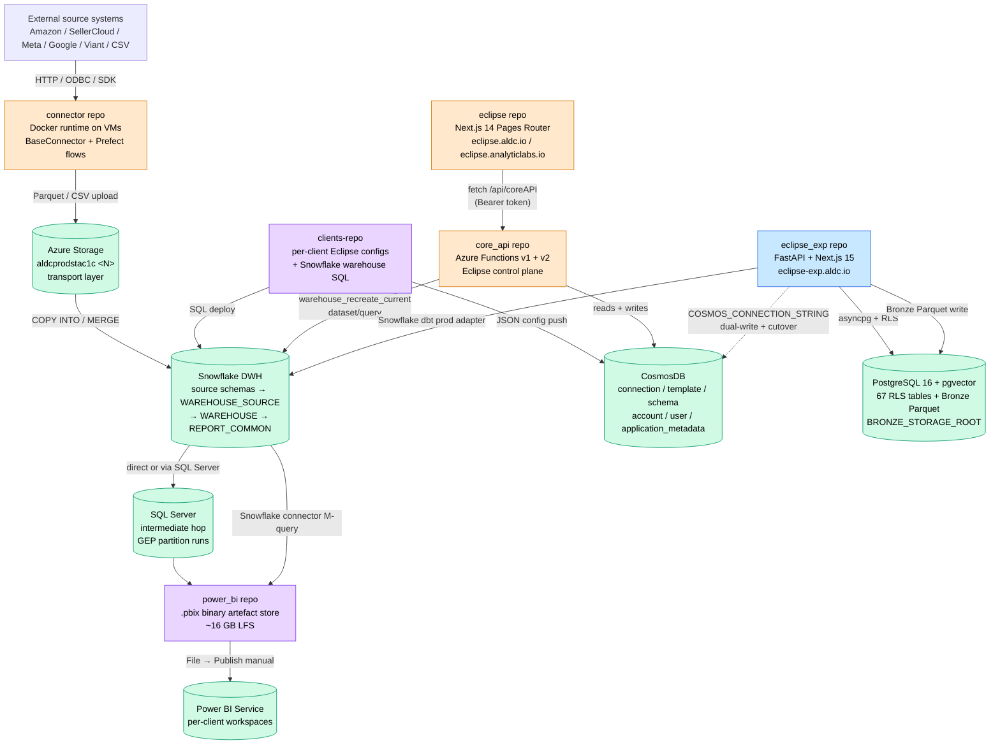
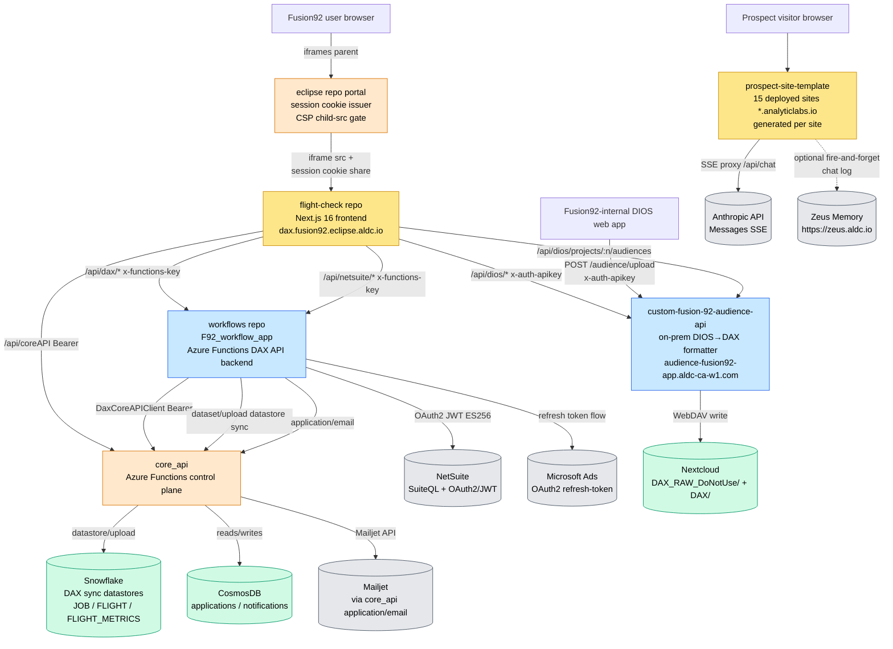
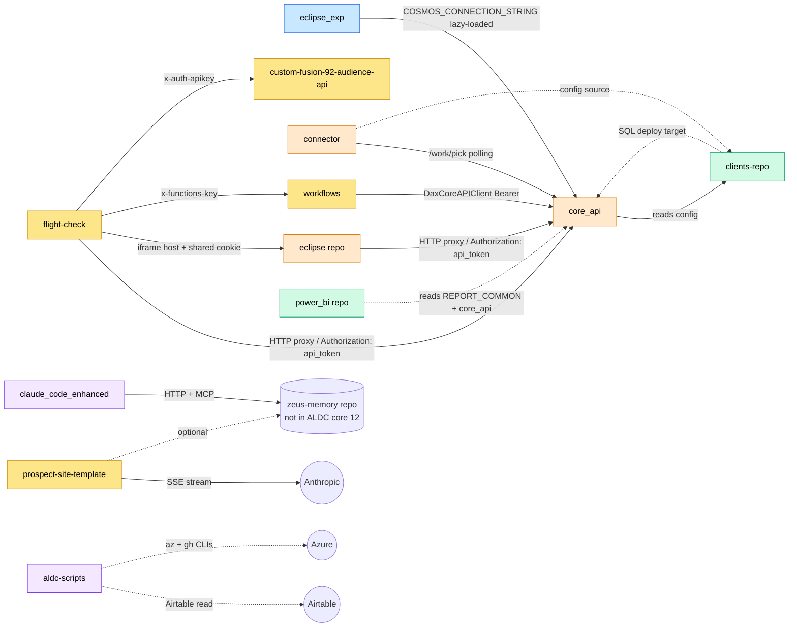
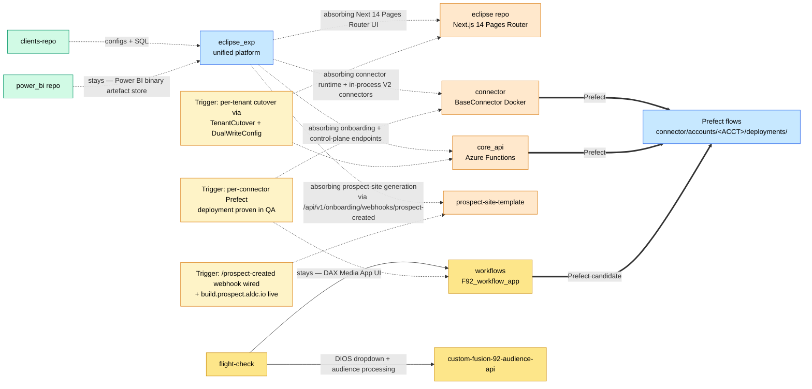

# Repo Integration Map

Cross-repo map of ALDC's GitHub estate: who calls whom, who owns which data, and — more importantly — where the whole thing is heading. The 12 repos covered here (the 9 from the repo-documentation workstream plus `core_api`, `connector`, and `clients-repo`) split into three rough groups: a **legacy core platform** being strangler-fig-absorbed into a new unified platform; a set of **client-facing products** that sit on top of that platform; and a handful of **tooling / binary-artefact / internal** repos with their own stories. This page documents both the current wiring and the direction of travel.

---

## Strategic narrative

ALDC is mid-flight on two overlapping consolidations. Both are active, both are multi-quarter, and neither has a fixed cutover date.

**Consolidation #1 — platform onto `[[eclipse_exp]]`.** The legacy ALDC platform is four repos: `[[entities/repos/eclipse|eclipse (repo)]]` (Next.js 14 Pages Router UI), `[[core_api]]` (Azure Functions control plane, CosmosDB-backed), `[[connector]]` (Eclipse connector runtime, Docker-on-VM), and a production-facing pair of domains (`eclipse.aldc.io` + `api.eclipse.analyticlabs.io`). `[[eclipse_exp]]` is the successor: a single contract-first FastAPI backend + Next.js 15 App Router frontend in one supervisord-managed container, with 67 RLS-enabled Postgres tables, 50 connector types (V1 + V2), 87 SQL migrations, and a 6-step AI-native onboarding pipeline. The migration is **strangler-fig**: legacy and successor run side-by-side on separate domains, with per-tenant dual-write + cutover machinery in `migration/` and a `task_type=cutover` handler that switches individual tenants from CosmosDB to Postgres atomically. There is no hard flip date — tenants migrate when verified. Driver is ALDC's AI-driven delivery pivot: agents navigating five disjoint repos is friction the company can no longer afford.

**Consolidation #2 — connector data-plane onto `[[Prefect]]`.** Orthogonal to eclipse_exp but the same consolidation flavour. The data-transport layer today runs out of `[[connector]]` (the `BaseConnector`-based Docker runtime polled by `aldcprodfnapcore1c03` via `/work/pick` — see [[connector-timeout-outage]]) and, historically, from data-pull queries inside `[[core_api]]`. The target is a Prefect deployment per account under `connector/accounts/<ACCOUNT>/deployments/`. This is flagged as an extremely-high-priority initiative (memory: `project-prefect-connector-migration.md`). `[[workflows]]` is a candidate next target — its F92_workflow_app is an Azure Functions runtime pattern that overlaps with what Prefect does. [[eclipse_exp]] also hosts in-process V2 connectors (`connectors/base/v2/`) and its Bronze-layer ingestion pipeline (`ingestion_v2`) — a **third** ingestion path that may eventually absorb more of the connector repo's responsibilities, though the exact boundary between Prefect flows and in-process V2 connectors is not yet formally defined.

**What is NOT being consolidated.** Client-facing products (`[[entities/repos/flight-check|flight-check (repo)]]` + `[[workflows]]` = DAX Media App; `[[custom-fusion-92-audience-api]]` = DIOS→DAX audience distribution; `[[entities/repos/prospect-site-template|prospect-site-template]]` = the microsite factory) consume the platform but are not themselves in scope for consolidation — with one exception: `[[entities/repos/prospect-site-template|prospect-site-template]]` will be absorbed into eclipse_exp once the onboarding webhook `/api/v1/onboarding/webhooks/prospect-created` is wired to `build.prospect.aldc.io`. `[[Power BI]]` stays: no replacement is in flight, and `[[entities/repos/power_bi|power_bi (repo)]]` remains the canonical binary-artefact store. `[[claude_code_enhanced]]` is dev-tooling, orthogonal to the data plane, and will not fold into anything.

**How to read this map.** The "Current data flow" and "Current dependency graph" diagrams capture **as-is** wiring (2026-04-20). The "Target-state / strangler-fig overlay" shows planned absorptions as dashed arrows and the Prefect migration path as dotted arrows. The per-repo integration notes describe each repo's in/out surface in detail. When current-state and future-state disagree, **prefer current-state as authoritative for today's work**, and treat the target-state diagram as direction-of-travel rather than a commitment.

---

## Summary table

12 repos. Tier column uses the tier taxonomy defined in [§ Integration tiers](#integration-tiers) below.

| Repo | Tier | Current role | Future state | Migration trigger |
|---|---|---|---|---|
| [[eclipse_exp]] | Core platform (active) | Unified FastAPI + Next.js 15 platform (36 routes, 87 migrations, 50 connectors, 67 RLS tables). New-tenant target. | Canonical — expanding scope by absorbing legacy capabilities | N/A (it's the target) |
| [[entities/repos/eclipse\|eclipse (repo)]] | Core platform (legacy, being absorbed) | Next.js 14 Pages Router legacy portal UI. `eclipse.aldc.io` prod + per-env subdomains. Existing-tenant host. | Being absorbed by [[eclipse_exp]]'s Next.js 15 App Router frontend | Per-tenant cutover via `TenantCutover` + DNS redirect; no hard date |
| [[core_api]] | Core platform (legacy, being absorbed) | Azure Functions control plane. CosmosDB-backed. Exposes v1 (`/v1/*`) + v2 (`/v2/*`, `api.eclipse.analyticlabs.io`) surfaces. Warehouse rebuild functions. | Onboarding + control-plane endpoints migrating into [[eclipse_exp]]. v1 legacy endpoints frozen (see DV-444 gap). | Per-endpoint cutover; some surfaces staying (warehouse rebuild, DAX dataset API) pending Prefect progress |
| [[connector]] | Core platform (legacy, being absorbed) | Eclipse connector Docker runtime. Polls `aldcprodfnapcore1c03`'s `/work/pick` for queued work. | Target of [[Prefect]] migration; individual connectors moving to `connector/accounts/<ACCOUNT>/deployments/` | Per-connector migration to Prefect flows; no hard date |
| [[clients-repo]] | Core platform (configuration) | Per-client Eclipse JSON configs + Snowflake warehouse SQL. 19 active client folders, 150+ connections, 300+ templates, 200+ warehouse views. | Stable — likely to keep its current shape even as eclipse_exp absorbs platform functionality. Configs migrate client-by-client. | N/A (data + config, not a platform) |
| [[entities/repos/flight-check\|flight-check (repo)]] | Client-facing product | Next.js 16 frontend for the DAX Media App. Iframes into eclipse portal, fans out to 4 backends (core_api, DAX API, DIOS, NetSuite Workflow). | Canonical Fusion92 UI — no replacement planned | N/A |
| [[workflows]] | Client-facing product (backend) | Azure Functions v2 backend for DAX Media App. `F92_workflow_app` hosts DAX API (HTTP), NetSuite PO sync, Microsoft Ads refresh, pacing/status notifications, Snowflake sync. | Candidate for [[Prefect]] migration; legacy `workflows/` package gradually absorbed into typed `dax_api/` pattern | Prefect migration initiative, per-function |
| [[custom-fusion-92-audience-api]] | Client-facing product | FastAPI + pandas DIOS→DAX audience-data-formatter. On-prem (60 GB RAM). 14 platforms, 17 file specs. | Stays on-prem until memory constraint resolved; candidate for Snowflake re-architecture (Phase 2 per CF92/1364688898) | Agreement with Fusion92 to change DIOS-side contract |
| [[entities/repos/prospect-site-template\|prospect-site-template]] | Client-facing product | Next.js 15 microsite factory. 15 deployed sites at `*.analyticlabs.io`. 3 templates (landing/dashboard/pitch) driven by one gitignored `site.config.ts`. | Being absorbed by [[eclipse_exp]]: forward-looking `/api/v1/onboarding/webhooks/prospect-created` → `build.prospect.aldc.io` integration | eclipse_exp onboarding webhook wired and `build.prospect.aldc.io` domain live |
| [[entities/repos/power_bi\|power_bi (repo)]] | Data artefact | Binary artefact store for ~94 `.pbix` + 3 `.pbit` + 6 CosmosDB report JSON + theme files. Git LFS (~16 GB). No code. | Canonical. `.pbip` migration is the biggest opportunity (per-model, not bulk). Archival of frozen client folders (DISH_DUER, BOOK_DEPOT, KIT_ACE) recommended but uncommitted. | N/A for tool; `.pbip` migration has no blocker, just prioritisation |
| [[claude_code_enhanced]] | Internal tooling | 20-hook runtime enforcement + 195-skill library + `cce` Bash launcher. Per-developer install. Consumes [[zeus-memory]] via HTTPS API + MCP. | Canonical dev tooling; active development. No migration. | N/A |
| [[aldc-scripts]] | Internal tooling (likely legacy) | 3 commits (all Lori Beck). Fusion92 ticket-status PDF (`f92_ticket_report.py`), generic Slack webhook (`send_slack.sh`), weekly corporate cost dashboard on Server4. | **Likely legacy — verify before relying on.** `#the-olds` Slack channel invisible to Paul, suggesting cron is dead. Cost-monitoring is a candidate for [[Prefect]] or [[eclipse_exp]] ops dashboard absorption if confirmed active. | `crontab -l` on Server4 to confirm live status before any migration investment |

---

## Product-to-Branch Reference

Source: Confluence TECH/1774256132 (Github Repo and Branch Reference, Brayden Offboarding). Snapshot as of 2026-04-22.

| Product/Service | Repository | Branch |
|---|---|---|
| Eclipse 2.1 | `eclipse` | `eclipse-2.1` |
| Core API 2.1 | `core_api` | `eclipse-2.1` |
| [[Prefect]] / New Connectors | `connector` | `operation-fiasco` |
| Old/Current Connectors | `connector` | `main` |
| Eclipse 2.0 | `eclipse` | `main` |
| Flight Check | `flight-check` | `main` |
| Eclipse 1 (Old Eclipse) | `portal` | `main` |
| Core API 1 (Old Core) | `core_api` | `main` |
| DIOS API | `custom-fusion-92-audience-api` | `main` |

> **Key Prefect note:** The Prefect migration work lives on the `operation-fiasco` branch of the `connector` repo, not `main`. The `main` branch continues to serve the old/current connector agents.

---

## Current data flow (Mermaid)

Two separate diagrams — one for the core platform + data pipeline, one for the DAX Media App product stack. Keeping them apart avoids a single unreadable blob.

### Diagram 1a — Core platform + ALDC data pipeline

### Diagram 1b — DAX Media App product stack + prospect sites

---

## Current dependency graph (Mermaid)

Who imports / calls / deploys what. Separate from data flow — this shows compile-time and runtime coupling, not per-request data movement.

**Notes on this graph:**

- **`[[eclipse_exp]]` has zero inbound dependencies from other ALDC repos** as of 2026-04-20. Its outbound edge to `core_api` is via `COSMOS_CONNECTION_STRING` used only by the `migration/` package (dual-write + cutover). Every other integration is a planned, not-yet-wired one — see target-state diagram.
- **`[[core_api]]` is the fan-in hub of the legacy stack.** Three of the four client-facing products (`eclipse`, `flight-check`, `workflows`) call into it. The [[connector]] runtime polls it. This is why it's the last thing to migrate: every legacy caller has to cut over first.
- **`[[clients-repo]]` is config, not code.** It doesn't "run" anywhere. Its outputs (Eclipse connection/template JSON, Snowflake warehouse SQL, data-share views) are pushed to CosmosDB + Snowflake by humans following [[model-deploy-production]] / [[gep-snowflake-pbi-deployment]]. Depicted with dotted edges to mark "config flows, not code imports."
- **`[[claude_code_enhanced]]` is dev-side only** and has no dependency on any ALDC data-plane repo — its only integrations are Zeus Memory (not in the 12), Anthropic, and GitHub.
- **`[[aldc-scripts]]`** has no integrations with the other 11 repos. Its outbound edges are entirely external (Airtable, Azure Consumption API, GitHub org API, Slack webhook).

---

## Target-state / strangler-fig overlay (Mermaid)

Planned absorptions as **dashed** arrows labelled `absorbing`. Prefect migration path as **dotted** arrows labelled `Prefect →`. Solid arrows are current-state carried forward.

**How to read this diagram:**

- **Dashed arrows (`-.absorbing.->`)** are "eclipse_exp will host this capability someday." Legacy repos are the source of truth until cutover.
- **Double-dotted arrows (`==Prefect ==>`)** are the Prefect migration path. `[[connector]]` is the primary target (reference implementation exists — `connector/accounts/ALDC_QA/deployments/exchange_rates.py`). `[[core_api]]`'s historical data-pull queries already moved; what remains there is Eclipse control-plane work. `[[workflows]]` is a natural candidate but not an announced target.
- **Trigger boxes** identify what has to be true for a given absorption to happen. None of them are time-boxed.
- **`[[clients-repo]]` and `[[entities/repos/power_bi|power_bi (repo)]]`** carry forward without structural change. They'll continue to feed eclipse_exp the same way they feed the legacy stack today (configs + SQL push, `.pbix` Publish).

---

## Per-repo integration notes

One block per repo. Each block: what it consumes (inputs), what it produces (outputs), who calls it, and relevant notes.

### eclipse_exp

- **Consumes:** PostgreSQL 16 + pgvector (its own schema `eclipse_exp`). Legacy `[[CosmosDB]]` via `COSMOS_CONNECTION_STRING` (lazy-loaded, migration `task_type=cutover` only). Anthropic API (SSE chat). `[[zeus-memory]]` via `clients/zeus_memory.py` for performance metrics. Azure Key Vault (optional) for Fernet keys. Snowflake via dbt prod adapter for Gold/semantic reads. Optional OTLP endpoint for OpenTelemetry.
- **Produces:** `/api/v1/*` REST surface (36 route prefixes). `/internal/*` reverse-proxied to Next.js 15 frontend (same container). SSE streams at `/api/v1/onboarding-chat` and `/api/v1/ai-chat`. WebSocket at `/api/v1/tasks/ws`. Bronze Parquet at `BRONZE_STORAGE_ROOT`. `audit_logs` append-only writes. Slack webhook alerts on job failure + 6 AM ET daily digest.
- **Called by:** No ALDC repo currently. Target of a future webhook from `[[entities/repos/prospect-site-template|prospect-site-template]]` (`/api/v1/onboarding/webhooks/prospect-created` — not wired yet). Target of a DNS cutover from `[[entities/repos/eclipse|eclipse (repo)]]` for migrated tenants.
- **Notes:** Single Container App, no staging slot — staging rides on prior revisions via `az containerapp revision` (contrast with the slot-swap model everywhere else). Auto-migrate runs in-process at cold start. 3848 backend + 388 frontend tests. camelCase aliases (`/dataViews`, `/signUp`, `/passwordReset`) are compat shims for the legacy Eclipse frontend during migration.

### eclipse (repo)

- **Consumes:** `[[core_api]]` via `pages/api/coreAPI.tsx` (universal server-side proxy, `api_url` + `api_token` env vars). NextAuth session cookie (`__Secure-next-auth.session-token` on HTTPS). F92-specific env-var set (`F92_NOTIFICATION_URL/KEY`, `F92_NETSUITE_WORKFLOW_URL`, `F92_NETSUITE_SYNC_TOKEN`, `DIOS_API_URL/KEY`). `CHILD_SRC_ALLOWED_ORIGINS` gates iframe embeds via CSP.
- **Produces:** Server-rendered Next.js portal. `/pages/api/*` proxy surface. Cookie-level session handoff for iframe apps (NextAuth cookie shared at domain `.eclipse.aldc.io` with `[[entities/repos/flight-check|flight-check (repo)]]`). `postMessage` `NAVIGATION_CHANGE` events to/from child iframes.
- **Called by:** Human users (browser). Parent frame for `[[entities/repos/flight-check|flight-check (repo)]]` and other iframe apps.
- **Notes:** Repo's on-disk state has been rewritten to Next 15 App Router (branch `eclipse-2.1`) and deployed at `https://eclipse.analyticlabs.io/` via App Service `aldcprodwbapeclipse1c01`. The `eclipse.aldc.io` domain + `aldcprodwbapportal1c01` App Service still serve the Next 14 Pages Router version. Two deployments run in parallel on different brand domains — **not** a DNS cutover of the same hostname. See the staleness callout at the top of the repo page.

### core_api

- **Consumes:** `[[CosmosDB]]` (`core` database, connection / template / schema / account / user / notification / application_metadata / task / etc.). `[[Snowflake]]` via `warehouse_recreate_current` and `dataset/query|request`. Azure Queue Storage for task dispatch. Mailjet / Twilio / Pushover for notifications. `[[clients-repo]]` configs pushed into CosmosDB by deployers.
- **Produces:** Two HTTP surfaces running side-by-side — **v1 Azure Functions** at port 7071 / `/v1/*` (`aldcprodfnapcore1c01.azurewebsites.net/v1/...`) and **v2 FastAPI** at port 8000 / `/v2/*` (`https://api.eclipse.analyticlabs.io/v2/`, CORS-allowlisting the Next 15 eclipse-2.1 frontend). Standard response envelope `{response: {code, type, message, origin, payload}}` on v1. Queue writes to `tasks` queue for the dispatcher function (`aldcprodfnapdispatch1c01`). Mailjet-wrapped email via `application/email`.
- **Called by:** `[[entities/repos/eclipse|eclipse (repo)]]` (every `/api/coreAPI` call), `[[entities/repos/flight-check|flight-check (repo)]]` (same pattern), `[[workflows]]` (`DaxCoreAPIClient`), `[[connector]]` (`/work/pick` on `aldcprodfnapcore1c03` — the connector-instance function app, distinct from the Eclipse-instance `aldcprodfnapcore1c01`), the CosmosDB dispatcher, and various task-trigger / queue-trigger function apps.
- **Notes:** The DV-444 ticket surfaced a v2 API gap — `application_metadata` has no PATCH/PUT endpoint on v2; `v1 update_metadata_item` is routed by `legacy_router.py` but that router is **commented out** in `api/main.py:164`. Workaround: direct CosmosDB patch via Azure Portal Data Explorer. Paul flagged this as an open action item. Also note: *two* function-app instances serve different concerns — `aldcprodfnapcore1c01` for Eclipse 1 / Eclipse UI, `aldcprodfnapcore1c03` for the connector runtime. These are frequently confused.

### connector

- **Consumes:** External source APIs + databases (Amazon Seller, SellerCloud, Meta, Google, Viant, Trade Desk, Amazon Ads, Bing Ads, Google Ads, Facebook, Google Analytics — full list in [[entities/tools/connectors/|connector spec pages]]). Source-system OAuth tokens stored in CosmosDB `work_connection` documents. `[[clients-repo]]` JSON configs via CosmosDB.
- **Produces:** Parquet files into Azure Storage accounts `aldcprodstac1c<N>` (per-connection queues). `CURRENT_*` tables in Snowflake source schemas via `COPY INTO` / `MERGE`.
- **Called by:** `[[core_api]]`'s `aldcprodfnapcore1c03` instance schedules work; connector Docker agents poll `/work/pick` on that same function app.
- **Notes:** Two generations coexist. Legacy `BaseConnector` runtime polls the function app. The Prefect-migration target is `connector/accounts/<ACCOUNT>/deployments/` — reference implementation is `accounts/ALDC_QA/deployments/exchange_rates.py`. See [[connector-timeout-outage]] for the post-mortem that exposed the `/work/pick` scaling limit, [[connector-docker-deployment]] for the Docker deploy runbook, and [[connector-development-standards]] for the canonical connector pattern. Some data-pull queries still live in `core_api`; Prefect migration is extracting them.

### clients-repo

- **Consumes:** Developer edits in per-client subfolders. No runtime inputs — it's a config repo.
- **Produces:** Eclipse `connections/*.json` + `templates/*.json` deployed to `[[CosmosDB]]`. Snowflake SQL (warehouse / report_common / data_share) deployed via [[model-deploy-production]] / [[gep-snowflake-pbi-deployment]]. The `__TEMPLATE_ACCOUNT/` folder defines the ALDC convention for new clients.
- **Called by:** Nothing at runtime. Source of truth for 19 active clients (GEP, Fusion92, KIT_ACE, etc.) and referenced by humans / deploy automation during releases.
- **Notes:** Not in the 9-repo queue — pre-existing page. It is the bridge between the Eclipse connector runtime output (source schemas) and the Snowflake warehouse layer. Uses the `<CLIENT>/development` → `user-testing` → `main` branching model per [[git-branching-strategy]]. 150+ connections, 300+ templates, 200+ warehouse views.

### flight-check (repo)

- **Consumes:** NextAuth session cookie issued by the parent `[[entities/repos/eclipse|eclipse (repo)]]` portal (shared via `__Secure-next-auth.session-token` at domain `.eclipse.aldc.io`). Four backend env-var sets — `api_url` + `api_token` ([[core_api]]), `DAX_API_URL` + `DAX_API_MASTER_TOKEN` ([[workflows]]), `DIOS_API_URL` + `DIOS_API_KEY` ([[custom-fusion-92-audience-api]]), `F92_NETSUITE_WORKFLOW_URL` + `F92_NETSUITE_*_TOKEN` ([[workflows]] — same host as DAX API). `metadata/*.json` files copied into CosmosDB at deploy.
- **Produces:** Frontend served at `dax.fusion92.eclipse.aldc.io` (prod) / `dax.fusion92.eclipse.aldc-ca-w1.com` (QA — note `.com`). Proxies in `pages/api/{coreAPI,dax,dios,netsuite,core}`. `postMessage` `NAVIGATION_CHANGE` events to the parent eclipse portal. PostHog analytics direct from browser.
- **Called by:** Human users (embedded inside the eclipse portal iframe). `[[entities/repos/eclipse|eclipse (repo)]]`'s `pages/application/[...slug].tsx` loads this app by reading `application/readmetadata` from core_api.
- **Notes:** `package.json` name is `"eclipse"` (fork-scaffold leftover). Shared components duplicated with the eclipse repo (`AccountForm`, `Sidebar`, etc.). `DAX_API_URL` and `F92_NETSUITE_WORKFLOW_URL` both resolve to the **same** Azure Functions app in `[[workflows]]` — two function keys, one host. See `components/nonHTMLcomponents/constants.tsx` for the hard-coded F92 account + flight/job application-type UUIDs (also repeated in `global_constants.py` in `[[workflows]]`).

### workflows

- **Consumes:** `[[core_api]]` via `DaxCoreAPIClient` (typed) and `LegacyCoreAPIClient` (DEPRECATED dict-based). NetSuite REST + SuiteQL via OAuth2 + ES256 JWT client assertion. Microsoft Ads OAuth2 refresh-token flow. `[[clients-repo]]` connection docs through core_api (`work/connectionlist` / `work/connectionupdate`). PEM private key from `.env`, function keys from Azure App Config, Cosmos DB credentials from Dashlane. F92 `metadata/*.json` drives the forms indirectly (same UUIDs in `global_constants.py`).
- **Produces:** Two HTTP surfaces on one Azure Functions app — DAX API (typed, `@handle_dax_api_errors` decorator, response shape `{error, error_description, error_context}` or bare 200-body Pydantic model) at `/api/dax/*`; Legacy workflow (dict-based, `{"response": {"code, message, data}}`) at `/api/f92_netsuite_*`. Six timer-triggered functions on NCrontab schedules (status-change notifications, pacing notifications, Microsoft Ads token refresh, flight + job sync to Snowflake). Snowflake uploads via core_api `datastore/upload` (JOB + FLIGHT + FLIGHT_METRICS stores).
- **Called by:** `[[entities/repos/flight-check|flight-check (repo)]]`'s `pages/api/dax/*` + `pages/api/netsuite/*` proxies. Azure timer triggers (cron).
- **Notes:** No CI/CD anywhere in the repo — deploys are manual via VS Code Azure Functions extension. One committed `.env` in `F92_notification_cron_update/` with production Cosmos credentials (security flag). DST cron strings are hand-edited twice a year. Candidate for future Prefect migration — the pattern of timer-driven Python scripts that call core_api + external APIs maps cleanly onto Prefect flows.

### custom-fusion-92-audience-api

- **Consumes:** DIOS-side HTTP POSTs from Fusion92-internal DIOS web app. `X_AUTH_APIKEY` shared API key header. Nextcloud WebDAV (source-of-truth for audience files, uses `nextcloud-api-wrapper`). No database, no persistent state between requests.
- **Produces:** Platform-specific CSV files for 14 ad platforms (17 `FileSpecification` instances — Snapchat and Reddit have multiple per-platform specs). Two Nextcloud folders: `DAX_RAW_DoNotUse/` (staging) and `DAX/` (production output). `/projects/{project_name}/audiences` lists staging folders (read by `[[entities/repos/flight-check|flight-check (repo)]]`'s DIOS Audience Name dropdown).
- **Called by:** Fusion92-internal DIOS web app (`/audience/upload`). `[[entities/repos/flight-check|flight-check (repo)]]` for `/projects/.../audiences` (audience dropdown) + `/audience/process` (Process Audience button after user selects platforms).
- **Notes:** On-prem Docker behind Nginx + Cloudflare DNS (**Cloudflare proxying disabled** — DIOS requests exceed Cloudflare's timeout cap). 60 GB RAM requirement at peak — blocks cloud migration. `gunicorn timeout=0` — no worker watchdog. No CI/CD. Snowflake re-architecture was discussed as Phase 2 of the DIOS-DAX integration but has not started; Fusion92 would need to agree to a new DIOS-side contract.

### prospect-site-template

- **Consumes:** Gitignored `site.config.ts` (generated by Claude Code from a natural-language prompt). Anthropic Messages API (SSE stream) for `/api/chat` — `ANTHROPIC_API_KEY` + `CHAT_MODEL`. Optional `[[zeus-memory]]` (`ZEUS_API_URL` + `ZEUS_API_KEY`) for fire-and-forget chat log. PostHog snippet (`NEXT_PUBLIC_POSTHOG_KEY` — shared across all 15 sites).
- **Produces:** Static + React-Server-Components microsite per generated site. Three template flavours: `landing` / `dashboard` / `pitch`. One SSE server route (`POST /api/chat`).
- **Called by:** Prospect visitors (browser). Generated sites deploy to Vercel independently — this repo doesn't run in production.
- **Notes:** 624 Vitest tests (622 passing, 2 skipped). `site.config.ts` is read by `tailwind.config.ts` at build time, so a malformed config fails the Tailwind build before Next.js starts. Pitch-template lead form has `onSubmit={e => e.preventDefault()}` — form is visual only, CTA falls through to `mailto:`. This is the consolidation target for the `/api/v1/onboarding/webhooks/prospect-created` webhook in [[eclipse_exp]] — not yet wired.

### power_bi (repo)

- **Consumes:** `.pbix` files produced manually by Power BI Desktop. No inbound code dependencies.
- **Produces:** `.pbix` binaries that are published to Power BI Service workspaces (per-client workspaces; per-environment for GEP). 94 LFS objects, ~16 GB total. 6 CosmosDB report-document JSON companions.
- **Called by:** No other ALDC repo. Power BI Service reads its own dataset cache after Publish; `.pbix` files themselves are read only by PBI Desktop operators.
- **Notes:** No CI/CD, no tests, no linter — conventional for a binary-artefact repo. Active folders are `custom/GEP/` (2026-03 latest) and `custom/FUSION_92/` (2025-12 latest). Frozen / legacy: `custom/DISH_DUER/`, `custom/BOOK_DEPOT/`, `custom/KIT_ACE/`, `custom/ALDC_FINANCE/`, all of `sales/` and `internal/aldc_demo/`, all of `templates/`. Biggest modernisation opportunity is `.pbix` → `.pbip` (Power BI Project folder format — unpacks to TMDL + JSON). Archival candidates (DISH_DUER + BOOK_DEPOT + sales/ + stale templates) total ~10 GB+.

### claude_code_enhanced

- **Consumes:** `[[zeus-memory]]` HTTPS API at `https://zeus.aldc.io` + MCP at `https://zeus.aldc.io/mcp`. Anthropic API (via `claude` CLI child process). GitHub via `GH_TOKEN`. Slack (Bot Token, messaging fallback). Optional: Context7 MCP, OpenAI, Gemini, Voyage, Nextcloud, Miro.
- **Produces:** `~/.claude/hooks/*` populated at each `cce` launch. `~/.claude/skills/` kept in sync (195 skills, 49 categories). Session-logs at `~/.cache/cce/session-logs/<session_id>.jsonl`. Auto-learn POSTs to `POST /api/store` with `tenant_id=11111111-...` (ALDC Management). Heartbeat POSTs every 30 s. Message polling every 3 s.
- **Called by:** Individual ALDC developer machines. Not a platform service. No ALDC repo imports from it.
- **Notes:** Client-side CLI, no server-side deploy. Hooks distributed by two channels — `cce` launcher resyncs on every invocation AND `cce-hooks-updater.py` pulls HMAC-verified updates from Zeus out-of-band (lets ALDC push critical hook fixes without waiting for each dev to run `cce`). The `scripts/deploy-*.sh` files in this repo deploy [[zeus-memory]], not CCE itself. Repo working tree is effectively read-only — `cce` does `git reset --hard origin/main` on every launch (if clean).

### aldc-scripts

- **Consumes:** Airtable Personal Access Token (for `f92_ticket_report.py` — reads the F92 ticket view). `az` CLI session (9 hard-coded subscription IDs across three scripts — drifted between them). `gh` CLI session (`aldc-io` org, owner scope for billing). Slack incoming webhook URL (`SLACK_WEBHOOK_THE_OLDS`).
- **Produces:** Fusion92 ticket-status PDF (local). Markdown cost report (Server4 `/home/aldc/scripts/cost-monitoring/reports/`). Slack message to `#the-olds` channel.
- **Called by:** Cron on Server4 (`send-cost-report-slack.sh` weekly Mon 09:00) **if** it's still running — this is unconfirmed as of 2026-04-20. Operators ad-hoc for `f92_ticket_report.py`.
- **Notes:** Default branch is `master`, not `main` (unusual for ALDC). Zero integration with any other repo in the 12. `#the-olds` channel invisible to Paul — likely signal that the weekly cron is dead, archived, or webhook-rerouted. Three Azure subscription lists have already drifted between scripts. Prototype Azure Automation + Logic App alternatives exist but are incomplete/abandoned. Whole repo is **likely-legacy-verify-before-relying**. Future-home candidates: [[Prefect]] flow for cost monitoring, [[eclipse_exp]] ops dashboard, or just delete.

---

## Isolated repos

Repos with no runtime integration to the other 11. Documented here so their standalone nature is explicit:

- **`[[claude_code_enhanced]]`** — no ALDC repo depends on it and it doesn't depend on any ALDC data-plane repo. Its only integrations are external (Zeus Memory, Anthropic, GitHub, Slack). Developer-tooling layer, not a platform component. Correct that it stands alone.
- **`[[aldc-scripts]]`** — zero integrations with the other 11 repos. The `F92_*` naming in `f92_ticket_report.py` is a Fusion92 reference, not a link to `[[workflows]]`'s `F92_workflow_app` or to `[[custom-fusion-92-audience-api]]`. This repo is likely legacy (see [§ Summary table](#summary-table)) so the lack of integration is expected; if it were to be revived, the natural future home is either a [[Prefect]] flow or an [[eclipse_exp]] ops dashboard, not direct integration with another client-facing product.
- **`[[entities/repos/power_bi|power_bi (repo)]]`** — no code-level integration. It's a binary artefact store. Its "connection" to the rest of the stack is through the Publish button in Power BI Desktop (manual) and through the M-queries embedded inside each `.pbix` that point at Snowflake `REPORT_COMMON` or SSMS intermediate tables. Correct that it stands alone at the repo level.
- **`[[entities/repos/prospect-site-template|prospect-site-template]]`** — today is functionally isolated from the other 11 repos (its only external touchpoints are Anthropic + optional Zeus + PostHog). The planned eclipse_exp absorption will change this — the `/api/v1/onboarding/webhooks/prospect-created` webhook + `build.prospect.aldc.io` pipeline will make eclipse_exp the orchestrator of prospect-site creation. Until that cutover this repo is the canonical way to create prospect sites.

---

## Integration tiers

Repos grouped by their integration posture. Tier membership drives how aggressively each repo is touched during the consolidations.

**Core platform (active)**
- [[eclipse_exp]] — the absorbing platform.
- [[core_api]] **— partial**, referring to the surfaces that are staying (warehouse-rebuild functions, dataset/query, v2 application_metadata after the PATCH gap is fixed). Onboarding + control-plane endpoints belong in the "being absorbed" tier below.

**Core platform (legacy, being absorbed)**
- [[entities/repos/eclipse|eclipse (repo)]] — Next.js 14 Pages Router UI to be replaced by eclipse_exp's Next 15 App Router frontend.
- [[core_api]] **— migrated-parts**, specifically onboarding + control-plane endpoints whose equivalents are in eclipse_exp already.
- [[connector]] — Eclipse connector Docker runtime to be replaced by Prefect flows and in-process V2 connectors.

**Client-facing product**
- [[entities/repos/flight-check|flight-check (repo)]] (UI for DAX Media App).
- [[workflows]] (`F92_workflow_app` — DAX API backend; also a Prefect migration candidate).
- [[custom-fusion-92-audience-api]] (DIOS→DAX audience distribution).
- [[entities/repos/prospect-site-template|prospect-site-template]] (future absorption target).

**Data artefacts**
- [[entities/repos/power_bi|power_bi (repo)]] — binary artefact store. Stable; `.pbip` migration is a future modernisation.

**Configuration**
- [[clients-repo]] — per-client Eclipse configs + Snowflake SQL. Referenced across all three tiers above as the config source of truth.

**Internal tooling**
- [[claude_code_enhanced]] — dev-side CLI + hooks + skills library.
- [[aldc-scripts]] — internal utility scripts (likely-legacy; see below).

**Likely legacy**
- [[aldc-scripts]] (whole repo, unconfirmed — `#the-olds` channel invisible to Paul).
- Portions of [[entities/repos/power_bi|power_bi (repo)]]: `custom/DISH_DUER/`, `custom/BOOK_DEPOT/`, `custom/KIT_ACE/`, `custom/ALDC_FINANCE/`, all of `sales/`, all of `internal/aldc_demo/`, and all of `templates/`.

---

## Stale references to verify

Cross-repo forward-looking claims surfaced during the integration review. None of these block today's work; file them for a future cleanup pass.

- **`eclipse_exp.md` § Onboarding Pipeline → "Webhook path".** `POST /api/v1/onboarding/webhooks/prospect-created` is documented as a public-path route on eclipse_exp, targeting a prospect-builder at `build.prospect.aldc.io`. The [[entities/repos/prospect-site-template|prospect-site-template]] page confirms this integration is **planned but not currently wired**. Both pages agree it's forward-looking, but the eclipse_exp page is easy to misread as already-working. When the webhook goes live, both pages need a cross-link update and the `eclipse_exp.md` caveat should be removed.
- **`build.prospect.aldc.io` domain.** Referenced by both pages. DNS / deployment status is unknown — cannot be verified from the wiki. Confirm with Vlad / ops before treating as live.
- **`eclipse.analyticlabs.io` vs `eclipse.aldc.io`.** `eclipse.md` documents that the repo has been rewritten to Next 15 App Router and runs at `eclipse.analyticlabs.io` via App Service `aldcprodwbapeclipse1c01`, while the legacy Next 14 Pages Router still serves `eclipse.aldc.io` via `aldcprodwbapportal1c01`. The two deployments run in **parallel on different brand domains** — not a DNS cutover. Multiple downstream pages (core_api, flight-check, dax-media-app) mix references to both hostnames. Worth a lint pass.
- **`core_api` v2 PATCH gap for `application_metadata`** — documented on the `[[core_api]]` page as surfaced by [[DV-444]]. The legacy `update_metadata_item` exists in `core_api/v1/route_application.py` and is routed by `legacy_router.py`, but `api/main.py:164` comments out the legacy router, so that path is unreachable on the running v2 service. Open action item tracked in [[action-items]]. Paul's workaround was a direct CosmosDB patch.
- **`aldcprodfnapcore1c03` vs `aldcprodfnapcore1c01`.** `[[connector]]` documents `aldcprodfnapcore1c03` as the connector-instance function app; `[[core_api]]`'s environment table lists `aldcprodfnapcore1c01` as the prod function app. Both are real and serve different concerns (Eclipse 1 vs connector). Multiple readers have confused these. A single cross-reference callout on both pages would help.
- **`[[workflows]]` committed `.env`** in `F92_notification_cron_update/` with production CosmosDB credentials. Documented in the repo page as a known hazard with three required actions (rotate keys, add to gitignore, optionally rewrite git history). Not strictly a cross-repo claim, but belongs on any cleanup pass touching Fusion92 secrets.
- **`[[aldc-scripts]]` cost-monitoring live status.** `#the-olds` Slack channel is invisible to Paul; Paul's note in the aldc-scripts page flags this as strong evidence that the weekly cron is dead. **Verify via `crontab -l` on Server4** before investing in any migration of the cost-monitoring scripts to Prefect or eclipse_exp.
- **KIT_ACE repo-vs-wiki contradiction.** The `[[entities/repos/power_bi|power_bi (repo)]]` page's Report Catalogue documents `custom/KIT_ACE/Finance Model (2025-05)/` as the last update before the client went inactive (2025-06-02). Paul confirmed 2026-04-20 this is consistent with the wiki's `kit-ace` = inactive classification — no update needed, but worth calling out so a future editor doesn't silently "reclassify" KIT_ACE as active based on 2025-repo activity alone.
- **`[[workflows]]` Prefect migration status.** The workflows repo page speculates it's a Prefect candidate; the memory note `project-prefect-connector-migration.md` treats it as one of several candidates. There's no announced commitment. Leave as speculation until a Prefect deployment exists for an F92 flow.
- **`DAX API` wiki page gap.** `flight-check.md` § Integrations flags `DAX API` as "TODO: create wiki page" — but the DAX API is exactly `workflows/fusion_92/F92_workflow_app/dax_api/`, which the `[[workflows]]` page now documents. The correct resolution is to update the flight-check page's Integrations table to link to `[[workflows]]` instead of `TODO: create wiki page`. Minor.
- **F92 NetSuite Workflow hosting.** `flight-check.md` § Integrations still has `TODO: verify hosting (Azure vs on-prem at Fusion92)`. The `[[workflows]]` page makes it clear: `F92_NETSUITE_WORKFLOW_URL` resolves to the same Azure Functions app as `DAX_API_URL` — both live in `F92_workflow_app`. Minor.
- **ECLIPSE_URL env var in flight-check.** `pages/api/core/sendWelcomeEmail.tsx:44` references `ECLIPSE_URL` but the `.env.template` does not declare it — gap that a local-dev contributor will hit. Minor.

---

## See Also

- [[data-pipeline-flow]] — end-to-end ALDC data pipeline: sources → Eclipse/connector → Azure Storage → Snowflake → (SQL Server) → Power BI. The pipeline-level view that cross-cuts these 12 repos.
- [[star-schema-convention]] — Snowflake warehouse naming (shared_dim_*, *_fct_*, extract_*, report_common) that every client's SQL in `[[clients-repo]]` follows.
- [[azure-environments]] — Azure subscription ↔ environment map. Many repos are deployed per-env per this page.
- [[deployment-groups]] — per-environment Azure resource inventory. Resource-name reference for the function apps and App Services above.
- [[aldc-naming-convention]] — `aldc<env><type><func><group><region><seq>` Azure resource naming + on-prem host naming.
- [[eclipse-azure-deployment]] — the slot-swap deploy model used by `[[entities/repos/eclipse|eclipse (repo)]]`, `[[core_api]]`, `[[entities/repos/flight-check|flight-check (repo)]]`. Contrast with `[[eclipse_exp]]`'s Container Apps revision model.
- [[ai-pr-workflow]] — ALDC's automated PR-gate pipeline (Semgrep + TruffleHog + Claude Opus review + PyTestArch). Applies to most active repos; does **not** apply to `[[entities/repos/power_bi|power_bi (repo)]]` (binary), `[[aldc-scripts]]` (no workflows), `[[workflows]]` (no workflows), or `[[custom-fusion-92-audience-api]]` (no workflows).
- [[connector-development-standards]] — canonical Prefect connector pattern. Referenced by the Prefect migration arrows above.
- [[client-repo-structure]] — standard layout of per-client folders in `[[clients-repo]]`.
- [[dax-media-app]] — the product page for the Fusion92-facing Flight Management app. Bound to `[[entities/repos/flight-check|flight-check (repo)]]` + `[[workflows]]`.
- [[cce]] — project/product page for Claude Code Enhanced (complements `[[claude_code_enhanced]]` as the engineering page).
- [[zeus-memory]] — out of the 12-repo scope but referenced by both `[[claude_code_enhanced]]` (developer integration) and `[[entities/repos/prospect-site-template|prospect-site-template]]` (optional chat-log logging) and `[[eclipse_exp]]` (clients/zeus_memory.py).
- [[processes/distributed-workflow/active/repo-documentation|repo-documentation tracker]] — the workstream that produced this map. Closed 2026-04-20.
