# ALDC Feature Delivery Workflow — Current vs Future State Analysis

Deep analysis of the end-to-end data engineering workflow across all layers: ticket lifecycle, Snowflake, Power BI, Prefect connectors, data quality, deployment, and monitoring. Identifies gaps in the current workflow and presents three implementation options for the future state.

---

## 1. Current State — End-to-End Workflow Diagram

### 1.1 High-Level Pipeline

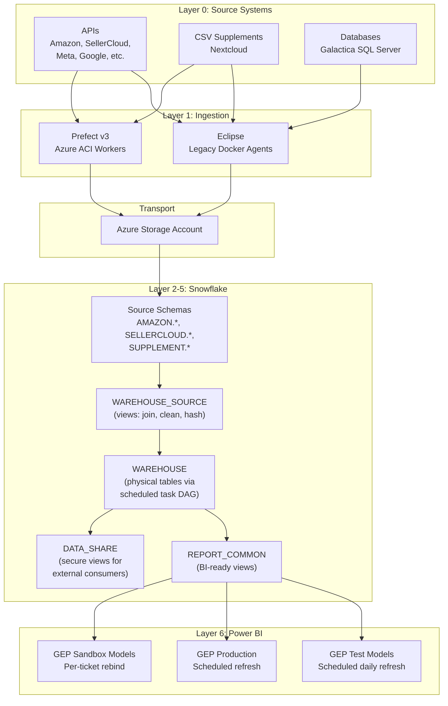

### 1.2 Current Feature Delivery Flow (as implemented by `/gep-feature`)

```mermaid
flowchart TD
    START(["/gep-feature GP-XXX"]) --> SCOPE

    subgraph SCOPE["Stage: Scoping"]
        S1[Fetch ticket from Jira MCP]
        S2[Interactive Q&A:<br/>data source, grain,<br/>delivery, business logic]
        S3[Write artifact.yaml]
        S4[Post questions to Jira<br/>via §C confirm-and-post]
    end

    SCOPE --> IMPL

    subgraph IMPL["Stage: Implementing"]
        direction TB
        I0["Eclipse gate<br/>(new data source only)"]

        subgraph SS1["Sub-step 1: Snowflake Sandbox"]
            I1[Create SANDBOX_DG1_GEP_ticket]
            I2[deploy.py --env sandbox]
            I3[validate.py --env sandbox]
            I4[Teardown prompt]
        end

        subgraph SS1B["Sub-step 1b: PBI Sandbox"]
            P1["Gate: pbi_model.required?"]
            P2[Rebind sandbox dataset<br/>via REST Update Parameters]
            P3[Apply TE CLI script<br/>via pbi_model_apply.exe]
            P4[Trigger + poll refresh]
            P5["Manual visual check<br/>(MANUAL)"]
        end

        subgraph SS2["Sub-step 2: TEST Deploy"]
            T1[Serialisation check]
            T2[deploy.py --env test]
            T3[validate.py --env test]
            T4[TE CLI apply to TEST<br/>+ refresh]
        end

        I0 --> SS1 --> SS1B --> SS2
    end

    IMPL --> TESTDEP["Stage: test-deployed"]

    subgraph TESTDEP_DETAIL["test-deployed steps"]
        TD1[PR: development → user-testing]
        TD2["PBI smoke-test (MANUAL)"]
        TD3[Post QA evidence to Jira §F]
        TD4[Notify client]
    end

    TESTDEP --> UAT["Stage: UAT<br/>(Blocked on client)"]
    UAT --> |"Change request"| FU["Stage: feature-update<br/>Delta Q&A only"]
    FU --> IMPL
    UAT --> |"Approved"| PROD

    subgraph PROD["Stage: prod-deployed"]
        PR1[deploy.py --env prod]
        PR2[validate.py --env prod]
        PR3{"visual_required?"}
        PR3 -->|No| PR4[TE CLI auto-apply<br/>to PROD + refresh]
        PR3 -->|Yes| PR5["Manual PBI Desktop<br/>publish (MANUAL)"]
        PR6[PR: user-testing → main]
        PR7[Post QA evidence to Jira]
    end

    PROD --> COMPLETE["Stage: complete"]

    style SS1 fill:#e8f5e9
    style SS1B fill:#e3f2fd
    style SS2 fill:#fff3e0
    style PROD fill:#fce4ec
```

### 1.3 Current Prefect Connector Workflow

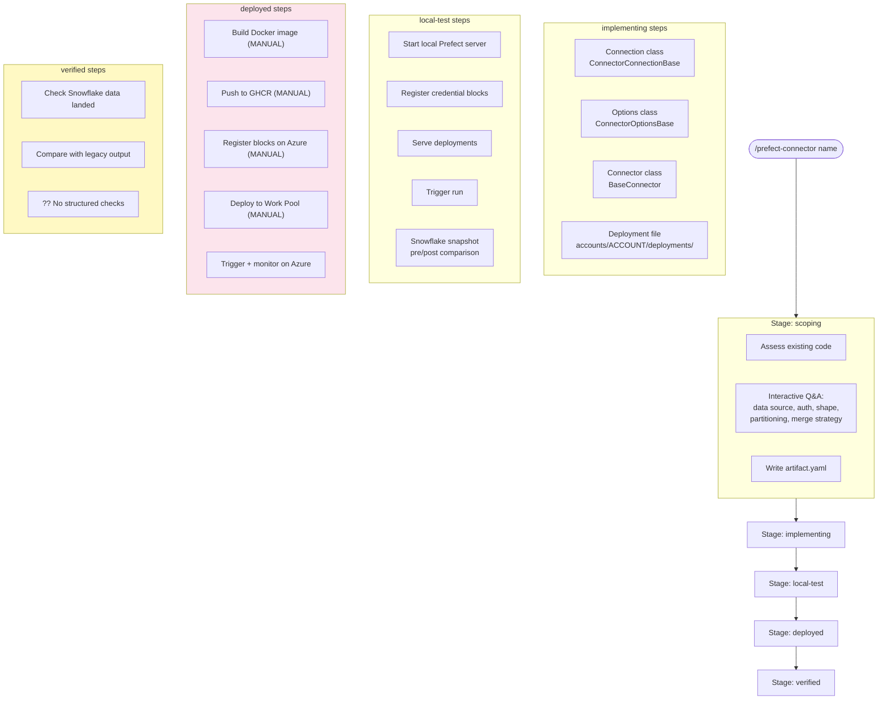

### 1.4 Current Distributed Workflow

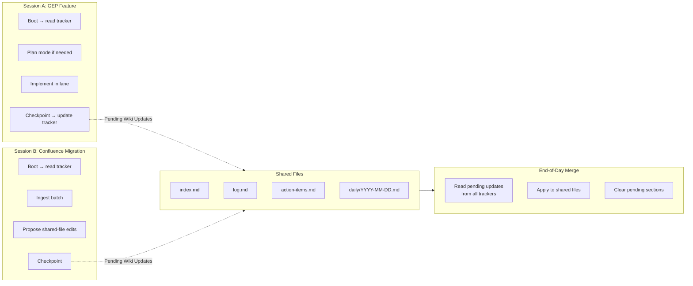

---

## 2. Gap Analysis

### 2.1 Missing Steps Summary

| Category | Gap | Current State | Impact | Where It Hurts |
|---|---|---|---|---|
| **Data Integrity** | No cross-DB comparison | Manual eyeballing of counts | Bugs ship to prod undetected | GP-208 found 2 bugs by eye |
| **Data Integrity** | No schema drift detection | Schema changes in source break views silently | Task chain failures at runtime | Data-share gaps (GP-200) |
| **Data Freshness** | No automated freshness monitoring | Accidental discovery only | 42-day stale data (SELLERCLOUD P&L) | GP-208 incident |
| **Data Quality** | No data drift alerting | No baseline comparison over time | Gradual quality degradation undetected | Volume shifts confuse stakeholders |
| **Deployment** | No rollback mechanism | Manual re-deploy of prior SQL | Recovery time = manual re-deploy duration | Every failed deploy |
| **Deployment** | No CI/CD for Snowflake | deploy.py is local-only | Single point of failure (Paul's machine) | Bus factor = 1 |
| **Deployment** | Prefect deploy is fully manual | Docker build + push + register + deploy | ~30 min per deploy, error-prone | Every connector deploy |
| **Monitoring** | No post-deploy monitoring | One-shot flight check, manually triggered | Issues between flight checks go unnoticed | Stale data, silent failures |
| **Monitoring** | No PBI refresh failure alerting | Check refresh history manually | Failed refreshes discovered late | Every PBI credential expiry |
| **Snowflake** | No environment promotion gate | Copy-paste between envs | Wrong version deployed to wrong env | Every multi-env ticket |
| **Snowflake** | No DDL version tracking | Views defined in repo but not versioned on deploy | No audit trail of what ran when | Post-incident forensics |
| **Power BI** | No visual regression testing | Manual eyeball in browser | Regressions missed | Every PBI deploy |
| **Prefect** | No structured post-deploy validation | "Check Snowflake data landed" | Connector correctness is guessed | Every new connector |
| **Prefect** | No connector health monitoring | No recurring health checks | Silent connector failures | Token expiry, API changes |
| **Cross-Repo** | No coordinated deploy across clients + connector | Separate manual deploys | Timing gaps between data source and warehouse | New marketplace onboarding |
| **Cross-Env** | No TEST vs PROD data comparison | Assume TEST mirrors PROD via share | Share gaps cause TEST/PROD divergence | GP-200 share gap |

### 2.2 Missing Steps by Workflow Phase

```mermaid
flowchart TD
    subgraph MISSING_PRE["Pre-Deploy (MISSING)"]
        M1["Schema diff check<br/>(repo vs live Snowflake)"]
        M2["Dependency graph<br/>auto-resolution"]
        M3["Data share completeness<br/>audit vs SQL references"]
        M4["Environment promotion<br/>gate (sandbox → TEST → PROD)"]
    end

    subgraph MISSING_DEPLOY["Deploy (MISSING)"]
        M5["DDL version tracking<br/>(what ran, when, by whom)"]
        M6["Automated rollback<br/>(snapshot + restore)"]
        M7["Prefect CI/CD pipeline<br/>(build → push → deploy)"]
        M8["Cross-repo deploy<br/>coordination"]
    end

    subgraph MISSING_POST["Post-Deploy (MISSING)"]
        M9["Cross-env data comparison<br/>(TEST vs PROD counts)"]
        M10["Data drift detection<br/>(baseline vs current)"]
        M11["Data freshness monitoring<br/>(scheduled, alerting)"]
        M12["PBI refresh monitoring<br/>(failure alerting)"]
        M13["Connector health checks<br/>(scheduled, per-connector)"]
    end

    subgraph MISSING_OPS["Ongoing Ops (MISSING)"]
        M14["Automated flight check<br/>(scheduled, not manual)"]
        M15["Data share health<br/>monitoring + alerting"]
        M16["Token expiry tracking<br/>(OAuth refresh lifecycle)"]
        M17["Visual regression<br/>testing (PBI)"]
    end

    MISSING_PRE --> MISSING_DEPLOY --> MISSING_POST --> MISSING_OPS

    style MISSING_PRE fill:#fff3e0
    style MISSING_DEPLOY fill:#fce4ec
    style MISSING_POST fill:#e8eaf6
    style MISSING_OPS fill:#f3e5f5
```

---

## 3. Future State — Target Workflow Diagram

### 3.1 Full End-to-End Target Flow

```mermaid
flowchart TD
    TICKET([Jira Ticket Created]) --> SCOPE

    subgraph SCOPE["1. Scoping + Design"]
        S1["/gep-feature auto-fetches<br/>ticket + wiki context"]
        S2["Interactive requirements Q&A"]
        S3["Auto-generate deploy manifest"]
        S4["Auto-generate validate manifest"]
        S5["Post questions to Jira"]
    end

    SCOPE --> IMPL

    subgraph IMPL["2. Implementation"]
        I1["Write SQL / connector code"]
        I2["Schema diff: repo vs live<br/>⬆ NEW"]
        I3["Dependency graph: auto-resolve<br/>deploy order ⬆ NEW"]
    end

    IMPL --> SANDBOX

    subgraph SANDBOX["3. Sandbox Validation"]
        direction TB
        subgraph SF_SANDBOX["Snowflake Sandbox"]
            SB1["deploy.py --env sandbox"]
            SB2["validate.py universal checks"]
            SB3["Cross-DB comparison:<br/>sandbox vs baseline ⬆ NEW"]
            SB4["Data drift check:<br/>distribution analysis ⬆ NEW"]
        end

        subgraph PBI_SANDBOX["PBI Sandbox"]
            PB1["XMLA model apply"]
            PB2["REST refresh + poll"]
            PB3["DAX row-count verification"]
            PB4["Visual check (manual)"]
        end

        subgraph PF_SANDBOX["Prefect Sandbox ⬆ NEW"]
            PF1["Local Prefect run"]
            PF2["Snowflake snapshot comparison"]
            PF3["Output schema validation"]
            PF4["Data completeness check"]
        end

        SF_SANDBOX --> PBI_SANDBOX
        PF_SANDBOX -.->|"If connector work"| SF_SANDBOX
    end

    SANDBOX --> TEST

    subgraph TEST["4. TEST Deploy"]
        TE1["deploy.py --env test"]
        TE2["validate.py --env test"]
        TE3["Cross-env comparison:<br/>TEST vs PROD baseline ⬆ NEW"]
        TE4["PBI TEST apply + refresh"]
        TE5["Automated flight check ⬆ NEW"]
        TE6["Post QA evidence to Jira"]
    end

    TEST --> UAT["5. UAT (client)"]

    UAT --> PROD

    subgraph PROD["6. PROD Deploy"]
        PR1["deploy.py --env prod"]
        PR2["validate.py --env prod"]
        PR3["Cross-env comparison:<br/>PROD new vs PROD baseline ⬆ NEW"]
        PR4["PBI PROD apply/publish"]
        PR5["Automated flight check ⬆ NEW"]
        PR6["DDL version record ⬆ NEW"]
        PR7["Post QA evidence to Jira"]
    end

    PROD --> MONITOR

    subgraph MONITOR["7. Post-Deploy Monitoring ⬆ NEW"]
        MO1["Data freshness monitor<br/>(scheduled Snowflake task)"]
        MO2["PBI refresh monitor<br/>(alerting on failure)"]
        MO3["Data drift baseline<br/>update + alerting"]
        MO4["Connector health check<br/>(Prefect flow status)"]
        MO5["Data share integrity<br/>monitor"]
        MO6["Token expiry tracker"]
    end

    style SANDBOX fill:#e8f5e9
    style TEST fill:#fff3e0
    style PROD fill:#fce4ec
    style MONITOR fill:#e8eaf6
```

### 3.2 Target Prefect Connector Workflow

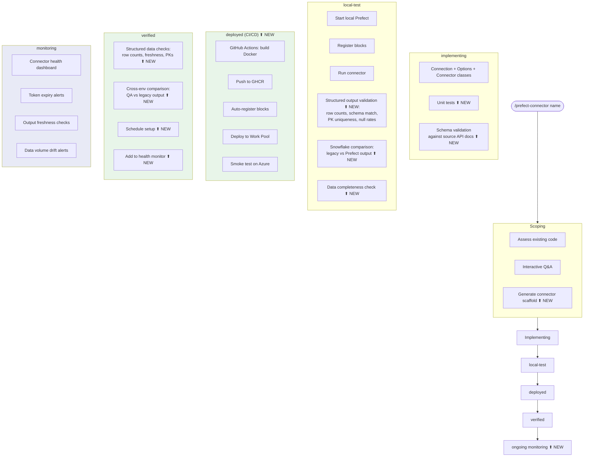

### 3.3 Target Data Quality Framework

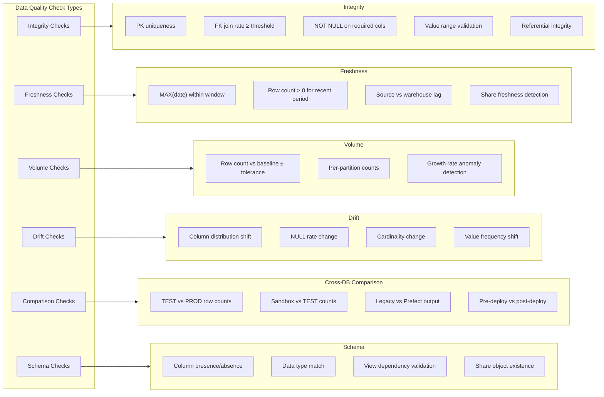

---

## 4. Detailed Gap Breakdown by Domain

### 4.1 Snowflake Gaps

| # | Gap | Current | Target | Effort |
|---|---|---|---|---|
| SF-1 | Schema diff (repo vs live) | None | Pre-deploy script compares CREATE OR REPLACE in repo vs INFORMATION_SCHEMA in Snowflake | Medium |
| SF-2 | Dependency auto-resolution | Explicit manifest list | Parse FROM references to build DAG | Medium |
| SF-3 | Data share audit | Manual SELECT attempts | Script scans SQL for `PROD_DG1_GEP.*` refs, verifies all exist | Low (designed, not built) |
| SF-4 | Cross-env comparison | None | validate.py --compare test prod --tables T1,T2 | Medium |
| SF-5 | DDL version tracking | None | Log table: deploy_id, file, hash, env, timestamp, user | Low |
| SF-6 | Automated rollback | None (manual re-deploy) | Pre-deploy snapshot of view DDL; restore on demand | Low (designed in workflow-automation) |
| SF-7 | Data freshness monitoring | Accidental discovery | Scheduled Snowflake task: check MAX(date) per table, alert if stale | Low (queries exist in flight-check) |
| SF-8 | Environment promotion gate | None | deploy.py refuses prod unless test validation passed | Low |
| SF-9 | Data drift detection | None | Baseline table of distributions; scheduled comparison | High |
| SF-10 | Task chain health monitoring | Manual Task History check | Scheduled check + alert on FAILED status | Low |

### 4.2 Power BI Gaps

| # | Gap | Current | Target | Effort |
|---|---|---|---|---|
| PBI-1 | Visual regression testing | Manual eyeball | DAX query snapshot comparison (v2d of Phase 6 plan) | High (no public API for visuals) |
| PBI-2 | Refresh failure alerting | Manual check of refresh history | Scheduled REST poll + alert on Failed status | Low |
| PBI-3 | Credential expiry tracking | Manual calendar check | Automated check of credential expiry dates | Low |
| PBI-4 | TEST → PROD dataset comparison | None | DAX COUNTROWS comparison across workspaces | Medium |
| PBI-5 | Deployment Pipeline integration | Not configured | Set up PBI Deployment Pipeline for stage promotion | Medium (v2a of Phase 6) |
| PBI-6 | TMDL version control | Binary .pbix only | pbi-tools extraction to text-based model definition | Medium (v2b of Phase 6) |

### 4.3 Prefect Gaps

| # | Gap | Current | Target | Effort |
|---|---|---|---|---|
| PF-1 | CI/CD pipeline | Manual Docker build + push | GitHub Actions on merge to main | Medium (GP-217 planned) |
| PF-2 | Structured post-deploy validation | None | validate.py equivalent for connector output tables | Medium |
| PF-3 | Connector health monitoring | None | Scheduled Prefect flow that checks all deployments | Medium |
| PF-4 | Token expiry tracking | Manual runbook | Automated check + alert before expiry | Low |
| PF-5 | Legacy vs Prefect output comparison | Manual spot-check | Structured row-count + schema comparison | Medium |
| PF-6 | Auto block registration on deploy | Manual script | Deploy pipeline registers blocks automatically | Medium |
| PF-7 | Per-connector environment promotion | Global Work Pool switch | Per-deployment Work Pool assignment (documented but not tooled) | Low |

### 4.4 Cross-Cutting Gaps

| # | Gap | Current | Target | Effort |
|---|---|---|---|---|
| CC-1 | Cross-repo deploy coordination | Separate manual deploys | Parent `/feature` skill orchestrating connector + clients | High |
| CC-2 | Automated flight check | Manual, ad-hoc | Scheduled (daily/weekly) with alerting | Medium |
| CC-3 | Deploy audit trail | None | Central log: what deployed, where, when, by whom | Low |
| CC-4 | Observability integration | Separate project | Data pipeline metrics feed into observability platform | High |

---

## 5. Implementation Options

### 5.1 Comparison Matrix

| Dimension | Option A: Incremental Automation | Option B: Data Quality Platform | Option C: Full CI/CD Pipeline |
|---|---|---|---|
| **Philosophy** | Extend existing scripts (deploy.py, validate.py) with missing checks | Build a dedicated data quality layer that all workflows feed into | Build end-to-end CI/CD with automated gates at every stage |
| **Effort** | Low-Medium (3-6 weeks) | Medium-High (6-10 weeks) | High (10-16 weeks) |
| **Risk** | Low — each piece ships independently | Medium — needs schema design upfront | High — big bang; partial state is awkward |
| **Biggest win** | Closes the most painful gaps fast | Creates a reusable quality framework | Eliminates all manual deploy steps |
| **Biggest weakness** | No unified quality framework; checks scattered across scripts | Delays deployment automation | Over-engineers for current team size (1 engineer) |
| **Prereq** | aldc-shipyard repo (exists) | aldc-shipyard + Snowflake monitoring schema | GitHub Actions + secrets management + Snowflake CI account |
| **Multi-client ready** | Per-client config files | Built-in multi-client from day 1 | Per-client pipeline configs |

---

### 5.2 Option A — Incremental Automation (Recommended for v1)

**Thesis:** extend the existing deploy.py + validate.py + /gep-feature skill with the highest-impact missing checks, keeping the current architecture. Ship each piece independently.

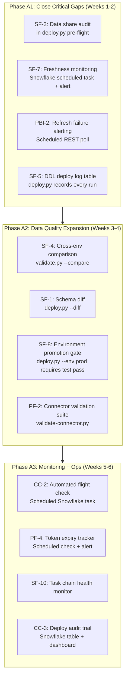

**Implementation details for key pieces:**

**A1.1 — Freshness monitoring (SF-7):**
```sql
-- Snowflake scheduled task (runs hourly)
CREATE OR REPLACE TASK MONITORING.CHECK_DATA_FRESHNESS
  WAREHOUSE = COMPUTE_WH
  SCHEDULE = 'USING CRON 0 * * * * America/Vancouver'
AS
INSERT INTO MONITORING.FRESHNESS_ALERTS
SELECT table_name, max_date, CURRENT_TIMESTAMP() as checked_at,
       DATEDIFF(hour, max_date, CURRENT_TIMESTAMP()) as hours_stale
FROM (
  SELECT 'SALES_DIM_ORDER_BASE' as table_name,
         MAX(CREATE_DATE) as max_date FROM WAREHOUSE.SALES_DIM_ORDER_BASE
  UNION ALL
  SELECT 'INVENTORY_FCT_BALANCE',
         MAX(BALANCE_DATE) FROM WAREHOUSE.INVENTORY_FCT_BALANCE
  -- ... per table
)
WHERE DATEDIFF(hour, max_date, CURRENT_TIMESTAMP()) > threshold;
```

**A1.2 — Cross-env comparison (SF-4):**
```python
# validate.py --compare test prod --tables SALES_DIM_ORDER_BASE,INVENTORY_FCT_BALANCE
# Runs the same count/distribution queries against both envs
# Reports: row count diff, column distribution diff, date range diff
```

**A1.3 — Deploy audit trail (SF-5):**
```sql
CREATE TABLE MONITORING.DEPLOY_LOG (
    deploy_id VARCHAR,
    ticket VARCHAR,
    env VARCHAR,      -- sandbox | test | prod
    file_name VARCHAR,
    file_hash VARCHAR,
    deployed_at TIMESTAMP_NTZ,
    deployed_by VARCHAR,
    status VARCHAR,   -- success | failed | rolled_back
    duration_seconds NUMBER
);
```

**Pros:**
- Each piece ships independently — no big-bang risk
- Extends proven tools (deploy.py, validate.py) rather than building new ones
- Lowest effort to close the most painful gaps
- Natural fit with the existing /gep-feature skill flow

**Cons:**
- Quality checks scattered across multiple scripts and Snowflake tasks
- No unified "data quality dashboard" — results in different places
- Doesn't address Prefect CI/CD (manual deploy remains)

---

### 5.3 Option B — Data Quality Platform

**Thesis:** build a unified data quality framework in Snowflake (a MONITORING schema) that all workflows feed into. Every check — integrity, freshness, drift, comparison — writes results to the same schema, enabling a single dashboard and alerting system.

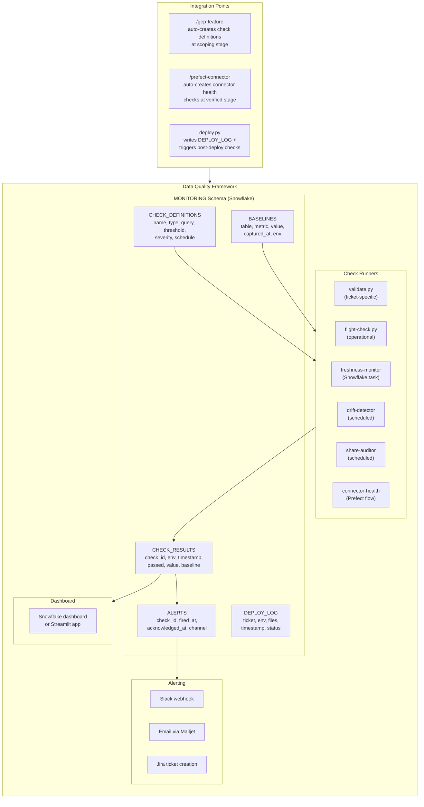

**Implementation phases:**

**B1 (Weeks 1-3): Schema + core runners**
- Design and create MONITORING schema (CHECK_DEFINITIONS, CHECK_RESULTS, BASELINES, DEPLOY_LOG, ALERTS)
- Port existing validate.py checks to write results to CHECK_RESULTS
- Port flight-check queries to a flight-check.py runner
- Baseline capture script

**B2 (Weeks 3-6): Automated checks + alerting**
- Freshness monitor (Snowflake scheduled task writing to CHECK_RESULTS)
- Data share auditor (scheduled)
- Drift detector (baseline comparison)
- Slack/email alerting from ALERTS table
- Token expiry tracker

**B3 (Weeks 6-8): Skill integration**
- /gep-feature auto-creates check definitions at scoping
- /prefect-connector creates connector health checks at verified
- deploy.py writes to DEPLOY_LOG and triggers post-deploy check suite

**B4 (Weeks 8-10): Dashboard + cross-env comparison**
- Streamlit or Snowflake dashboard showing check results over time
- Cross-env comparison checks (TEST vs PROD)
- Data drift trending

**Pros:**
- Unified quality framework — all checks in one place
- Historical trending — can track quality over time
- Multi-client from day 1 — CHECK_DEFINITIONS are parameterised
- Reusable for any new client onboarding
- Natural foundation for the observability platform integration

**Cons:**
- Higher upfront investment before any check runs
- Schema design is load-bearing — changes are expensive
- Doesn't address deployment automation (Prefect CI/CD still manual)
- Risk of over-engineering for current team size

---

### 5.4 Option C — Full CI/CD Pipeline

**Thesis:** build end-to-end CI/CD so that a merge to the right branch automatically deploys, validates, and monitors. Every manual step becomes a pipeline stage.

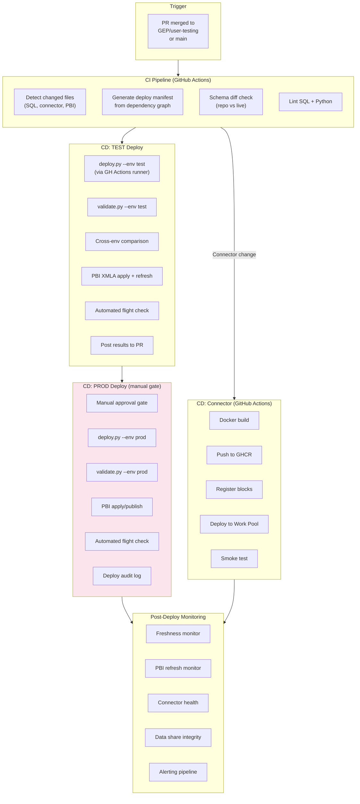

**Implementation phases:**

**C1 (Weeks 1-4): GitHub Actions foundation**
- CI pipeline: detect changed files, generate manifest, lint
- Secrets management: Snowflake credentials in GitHub Secrets
- Self-hosted runner (or Azure-hosted) with Snowflake network access
- TEST deploy on merge to GEP/user-testing

**C2 (Weeks 4-8): Validation + quality gates**
- validate.py as a CI step
- Cross-env comparison as a CI step
- PBI XMLA apply via CI (requires Azure auth in CI)
- Results posted as PR comments

**C3 (Weeks 8-12): PROD deploy + connector CI/CD**
- Manual approval gate for PROD
- PROD deploy pipeline
- Connector Docker build + push pipeline (GP-217)
- Auto block registration

**C4 (Weeks 12-16): Monitoring + observability**
- All monitoring checks from Option B
- Integration with observability platform
- Dashboard

**Pros:**
- Eliminates all manual deploy steps
- Full audit trail via CI logs
- Reproducible deploys — no "works on Paul's machine"
- Natural multi-developer scaling

**Cons:**
- Highest effort and longest time to first value
- Secrets management complexity (Snowflake creds in CI)
- Network access: GitHub Actions runner must reach Snowflake + PBI + Azure
- Over-engineered for current team size (1 engineer)
- Partial state is awkward — half-built CI/CD is worse than manual

---

## 6. Recommendation

### Primary: Option A first, evolve toward Option B

**Rationale:**
1. **Option A delivers value in week 1.** The first piece (data share audit baked into deploy.py pre-flight) closes the most painful gap immediately. Each subsequent piece is independently shippable.
2. **Option B is the right long-term architecture** but requires schema design upfront. After Option A closes the acute gaps, refactor the scattered checks into the MONITORING schema as a follow-on workstream.
3. **Option C is premature** for a team of 1. The overhead of CI/CD secrets management, network access, and pipeline maintenance exceeds the benefit until the team grows or deploy frequency increases.

### Suggested implementation order (combining A → B):

| Week | Deliverable | Option | Impact |
|---|---|---|---|
| 1 | Data share audit in deploy.py pre-flight | A1 | Prevents the #1 deploy failure mode |
| 1 | DDL deploy log table | A1 | Audit trail for every deploy |
| 2 | Freshness monitoring (Snowflake task + alert) | A1 | Prevents 42-day stale data incidents |
| 2 | PBI refresh failure alerting | A1 | Catches expired credentials fast |
| 3 | Cross-env comparison (validate.py --compare) | A2 | Catches TEST/PROD divergence |
| 3 | Schema diff (deploy.py --diff) | A2 | Pre-deploy safety check |
| 4 | Environment promotion gate | A2 | Prevents wrong-env deploys |
| 4 | Connector validation suite | A2 | Structured Prefect post-deploy checks |
| 5-6 | MONITORING schema + migrate checks | B1 | Unified quality framework |
| 7-8 | Automated flight check + alerting | B2 | Replaces manual ops checks |
| 9-10 | Skill integration + dashboard | B3-B4 | Full loop closure |

### What stays manual (accepted):
- PBI visual regression testing (no public API)
- PBI Desktop publish for visual-bearing changes
- Client UAT (human judgment)
- Connector Docker build + push (until GP-217 CI/CD pipeline ships)

---

## 7. Architectural Notes

### 7.1 Where each piece lives

| Component | Location | Why |
|---|---|---|
| deploy.py, validate.py | aldc-shipyard | Neutral ground; decoupled from clients/connector CI/CD |
| MONITORING schema | Snowflake (per-env) | Data quality results live alongside the data |
| Freshness/health tasks | Snowflake scheduled tasks | No external infra needed |
| PBI monitoring | aldc-shipyard scripts | REST API polling from Paul's machine or a scheduled agent |
| /gep-feature, /prefect-connector | ~/.claude/commands/ | Claude Code skill layer |
| Deploy manifests | clients repo (GEP/deploy_manifest/) | Per-ticket, version-controlled |
| Validate manifests | clients repo (GEP/validate_manifest/) | Per-ticket, version-controlled |

### 7.2 Credential model

| System | Auth method | Storage |
|---|---|---|
| Snowflake (deploy/validate) | Service account password | .env (gitignored) |
| Snowflake (monitoring tasks) | Task owner role | Snowflake RBAC |
| PBI REST | Azure CLI bearer token | In-memory, ~1h TTL |
| PBI XMLA | MSAL device-code | In-memory, MSAL cache |
| Prefect Server | HTTP Basic auth | .env / vault |
| Jira MCP | OAuth (Claude Code managed) | Claude Code session |

---

## See Also

- [[workflow-automation]] — parent design doc for GEP automation
- [[sandbox-feature-delivery]] — per-feature schema pattern
- [[phase6-pbi-automation-plan]] — PBI XMLA automation plan
- [[gep-snowflake-pbi-deployment]] — current GEP deployment runbook
- [[ticket-breakdown-to-ship]] — generic ticket lifecycle
- [[flight-check]] — current operational validation process
- [[data-pipeline-flow]] — end-to-end data architecture
- [[prefect-connector-deployment]] — Prefect deployment guide
- [[observability-architecture]] — company-wide monitoring (separate concern)
- [[Prefect]] — Prefect architecture and migration context
