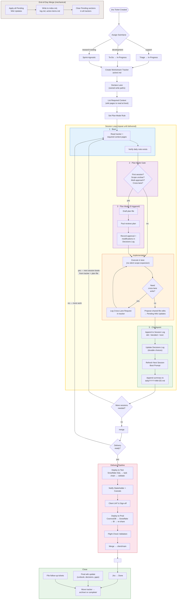

# Distributed Workflow — Ticket to Delivery

```mermaid
flowchart TB
    %% ── Ticket Intake ──
    ticket([Jira Ticket Created]) --> swimlane{Assign Swimlane}
    swimlane -->|support| triage[Triage → In-Progress]
    swimlane -->|development| todo[To-Do → In-Progress]
    swimlane -->|research-tooling| research[Sprint-Agnostic]
    triage & todo & research --> tracker

    %% ── Tracker Bootstrap ──
    tracker["Create Workstream Tracker<br/>active/<workstream>.md"]
    tracker --> declare["Declare Lane<br/>(owned write paths)"]
    declare --> required["List Required Context<br/>(wiki pages to read at boot)"]
    required --> plan_rule["Set Plan-Mode Rule"]

    %% ── Session Loop ──
    plan_rule --> session_start

    subgraph session_loop["Session Loop (repeat until delivered)"]
        direction TB

        subgraph boot["1 · Boot"]
            session_start["Read tracker +<br/>required context pages"]
            daily_check["Verify daily note exists"]
            session_start --> daily_check
        end

        subgraph plan_gate["2 · Plan-Mode Gate"]
            plan_decide{First session?<br/>Scope unclear?<br/>Multi-approach?<br/>Cross-lane?}
            daily_check --> plan_decide
        end

        subgraph plan_mode["3 · Plan Mode (if triggered)"]
            draft_plan["Draft plan file"]
            paul_review["Paul reviews plan"]
            record_decision["Record approval +<br/>modifications in<br/>Decisions Log"]
            draft_plan --> paul_review --> record_decision
        end

        subgraph execute["4 · Implementation"]
            stay_lane["Execute in lane<br/>(no silent scope expansion)"]
            cross_lane{"Need<br/>cross-lane<br/>write?"}
            cross_req["Log Cross-Lane Request<br/>in tracker"]
            propose["Propose shared-file edits<br/>→ Pending Wiki Updates"]
            stay_lane --> cross_lane
            cross_lane -->|yes| cross_req --> stay_lane
            cross_lane -->|no| propose
        end

        subgraph checkpoint["5 · Checkpoint"]
            session_log["Append to Session Log<br/>did: / decided: / next:"]
            decisions_log["Update Decisions Log<br/>(durable choices)"]
            refresh_boot["Refresh Next Session<br/>Boot Prompt"]
            daily_note["Append summary to<br/>daily/YYYY-MM-DD.md"]
            session_log --> decisions_log --> refresh_boot --> daily_note
        end

        plan_decide -->|yes| draft_plan
        plan_decide -->|no| stay_lane
        record_decision --> stay_lane
        propose --> session_log
    end

    %% ── Handoff ──
    daily_note --> handoff{More sessions<br/>needed?}
    handoff -->|"yes — next session boots<br/>from tracker + plan file"| session_start
    handoff -->|no| merge

    %% ── End-of-Day Merge ──
    subgraph merge_session["End-of-Day Merge (mechanical)"]
        apply["Apply all Pending<br/>Wiki Updates"]
        update_shared["Write to index.md,<br/>log.md, action-items.md"]
        clear["Clear Pending sections<br/>in all trackers"]
        apply --> update_shared --> clear
    end

    merge --> delivery_gate

    %% ── Delivery Pipeline ──
    subgraph delivery["Delivery Pipeline"]
        direction TB
        deploy_test["Deploy to Test<br/>Snowflake SQL → task chain → validate"]
        notify["Notify Stakeholder + Caveats"]
        uat["Client UAT & Sign-off"]
        deploy_prod["Deploy to Prod<br/>CosmosDB → Snowflake → BI → re-share"]
        flight["Flight Check Validation"]
        merge_main["Merge → client/main"]
        deploy_test --> notify --> uat --> deploy_prod --> flight --> merge_main
    end

    delivery_gate{Delivery<br/>ready?}
    delivery_gate -->|"no — more work"| session_start
    delivery_gate -->|yes| deploy_test

    %% ── Close ──
    merge_main --> close_out

    subgraph close["Close"]
        jira_done["Jira → Done"]
        wiki_final["Final wiki update<br/>(runbook, decisions, gaps)"]
        followups["File follow-up tickets"]
        archive["Move tracker →<br/>archive/ or complete/"]
        jira_done & wiki_final & followups --> archive
    end

    close_out[" "] --> jira_done

    %% ── Styling ──
    style session_loop fill:#fffde7,stroke:#FFC107,stroke-width:2px
    style boot fill:#e3f2fd,stroke:#1976D2
    style plan_gate fill:#f3e5f5,stroke:#7B1FA2
    style plan_mode fill:#f3e5f5,stroke:#7B1FA2
    style execute fill:#fff3e0,stroke:#E65100
    style checkpoint fill:#e8f5e9,stroke:#2E7D32
    style merge_session fill:#efebe9,stroke:#5D4037
    style delivery fill:#fce4ec,stroke:#C62828
    style close fill:#e8f5e9,stroke:#2E7D32
```
