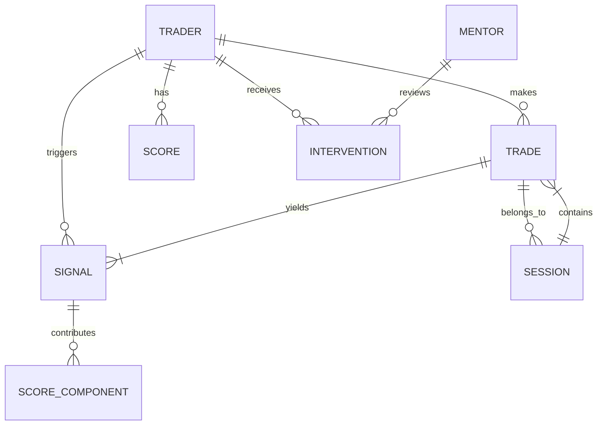
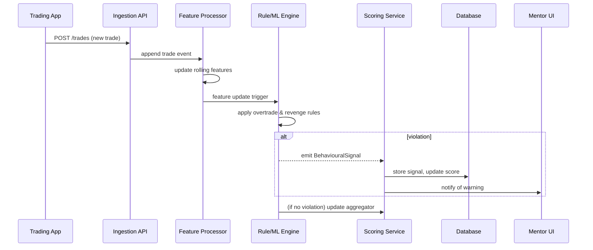

# Behavioural Analytics for Traders – Design of an Analytics Engine

## Executive summary

Retail trading is as much psychological as it is quantitative. This report designs an end-to-end behavioural analytics system for a trading mentorship platform, identifying common cognitive biases (e.g. overconfidence, anchoring, herding【2†L49-L57】), defining detection models for overtrading and revenge trading, and building composite scores and dashboards to improve trader discipline. The system ingests trade/event streams and market data in real time, computes features (trade counts, risk use, stop adherence, streaks), and runs a hybrid rule/ML engine to flag behavioural signals (excess turnover, loss-chasing trades, stop-skipping). A scoring layer produces a personalised **discipline index** (a weighted sum of risk-discipline metrics with decay), benchmarked against cohorts. Visual dashboards (heatmaps, timelines, alerts) highlight patterns such as weekend overtrading or revenge-trade streaks. Feedback mechanisms include real-time nudges (pop-ups/warnings when risky patterns emerge), automated coaching tasks (e.g. “you've risked 50% of budget this week – review your plan”), and human review workflows. 

Key technical choices: stream processing (for intraday pattern detection), time-series and OLAP stores (for rolling aggregates and long-term trends), and a policy engine (rules + ML models) decoupled from the trading system. Data privacy and PII minimisation are enforced by design. Monitoring covers model drift (e.g. strategy regime shifts) and alert fatigue. The final section presents evaluation metrics (precision/recall for detectors, calibration tests for scores, A/B uplift for interventions) and a 6-month implementation roadmap.

## 1. Psychological trading mistakes (bias taxonomy and drivers)

**Cognitive biases** frequently derail traders. A taxonomy of well-known biases includes overconfidence, **confirmation bias**, **herding**, **recency/availability bias**, **anchoring**, **loss aversion**, and the **gambler’s fallacy**【2†L49-L57】. For example, *overconfidence* leads traders to overestimate skill and take excessive risk, while *loss aversion* causes holding losers too long and selling winners too early (the disposition effect)【4†L269-L277】. Herding arises when traders mimic the crowd, often seen in momentum or breakout trades. In high-volatility markets or social-media driven “attention spikes,” emotions like fear and greed dominate, prompting impulsive trades and poor outcomes【7†L168-L177】. 

**Affective (emotional) drivers** include stress, regret, and the fixation on recent outcomes (“outcome bias”). Losses provoke strong emotions (despair, anger) that can trigger *compensatory risk-taking*—a hallmark of revenge trading【7†L153-L162】. Similarly, a sequence of wins often breeds overconfidence and excessive position sizing. Traders also exhibit the **status quo bias** (inaction bias), often avoiding rules (e.g. skipping stops) under stress. These biases are well-documented in behavioural finance research【2†L49-L57】【7†L153-L162】 and form the basis for detecting behavioural deviations.

## 2. Overtrading detection models

**Definition**: Overtrading is generally defined as excessive trading volume that harms performance. Empirical studies show a *negative correlation between trade volume and returns* for many retail traders【4†L231-L239】【4†L255-L264】. In practice, overtrading may be flagged when trade frequency or turnover exceeds expected norms **and** coincides with declining P&L. 

**Detection approaches** span:

- **Rule-based**: e.g. daily trade count exceeding a threshold (perhaps a percentile of past behaviour or peer cohort). For example, “>N trades in 24h with net loss” might trigger a flag. Trade count can be normalised by volatility or account size to avoid false alarms in high-volatility periods.
- **Statistical**: monitor moving averages of trade frequency or turnover; detect statistically significant spikes (Z-score or EWMA control chart). Monitor average win rate drop after high-activity periods.
- **Machine learning**: train classifiers on historical labelled data (if available). Features could include trade count per unit time, net liquidation value change, ratio of losing trades, etc. Techniques like isolation forest could detect outliers in multi-dimensional feature space. 

**Example rule-based criteria**:
```text
IF trades_in_last_1h > X AND (profit_pct_last_1h < 0)
THEN flag_overtrading
```

Where X may be e.g. 3× normal hourly volume. Controls: suppress repeated alerts (cooldown period), require consecutive signals, and optionally weight by significance of loss.  

**Features & thresholds**: Useful inputs include (a) trades per time interval; (b) average time between trades; (c) proportion of profits lost in recent trades; (d) deviations from personal baseline. False positives can be controlled by requiring a combination of metrics (e.g. high frequency *and* loss accumulation) or gradual thresholds.

**Precision/recall** for overtrading detection can be evaluated by labeling known overtrading episodes (via retrospective analysis or trader self-report). Use ROC curves to tune thresholds. Detectors should be conservative at first (low false-positive) and tune up as labelled data grows.

## 3. Revenge trading indicators

**Revenge trading** (chasing losses) is operationally defined as taking new trades in an attempt to recoup recent losses. It typically shows these patterns: a loss-making trade, followed within a short time by an impulsive new trade (often larger or riskier) without strategy justification.

**Temporal trigger**: e.g. within 5 minutes of a stop-out or large loss, with disregard of the original plan.  
**Features**:
- Loss size of previous trade (absolute or % of equity) above a threshold.
- Increase in position size or leverage relative to previous trade or plan.
- Trade placed at first available opportunity (zero wait time).
- Deviation from allowed order types (e.g. using market order instead of planned limit).

**Detection pseudocode**:
```text
if last_trade.profit_loss < -L_threshold:
   if new_trade.enter_time - last_trade.exit_time < T_window:
      if new_trade.risk > last_trade.risk * R_factor:
          flag_revenge = True
```
Where `L_threshold` could be a fraction of account size (e.g. 1%), `T_window` is short (minutes), and `R_factor>1` indicates increased risk. 

**Controls and nuances**: Only flag if the new trade lacks strong rationale (e.g. not in a pre-identified setup). Combine with emotion proxies if available (e.g. repeated cancellations). The preprint on outcome-focus notes that losses increase “reward signaling” which drives such behaviour【7†L153-L162】, so patterns are consistent.

**Evaluation**: Use labeled instances (for instance, tags by coaches or self-assessment) to measure recall/precision. Interventions (e.g. blocking trade) and trader feedback can help refine thresholds.  

## 4. Risk-discipline metrics

Risk adherence is quantified by metrics on each trade and the portfolio:

- **Risk per trade**: ratio of risk taken (e.g. distance to stop * position size) to account or strategy budget. Ideally ≤ 1–2%. Deviation (actual vs planned).
- **Stop placement**: how often stops are at planned levels. E.g. measure the distance from entry to stop vs ideal ATR-based distance. Percentage of trades where stop was closer (higher risk).
- **Max Adverse Excursion (MAE)**: maximum unrealised loss during the trade. High MAE% suggests poor stop discipline【18†L278-L287】.
- **Position sizing**: compare actual size to rule-of-thumb (Kelly, ATR%).
- **Time-in-trade vs plan**: e.g. cut loss too quickly or hold losers too long (disposition effect).
- **Portfolio drawdown/risk budget**: cumulative P&L vs allowed drawdown. If a trader exceeded their daily risk limit, it’s a violation.

These metrics can be computed from the trade journal. For example, MAE is defined as “the largest unrealized loss experienced during a trade”【18†L278-L287】. The system logs each trade’s entry, exit, stop, and records MAE%, final profit/loss%, and whether the stop was honored.

Quantify adherence as percent-of-trades meeting guidelines. E.g., “80% of trades had stops within planned range” or “95% of trades risk ≤2% of capital.” These percentages feed into composite scoring.

## 5. Behavioural scoring system

Aggregate metrics into a **discipline score** (e.g. 0–100). For example:

- **Components**: Subscores for “Overtrading”, “Revenge”, “Stop Discipline”, “Risk Sizing”, “Plan Adherence”.
- **Weighting and decay**: More recent behaviour weighs more (exponential decay on past violations). Weight components by severity (e.g. a massive stop-out violation > many small overtrading incidents).
- **Normalization**: Score can be percentile among similar traders (“cohort norms”) or scaled by targets (90%+ is excellent).
- **Calibration**: Align scores with outcomes (low-scoring traders underperform). Use calibration on historical data to ensure score correlates with actual performance issues.
- **Decay**: Older incidents gradually diminish (e.g., 50% weight after 30 days), so traders who improve can recover their score.

**Example composite**:
```
Score = 100 – (w_ot * overtrade_penalty + w_rev * revenge_penalty + w_risk * risk_penalty + ...)
```
Where `overtrade_penalty = count_overtrade_flags * 10`, etc. Adjust weights (w_ot, w_rev) to reflect concern levels and validated by user feedback. Regular benchmarking against peer group sets realistic expectations (e.g. “you took more risk per trade than 90% of our users”).

**Evaluation**: Treat score as a predicted “riskiness” label. Calibration plots (predicted vs actual loss frequency) ensure reliability. Uplift metrics (e.g. did interventions improve future scores?) gauge impact.

## 6. Data models and schemas

**Core entities**: Trader, Mentor, Trade (order, fill), Session, BehaviouralSignal, Score, InterventionTask.

*Example JSON trade event*:
```json
{
  "trade_id": "T123",
  "trader_id": "user_45",
  "timestamp": "2026-03-07T15:23:45Z",
  "instrument": "AAPL",
  "side": "buy",
  "quantity": 100,
  "entry_price": 150.0,
  "stop_price": 148.0,
  "exit_price": 149.0,
  "profit_loss": -100.0,
  "duration_sec": 3600
}
```

*Behavioural signal event* (output of detection):
```json
{
  "signal_id": "S678",
  "trader_id": "user_45",
  "timestamp": "2026-03-07T15:25:00Z",
  "type": "overtrading",
  "details": {"trades_in_last_hour": 5, "profit_loss_last_hour": -250},
  "severity": "high",
  "confidence": 0.85
}
```

*Composite score snapshot*:
```json
{
  "score_id": "SC901",
  "trader_id": "user_45",
  "timestamp": "2026-03-07T16:00:00Z",
  "score": 72,
  "components": {
    "overtrade_score": 80,
    "revenge_score": 60,
    "risk_score": 75
  }
}
```

*Intervention record*:
```json
{
  "intervention_id": "I345",
  "trader_id": "user_45",
  "timestamp": "2026-03-07T16:05:00Z",
  "type": "popup_warning",
  "content": "Your trading pace and recent losses exceed your normal limits. Consider taking a break or reviewing your plan.",
  "trigger_signal": "overtrading"
}
```

### ER diagram (core schema)



- **Trader** (or user) and **Mentor** entities link to trades, signals, scores.
- Each **Trade** can produce **BehaviouralSignal** flags.
- The **Score** aggregates components (overtrade, revenge, risk).
- **Intervention** tasks tie to signals and mentors.

## 7. Architecture and pipelines

The engine operates in real time on streaming data:

- **Ingestion**: Trades/orders and timestamps flow into the system (REST/webhook or exchange feed). Market data (for context) is optionally incorporated for context (e.g. volatility).
- **Feature extraction**: A stream processor computes rolling features per trader (e.g. `trades_last_5m`, `recent P/L`, `avg_risk_per_trade`).
- **Detectors**: A CEP/rule engine runs rule-based or ML-based checks on feature streams. E.g., a streak-of-losses pattern detector for revenge trading (sequence trigger), or an aggregate check for overtrading.
- **Scoring**: A stateful service updates each trader’s composite score as new signals arrive (e.g. applying decay on old violations).
- **Storage**: Raw events in append-only log (Kafka or event store), aggregated features in time-series DB, scores in OLTP, compliance for audit.
- **API and UI**: 
  - Query endpoints for scores, historical signals.
  - Mentor dashboard subscriptions (WebSocket alerts).
  - Triggering interventions (via WebSocket or REST callback).

Sequence of processing (mermaid):



## 8. Detection algorithms (pseudocode)

**Overtrading**:
```python
window = 60*60  # 1 hour
if count_trades(trader, last=window) > trades_threshold:
    if pnl(trader, last=window) < pnl_threshold:
        emit_signal(trader, "overtrading", details)
```
With threshold calibrated (e.g. `trades_threshold=10`, `pnl_threshold=0`) and requiring both conditions to limit false positives.

**Revenge trading**:
```python
last_trade = get_last_trade(trader)
if last_trade.profit_loss < -loss_thresh:
    next_trade = wait_for_next_trade(trader)
    if next_trade and (next_trade.size > last_trade.size * 1.5):
        emit_signal(trader, "revenge_trading", details)
```
`loss_thresh` might be e.g. 1% of equity; larger factor for “increased risk”.

**Scoring aggregation**:
```python
score = 100
for signal in new_signals:
    if signal.type == "overtrading":
        score -= 10 * signal.severity
    if signal.type == "revenge_trading":
        score -= 15 * signal.severity
    if signal.type == "stop_loss_skipped":
        score -= 5 * signal.severity
score = max(score, 0)
```

Decay and recency can be handled by age-weighting signals (older signals add less penalty).

## 9. Psychology dashboards and alerts

Visualisations should highlight *behavioural patterns over time*:
- **Heatmaps**: e.g. hourly or weekday heatmap of trade counts/loss frequency to spot overtrading clusters.
- **Timelines**: chart of daily composite score and component flags, with markers where violations occurred.
- **Drill-down tables**: recent trades with colour coding on risk metrics (e.g. high-leverage trades highlighted).
- **Alerts**: in-UI or push notifications when key breaches happen (e.g. "consecutive 3 loss-trades", or score<50).
- **Mentor view**: aggregated view of all mentees, their trend of scores, flagged high-risk behaviours.

**UX notes**: Keep visuals simple (no graphs of cognitive models). Prioritise clarity: e.g. “Goal vs Actual” bars for risk use, timeline of P/L vs threshold. Mentors should be able to annotate (approve or escalate flags).  

## 10. Feedback and intervention

**Nudges**: Real-time prompts in the trading UI (or app) when detection occurs. For example: “You have placed 5 trades this hour with losses. Consider pausing and reviewing your strategy.” These are non-blocking alerts.

**Coaching workflows**: 
- On flag, optionally assign a mentor task (e.g. in platform’s CRM) to review with trader.
- Provide educational links (e.g. articles on loss-chasing) in the alert content.
- Schedule “trade review” sessions after key incidents.

**Automated interventions**: For severe cases, one could auto-lock new trades for N minutes (with trader consent) – though this must be opt-in and carefully managed.

**A/B testing**: Randomly apply some interventions to a subset of users to measure effect on behaviour and P/L over time. For example, some traders get a warning popup, others just a log, to test nudge efficacy.

**Human-in-loop**: Allow mentor override of flags (e.g. if the flag was a false positive or the trader had a good reason). Keep audit logs of overrides.

## 11. Evaluation metrics

- **Detection (classification)**: Precision, recall, F1 score for behavioural flags (requires labeled incidents). ROC curves for threshold tuning.
- **Calibration**: Compare predicted “riskiness” vs observed performance loss (e.g. Brier score for probability outputs).
- **Uplift**: When interventions deployed (A/B test), measure changes in trading metrics (e.g. average trades/day, win-rate) or reduction in violations among the treated group vs control.
- **User feedback**: Surveys or self-assessment correlation (did the trader agree the alert was helpful?).

## 12. API design

Endpoints (REST + WebSocket):

- **Ingestion**:
  - `POST /v1/trades` – submit new trade data.
  - `POST /v1/session/start` / `/end` (optional session tracking).
- **Query**:
  - `GET /v1/trades?trader=...&from=...&to=...`
  - `GET /v1/scores?trader=...`
  - `GET /v1/signals?trader=...&type=...`
  - `GET /v1/alerts?trader=...`
- **Alerts**:
  - WebSocket topic `alerts/{trader_id}` – push notifications of new flags or interventions.
- **Interventions**:
  - `POST /v1/interventions` – create/resume coaching tasks.
  - `POST /v1/interventions/{id}/action` – e.g. mark as reviewed.

**Auth & rate limiting**:
- Use OAuth2 tokens per user (trader vs mentor roles).
- Rate-limit ingestion endpoints per account (e.g. 1000 events/min) to handle bursts.
- Mentor endpoints should paginate (100 mentees queries at once).

## 13. Storage and processing

- **Streaming**: Use a message bus (Kafka/RabbitMQ) to ingest trades in real time. Process with a stream processor (Flink, Spark Structured Streaming) for low latency feature updates.
- **Time-series DB**: Store per-minute aggregated features and scores (e.g. InfluxDB, TimescaleDB) for efficient temporal queries.
- **OLTP/OLAP separation**: Keep trade and signal records in OLTP for consistency; analytics/aggregates in OLAP (e.g. ClickHouse, BigQuery) for dashboards.
- **Retention**: Keep behavioural event history (signals, scores) at least 1 year, anonymise or delete after if required by GDPR. Raw trade data often must be kept (broker rules).
- **Privacy**: Avoid storing sensitive PII (address, identity). Trader ID pseudonymisation where possible. 
- **Encryption**: TLS in transit; encrypt data at rest (trading data is financial data).

## 14. Monitoring and observability

Monitor:
- **Data pipelines** (lag, failures).
- **Detection metrics**: count of signals/day, distribution by trader; watch for unusual spikes (model drift).
- **False-positive rates**: periodically review a sample of flags. 
- **System health**: stream lag, API latency, error rates.

Alerts:
- High error rate on inference (e.g. exceptions).
- Sudden drop in ingestion (source issue).
- Model performance degrade (drop in expected recall vs baseline in test sets).

## 15. Security, privacy, and compliance

- **PII minimisation**: Only store necessary user identifiers. E.g. no passport or SSN in this context.
- **Encryption**: As above.
- **Consent**: Traders must consent to behavioural monitoring; provide clear privacy notice. GDPR rules apply (right to access/export their data).
- **Data export**: Provide endpoints for exporting a trader’s own behavioural data and scores.
- **Audit logs**: record all interventions and overrides (with timestamps and user IDs).
- **Access control**: Strict permissions (e.g. mentor can see mentee’s scores but not other private data).
- **GDPR**: Allow users to delete account (erasure) with data anonymization if required.
- **Retention policy**: automatically purge or anonymize old raw logs beyond regulatory needs.

## 16. Testing and validation

- **Synthetic replay**: Use historical trade logs (possibly anonymized) to replay through the engine. Check if it flags known episodes (backtesting rules).
- **Shadow mode**: Deploy new models/rules in logging-only mode for a subset of users, compare with baseline metrics.
- **A/B testing**: Randomly assign interventions to measure effect on behaviour metrics and P&L. 
- **Human labelling**: Periodically have mentors label episodes (e.g. “yes this was chasing losses”) to refine detection rules.
- **Longitudinal studies**: Track cohorts over months to see if scores predict long-term performance or if coaching improves metrics.

## 17. 6-month roadmap

```mermaid
gantt
  title Behavioural Analytics Platform Roadmap (6 months)
  dateFormat  YYYY-MM-DD
  axisFormat  %b '%y

  section Foundations
  Requirements & Design           :a1, 2026-03-10, 15d
  Bias/Behavior Model Design     :a2, after a1, 10d
  Core Data Schema & API         :a3, parallel with a2, 10d

  section Data & Detection
  Implement Trade Stream Ingest  :b1, 2026-03-25, 15d
  Overtrade/Patterns Engine      :b2, after b1, 20d
  Revenge Trade Detector         :b3, after b2, 15d

  section Scoring & Dashboards
  Risk Metrics Computation       :c1, 2026-04-20, 15d
  Composite Score System         :c2, after c1, 15d
  Dashboard Prototypes           :c3, parallel with c2, 20d

  section Alerts & Interventions
  Alerts/Nudge Framework         :d1, 2026-05-10, 15d
  Mentor Coaching UI             :d2, after d1, 20d
  Intervention Workflows         :d3, after d2, 15d

  section Testing & Review
  Synthetic Replay Validation    :e1, 2026-05-25, 15d
  Beta Pilot with Mentors        :e2, after e1, 30d
  Feedback Iteration             :e3, after e2, 15d

  section Hardening
  Monitoring & Security          :f1, 2026-06-20, 20d
  Privacy & Compliance Audit     :f2, parallel with f1, 10d
  Release v1.0                   :f3, after f1 and f2, 2026-07-10, 1d
```

**Milestones**:
- *M1 (end Mar)*: Trade ingestion live, basic overtrading and risk metrics computed.
- *M2 (end Apr)*: Behavioural detectors (overtrade, revenge) deployed; risk adherence scored.
- *M3 (mid May)*: Scorecard and dashboards prototype; initial alerts.
- *M4 (end May)*: Pilot test with mentors/traders (shadow mode); refine thresholds.
- *M5 (mid Jun)*: Launch nudges and mentor-feedback loop; QA and security review.
- *M6 (early Jul)*: V1 release; measure uptake (number of alerts, user actions, score distribution).

**Success metrics**: Reduction in average daily trade count or position sizing among flagged traders; positive mentor feedback; measurable improvement in disciplined behaviour (e.g. fewer stop-skips) in pilot; engagement with coaching.

**Assumptions**: Traders consent to monitoring; initial data volume moderate; mentors available to review flagged cases; algorithms tuned to reduce false alarms (false positives can cause frustration).

**Sources**: Academic reviews on behavioural trading【2†L49-L57】【4†L255-L264】【7†L153-L162】, metrics references【18†L278-L287】, and industry knowledge on trader psychology and best practices in behavioural finance. (Data gaps: No standardized “score” exists—design is inferred from analogous risk-compliance systems. Regulatory guidance on behavioral alerts is nascent; we assume ethical best practice as above.)