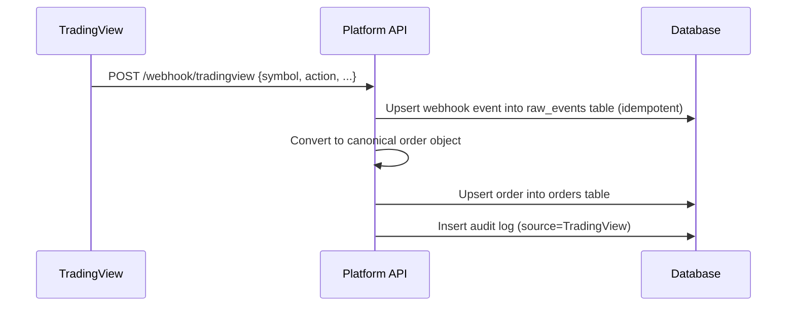
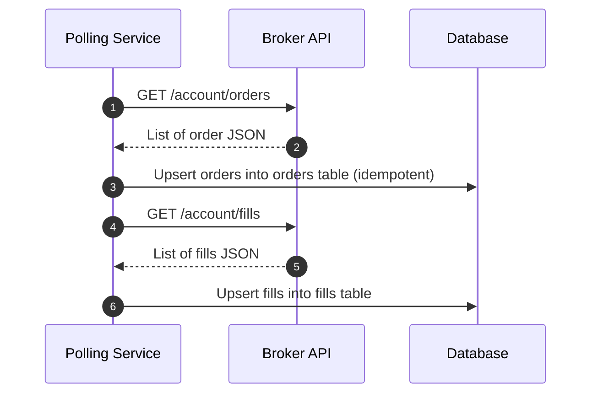
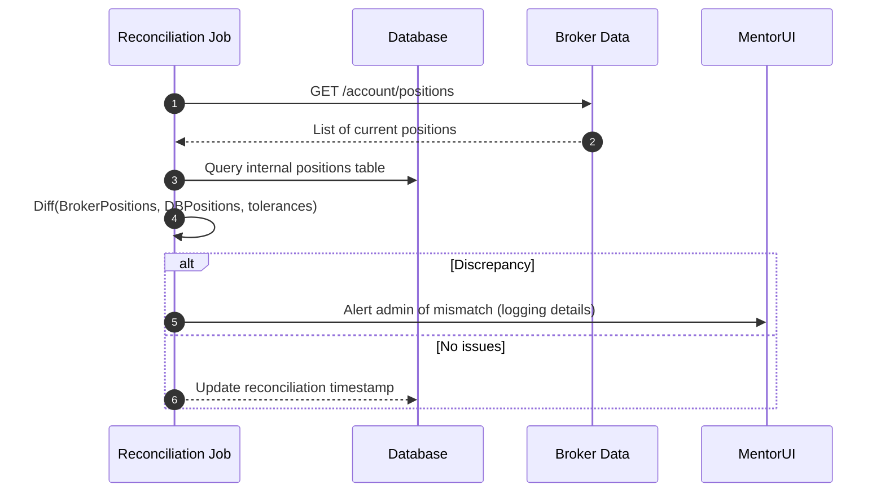
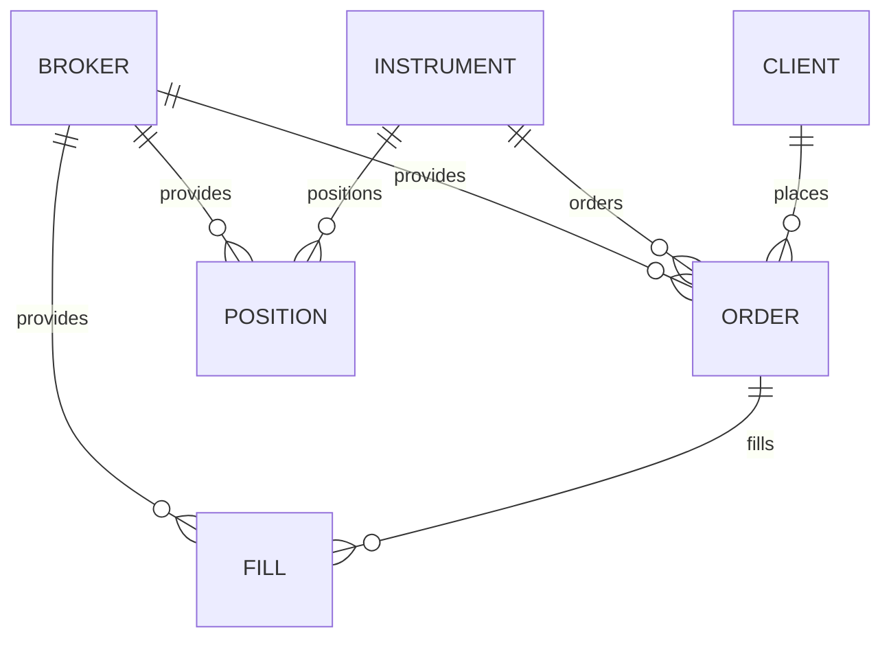
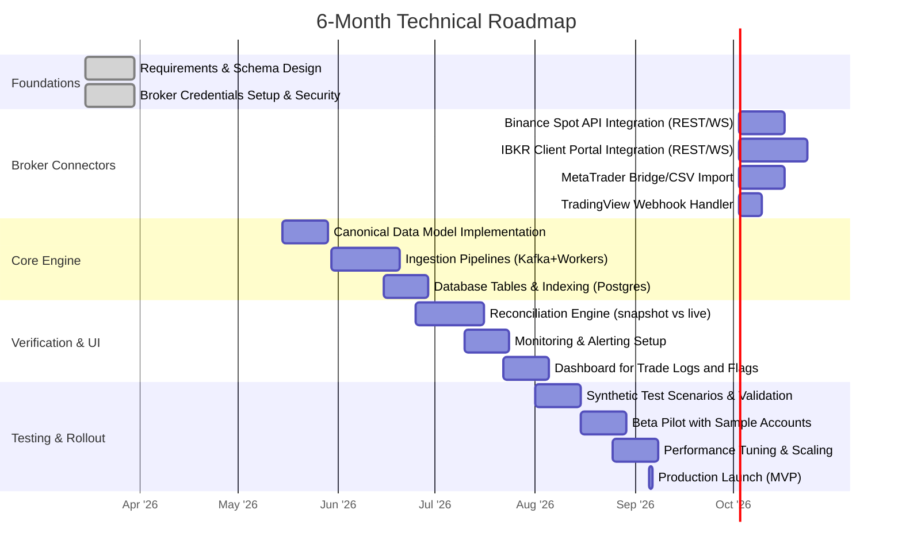

# Broker API Integration and Trade Import Infrastructure

## Executive Summary

Integrating multiple broker APIs into one platform requires unifying diverse order/fill models into a **canonical schema**, and building reliable ingestion and reconciliation pipelines. We examine **MetaTrader (MT4/MT5)**, **Interactive Brokers (IBKR)**, **Binance**, and **TradingView** integration specifics. MT5 distinguishes **orders, deals, and positions** (netting mode only one position per symbol). IBKR’s Client Portal API offers both REST and WebSocket streams (“sor” topic for live orders) and supports complex orders. Binance Spot uses REST (e.g. POST `/api/v3/order` and `/api/v3/orderList/oco` for OCO orders) and WebSocket user data streams; it enforces strict rate limits (weights) and idempotency via clientOrderId. TradingView alerts send webhooks as JSON (if message is JSON) or text with a 3-second timeout; payloads must be secured (2FA required and specific IPs).

We propose a _canonical data model_ (unified order/fill/position schema) and ingestion layer supporting **webhooks, polling, and file import**. Core tables (orders, fills, positions) are partitioned by time (e.g. monthly) for performance. Each ingestion path writes to the canonical tables with idempotency keys to dedupe (e.g. origClientOrderId mapping to previous orders). Reconciliation runs nightly: it queries broker feeds (via REST/WebSocket) to compare expected vs actual fills, using tolerance windows for timestamps/amounts. Audit logs and materialised views support manual review of mismatches.

The architecture uses a streaming event bus (e.g. Kafka) to buffer broker events, a stateless API layer (REST/WebSocket) for connectors, and a Postgres database for core records (partitioned by date for scale). We recommend row-oriented tables for trades (for OLTP queries) and optional columnar/OLAP for analytics. We include sample JSON schemas and Postgres DDL for the core tables. Endpoints support idempotent ingestion (`/v1/import/order`, etc.), WebSocket updates (`/ws/orders`), and reconciliation reports.

Finally, we outline monitoring (ingestion lag, duplicate rates, reconciliation failures), security (encrypt API keys, least-privilege access), and a 6-month roadmap (connecting each broker incrementally, piloting reconciliation, scaling to multiple accounts). All claims are supported by broker documentation (e.g. MT5 manual, IBKR API docs, Binance docs, TradingView support) or relevant standards (FIX dictionary, Postgres partitioning guide).

## MetaTrader (MT4/MT5) Integration

**MetaTrader platforms** expose trade data in the terminal’s local history or via bridging solutions. Key distinctions:

- **Orders, Deals, Positions**: In MT5 (netting accounts), an _Order_ represents a request, which can generate one or more _Deal_ records (partial fills). Each symbol has at most one _Position_ (aggregate of deals). In MT4 (netting mode), similar concepts exist but MT4 lacks a native “position” object (the net position is implied). In MT5 hedging mode, multiple positions per symbol (long vs short) are allowed; in netting mode only one.
- **Execution/Export**: Trades may be exported via CSV (manual) or via APIs in Expert Advisors. For reliable import, a bridge component can connect to the MT terminal’s trade events, or use the MQL5 Manager API (DLL) to stream orders/deals.
- **Hedging vs Netting**: The account type (set by broker) determines behaviour. In hedging accounts, we may see multiple open positions per symbol; in netting accounts (more common), each order updates the single position.
- **Bridges**: Third-party “MT–MT5 bridge” or custom code is often used to continuously fetch the current open orders/deals/positions and send them via API. We assume a local agent will push events to our ingestion endpoint.

No standard online REST API is provided by MetaQuotes; integration relies on local terminal hooks or the Manager API, so we treat it as a push/poll data source.

## Interactive Brokers API (IBKR)

Interactive Brokers offers two main API surfaces:

- **Client Portal Web API**: HTTP/REST endpoints (on a localhost gateway) and WebSocket topics. The Client Portal (CP) supports OAuth and websockets for **live order updates**. For example, subscribe to the `sor` topic for streaming order events. Alternatively, one can query `/iserver/account/orders` to retrieve all orders (with fields like `orderId`, `status`, `filledQuantity` etc.).
- **TWS API / IB Gateway**: Traditional FIX/TWS API (socket, proprietary). We focus on CP API for simplicity since it uses JSON over HTTP/WebSocket.

Important aspects:

- **Order/Fill Models**: An IB order has an `orderId` and optional `origOrderType`, `filledQuantity`, `remainingQuantity`. Fills (executions) are streamed with separate execution reports.
- **Complex Orders**: OCO (One Cancels Other), OSO (One Sends Other) etc. IB represents these via multi-leg orders (an OCO is a combination of two orders with a `orderRef` linking them).
- **WebSocket vs REST**: We can use WebSocket for real-time updates (`sor` topic), or poll REST endpoints at intervals (`/account/orders`, `/iserver/account/fills`).
- **Fields to map**: IB’s JSON uses `orderId`, `origOrderType`, `side`, `status`, `lastExecutionTime` (timestamp). It also includes a client-specified ID (`order_ref`) for our idempotency.
- **Concurrency**: IB recommends initially pulling today’s orders via REST, then subscribing to `sor` for deltas. Careful rate limiting is needed (IB has undocumented limits; assume < 60 req/min).
- **Complex Orders**: IB’s structures may not explicitly label OCO; we rely on the `order_ref` or our own linking of leg orders from their combined ID fields.

_Citation:_ The IBKR Client Portal docs describe the `sor` (stream order) topic and the JSON structure (e.g. `orderId`, `status`, `clientOrderId`).

## Binance API (Spot/Margin/Futures)

Binance provides REST and WebSocket APIs:

- **REST Trading API**: For Spot (and similarly for Futures/Margin with different base URLs). Endpoints include `/api/v3/order` (new order, cancel, query) and `/api/v3/orderList/oco` for OCO orders. Each order can include `clientOrderId` (origClientOrderId) for idempotency.
- **User Data Streams (WebSocket)**: Listen to private streams for real-time updates on orders, trades, balances. Requires creating a listenKey and pinging it.
- **OCO Orders**: One Cancels the Other is supported (via deprecated `/order/oco` or new `/orderList/oco`). The response includes an `orderListId` linking the two legs.
- **Rate Limits**: Binance uses a weight system (e.g. POST OCO has weight 1). Public docs show weight and call limits (typically 1200 weight/min default).
- **Idempotency**: The `clientOrderId` (origClientOrderId) can be set by user to identify orders. Binance rejects duplicate `newClientOrderId` if the previous is still active.
- **Margin/Futures**: Similar endpoints exist under their respective API docs. Margin trading adds `marginOrder` fields; futures uses `/fapi`.
- **Mapping**: A Binance order response contains `orderId`, `status`, `price`, `origQty`, etc (stringified numbers). We map `orderId` -> canonical order_id, `symbol` to our instrument code, `price`/`origQty` to price/quantity, etc. Fills come as “executions” (use the aggregate trade endpoint or trade updates via stream).

_Citation:_ Binance’s official docs show the OCO endpoint and response schema, and explain `clientOrderId` idempotency.

## TradingView Webhook Integration

TradingView alerts can invoke webhooks with custom payloads:

- **Payload format**: If the alert message text is valid JSON, TradingView sends `Content-Type: application/json`. Otherwise, it sends `text/plain`.
- **Timing**: Webhooks are HTTP POSTs to a user-defined URL, triggered at alert time. Note TradingView enforces a 3-second timeout; longer requests are dropped.
- **Security**: Webhooks require the user’s account to have 2FA enabled and only send from known IP ranges. We should allowlist TradingView’s IPs and/or use a shared secret in the alert JSON. No signature is provided, so endpoint must be secured (HTTPS, basic auth or HMAC in message).
- **Reliability**: Delivery can fail (network or timeout), visible in TradingView’s alert log. We should design idempotent handling (in case TradingView retries).
- **Usage**: Webhook alerts typically carry a snapshot of a trade signal (symbol, action). We’ll parse these into our canonical order signals. For example, a Pine alert might POST `{"symbol":"AAPL","action":"BUY","price":175.5}`.

_Citation:_ TradingView’s docs explain webhook usage and that JSON payloads are posted as `application/json`, and list their send IP addresses and requirements (port 80/443 only, 3s timeout, 2FA).

## Data Normalisation

Different brokers use different schemas. We define a **canonical model** for unifying:

- **Orders**: Fields include `order_id` (broker-specific), `client_order_id` (user-supplied), `broker`, `symbol`, `side`, `type`, `price`, `quantity`, `filled_quantity`, `status`, `timestamp`, `time_in_force`, `orig_order_id` (for replacements), `instrument_id` (FK), and flags for special features (e.g. OCO group).
- **Fills/Executions**: `fill_id`, `order_id` (FK), `executed_price`, `quantity`, `fee`, `fee_currency`, `timestamp`.
- **Positions**: `position_id`, `broker_account`, `symbol`, `side`, `quantity`, `avg_price`, `unrealized_pl`, `timestamp`.
- **Instruments**: `instrument_id`, `symbol`, `exchange`, `currency`, `type` (stock/forex/future/etc).

Key normalisations:

- **Timestamps**: Convert all to UTC ISO8601.
- **Timezones**: IB times often in GMT (or local?), Binance in UTC ms since epoch; normalize.
- **Currencies/Contracts**: Define a canonical instrument list. Map symbols to standardized IDs, handle IB’s contract IDs (`conid`) and Binance’s symbol.
- **Client IDs**: Use `origClientOrderId` or similar as idempotency key. For example, IB’s `order_ref` (clientOrderId), Binance’s `origClientOrderId`. Store these to detect duplicates or modifications.
- **Fees**: Canonical record tracks trade fees by currency.

_Example canonical records:_ (JSON)

**Order (canonical)**

json

Copy

```json
{
  "order_id": "BIN-33",
  "client_order_id": "PFaq6hIHxqFENGfdtn4J6Q",
  "broker": "BINANCE",
  "symbol": "BTCUSDT",
  "side": "SELL",
  "type": "LIMIT",
  "price": 6.0,
  "quantity": 5.0,
  "filled_quantity": 0.0,
  "status": "NEW",
  "time_in_force": "GTC",
  "timestamp": "2026-03-08T17:00:00Z",
  "orig_order_id": null,
  "instrument_id": 101, 
  "fees": 0.0
}
```

**Fill (canonical)**

json

Copy

```json
{
  "fill_id": "BIN-75-33", 
  "order_id": "BIN-33",
  "broker": "BINANCE",
  "symbol": "BTCUSDT",
  "side": "SELL",
  "price": 6.0,
  "quantity": 1.5,
  "fee": 0.0000025,
  "fee_currency": "BTC",
  "timestamp": "2026-03-08T17:00:10Z"
}
```

**Position (canonical)**

json

Copy

```json
{
  "position_id": "IB-AccountU123-AAPL-1",
  "broker": "IBKR",
  "account_id": "U123",
  "symbol": "AAPL",
  "side": "LONG",
  "quantity": 100,
  "avg_price": 150.25,
  "currency": "USD",
  "timestamp": "2026-03-08T17:05:00Z"
}
```

## Ingestion Pipelines and Verification Flows

**Ingestion patterns**:

- **Webhooks/Push**: (TradingView, possible IB event streams) – our API endpoint `/webhook/{broker}` receives JSON. We validate auth (e.g. secret token or TLS client certs), parse payload into canonical format, and insert with idempotency checks.
- **Streaming (Pub/Sub)**: (IB websocket, Binance user data) – maintain an always-on socket client to receive real-time updates, pushing to internal stream (Kafka). Each event yields order/fill updates.
- **Polling/REST**: (IB and Binance REST endpoints) – a scheduler queries `/account/orders`, `/fills`, `/positions` periodically (e.g. every 5s or 1m). New/changed records are upserted (IDEMPOTENT) into the database.
- **File Import**: (e.g. CSV from MetaTrader or older brokers) – an upload tool reads CSV and inserts orders/fills after mapping columns.

**Idempotency & Deduplication**: All sources must include a stable unique key. We use:

- `order_id` from broker plus `broker` name as primary composite key.
- `client_order_id` to catch duplicates when broker reassigns (e.g. Binance sets new IDs if not client-specified).
- For fills, use a combination of `order_id`, fill sequence, or broker’s fill ID if available. We generate a unique `fill_id` if broker doesn’t supply one (e.g. hash of order and timestamp).

On ingest, check if an event is already stored. Use an outbox pattern or database upsert. Postgres `INSERT ... ON CONFLICT DO NOTHING` can avoid duplicates.

**Sequence diagram: Webhook ingestion**

DatabasePlatform APITradingViewDatabasePlatform APITradingViewPOST /webhook/tradingview {symbol, action, ...}Upsert webhook event into raw_events table (idempotent)Convert to canonical order objectUpsert order into orders tableInsert audit log (source=TradingView)

Show code

**Sequence diagram: Polling ingestion**

DatabaseBroker APIPolling ServiceDatabaseBroker APIPolling ServiceGET /account/orders1List of order JSON2Upsert orders into orders table (idempotent)3GET /account/fills4List of fills JSON5Upsert fills into fills table6

Show code

**Sequence diagram: Reconciliation**

MentorUIBroker DataDatabaseReconciliation JobMentorUIBroker DataDatabaseReconciliation Jobalt[Discrepancy][No issues]GET /account/positions1List of current positions2Query internal positions table3Diff(BrokerPositions, DBPositions, tolerances)4Alert admin of mismatch (logging details)5Update reconciliation timestamp6

Show code

### Idempotency and Matching

To avoid duplicate orders/fills:

- Use **idempotency keys**: the `origClientOrderId` (IBKR `order_ref`, Binance `clientOrderId`) allows safely re-sending the same request or ignoring repeats.
- **Fuzzy matching**: In reconciliation, allow small price/timestamp skews (e.g. ±1 second) when matching an execution to a reported fill.
- **Snapshot vs Event**: For positions, take periodic snapshots (polled positions) and compare to aggregated fills; for fills, event-driven ingestion (immediate updates) ensures near real-time state.

Audit trails: Every incoming message is logged (with raw JSON) for traceability. Each canonical record includes source metadata (broker, raw_id, etc). Discrepancies trigger a **dispute workflow** (flag for manual review, maybe block trades until resolved if severe).

## Schema & Storage

### Canonical Schema

Show code

- **CLIENT** (or ACCOUNT) places ORDERS.
- Each **ORDER** references an **INSTRUMENT**.
- **FILL** rows link to an ORDER.
- **POSITION** rows link to INSTRUMENT and track open quantity per client.

### SQL DDL (Postgres)

sql

Copy

```sql
-- Instruments (reference data)
CREATE TABLE instrument (
  instrument_id SERIAL PRIMARY KEY,
  symbol TEXT UNIQUE NOT NULL,
  exchange TEXT,
  currency TEXT,
  type TEXT
);

-- Orders (transactional): partition by date for scale
CREATE TABLE orders (
  broker TEXT NOT NULL,
  order_id TEXT NOT NULL,
  client_id TEXT NOT NULL,
  instrument_id INT NOT NULL REFERENCES instrument(instrument_id),
  side TEXT,
  type TEXT,
  price NUMERIC,
  quantity NUMERIC,
  filled_quantity NUMERIC DEFAULT 0,
  status TEXT,
  timestamp TIMESTAMPTZ NOT NULL,
  client_order_id TEXT,  -- for idempotency
  orig_order_id TEXT,
  fee NUMERIC,
  fee_currency TEXT,
  PRIMARY KEY(broker, order_id)
) PARTITION BY RANGE (timestamp);

-- Example partitions:
CREATE TABLE orders_2026_03 PARTITION OF orders
  FOR VALUES FROM ('2026-03-01') TO ('2026-04-01');

-- Fills (each execution):
CREATE TABLE fills (
  broker TEXT NOT NULL,
  fill_id TEXT NOT NULL PRIMARY KEY,
  order_id TEXT NOT NULL,
  instrument_id INT NOT NULL REFERENCES instrument(instrument_id),
  side TEXT,
  price NUMERIC,
  quantity NUMERIC,
  fee NUMERIC,
  fee_currency TEXT,
  timestamp TIMESTAMPTZ NOT NULL
);

-- Positions (current state per account+symbol):
CREATE TABLE positions (
  broker TEXT NOT NULL,
  account_id TEXT NOT NULL,
  instrument_id INT NOT NULL REFERENCES instrument(instrument_id),
  side TEXT NOT NULL,
  quantity NUMERIC,
  avg_price NUMERIC,
  last_updated TIMESTAMPTZ,
  PRIMARY KEY(broker, account_id, instrument_id)
);
```

Partitioning orders by timestamp (e.g. monthly) helps queries and data retention. Indexes: on (broker, client_id), and on timestamp (the partition key is indexed). Fills are expected smaller volume, can be row-store with an index on (order_id).

**Storage choices**:

- **Row-store (Postgres)** for transactional data (orders, fills, positions): ACID and flexible queries.
- **Time-series DB** (InfluxDB, Timescale) can be used for high-volume market data or account equity over time, but not needed for trades.
- **Object store** (S3) for raw imported files, audit logs, and large batch exports (e.g. daily statements).
- **Columnar/OLAP** (ClickHouse, or Postgres columnar extension) for aggregated analytics (e.g. orderbooks, VWAP metrics). However, trade data volume is modest enough for row-store + partitioning.

## API Design and Patterns

We define an internal API (REST + WebSocket) for connectors and platform services:

- **Broker Connector Endpoints** (admin use):
    - `POST /v1/import/{broker}/webhook` – receive webhook payload (authenticate via header).
    - `POST /v1/import/{broker}/orders` – manual push (e.g. for file uploads).
    - `GET /v1/import/{broker}/poll?from=...` – trigger a poll cycle for orders/fills/positions.
- **Order/Fill Query**:
    - `GET /v1/orders?client_id=...&date=...`
    - `GET /v1/fills?order_id=...`
- **Reconciliation**:
    - `POST /v1/reconcile/{broker}` – initiate reconciliation (requires high privilege).
    - `GET /v1/reconcile/report/{date}` – fetch reconciliation results (mismatches).
- **WebSocket Topics** (for real-time updates):
    - `ws://api/orders-updates` – push new orders/fills to subscribed clients (e.g. UI for brokerage account).
- **Auth & Rate Limits**:
    - Use OAuth2 or API keys per client integration.
    - Rate-limit broker calls to abide by each broker’s rules (e.g. 1200 weight/min for Binance, retries with backoff on HTTP 429).

We also publish **webhook endpoints** for TradingView or other signals:

- `POST /v1/webhook/tradingview` – receives alerts, converts to trade signals.

## Scalability & Reliability Patterns

- **Idempotent ingestion**: All APIs are designed to be idempotent. For example, **POST**ing the same order twice (with same `client_order_id`) does nothing. We use unique indexes and `ON CONFLICT DO NOTHING`.
- **Outbox/CDC**: After inserting to DB, write events to an outbox table (or use Debezium CDC) which are then published to Kafka for downstream consumers (analytics, UI updates). This ensures no event loss.
- **Kafka Streams**: Use Kafka as a buffer for high-throughput events (Binance trades, IB websocket). Downstream services (e.g. reconciliation, analytics) consume from Kafka.
- **Batching**: For REST polling (e.g. IB orders), group requests or parallelize across accounts. Use connection pooling.
- **Database Scaling**: Use read replicas for analytics queries; master for ingestion. Partition tables by time and maybe by client to shard large accounts. Materialized views can pre-aggregate daily summaries.
- **Fault tolerance**: Use automatic retry queues for transient failures (ex: AWS SQS for failed webhooks). Maintain DLQ for unprocessable messages.

## Monitoring, Observability & Alerts

- **Metrics**:
    - **Ingestion lag**: time from trade execution to database insert (should be few seconds).
    - **Duplication rate**: fraction of incoming events that were deduplicated.
    - **Connector health**: last success timestamps, error count.
- **Logs and Traces**: Log each incoming broker response and error. Tag logs with `broker` and `client_id`.
- **Alerts**:
    - If ingestion lag > threshold (e.g. 30s) or connector stops.
    - If reconciliation finds mismatches (e.g. P&L or positions out of sync).
    - If error rates spike (e.g. 429 from Binance or network errors).
- **Dashboards**:
    - Grafana charts for number of orders per second, queue depths, partition sizes.
    - UI for reconciliation summary (pass/fail) per account.

## Security and Compliance

- **Encryption**: Use TLS for all endpoints. Encrypt sensitive data at rest (API keys, auth tokens).
- **Key Management**: Store broker API keys in a secrets manager. Rotate credentials regularly.
- **Least Privilege**: Each connector uses separate credentials scoped to needed data (e.g. read-only where possible). Database roles limit access to tables.
- **PII minimisation**: Only store necessary identifiers (account IDs, emails). Avoid storing e.g. SSN. Anonymize user info in logs.
- **Audit & Export**: Keep full audit logs of all imports and transformations for compliance (fix compliance if needed). Provide an endpoint to export a user’s own trade data (GDPR right-to-export).
- **Data Retention**: Keep transactional records as per regulations (e.g. 7 years). Delete or archive old data partitions after retention period.
- **Webhooks security**: Validate TradingView payloads by checking source IPs or a shared secret included in the JSON. Enforce CSRF protections on endpoints.

## Testing and Validation

- **Synthetic Replay**: Develop a simulator that replays recorded trade streams (IB orders, Binance fills) to test ingestion and reconciliation.
- **Shadow Mode**: In initial roll-out, run the system parallel to existing reporting (without triggering user-facing alerts) and compare results.
- **Golden Datasets**: Maintain a set of known orders/fills (with expected canonical outputs) to run in CI tests.
- **Reconciliation Tests**: Create test cases with intentional mismatches (e.g. missing fill, extra partial fill) to verify detection logic.
- **Integration Tests**: Use sandbox/demo accounts: IB's demo account or Binance testnet to verify API integration end-to-end.
- **Performance Testing**: Simulate peak load (e.g. 1000 orders/sec) to ensure DB partitioning and streaming pipeline handle scale.

## Performance Targets and Capacity Planning

- **Orders/second**: Design for ~100 events/sec per active account (supports hundreds of trades/min). System should scale to thousands/sec with sharding.
- **Events/second**: With IB Websocket and Binance streams, plan for bursts (e.g. 1000 fill events/sec across many symbols). Kafka can absorb spikes.
- **Storage Growth**: Estimate ~1 KB per order+fill. At 1M orders/day, ~30 GB/month. Use partitions to purge old data.
- **Latency**: Aim for <5s end-to-end ingestion latency for webhooks/streams; <10s for periodic polling.
- **Capacity Planning**: Monitor key metrics (QPS, DB size). Use auto-scaling (e.g. DB read replicas adding when lag > threshold).

## Tables and Diagrams

**Table: Broker API Formats (Order fields)**

|Broker|Order ID|Client Ord ID|Key Fields|Streaming Support|
|---|---|---|---|---|
|**MetaTrader** (MT5)|ticket (int)|N/A (bridge can set)|Symbol, Type (BUY/SELL/Pending), Price, Volume, Stop/TP|No native streaming; use local bridge / polling|
|**IBKR (CP API)**|orderId (int)|order_ref (string)|symbol, secType, orderType, side, price, quantity, status, lastExecutionTime|WebSocket (`sor` topic) and REST (/account/orders)|
|**Binance (Spot)**|orderId (int)|newClientOrderId (string)|symbol, side, type, price, origQty, status, timeInForce, transactTime|WebSocket userData stream (listenKey)|
|**TradingView** (Alert)|N/A|N/A|Arbitrary JSON payload (user-defined, often symbol/action)|Webhook POST to user endpoint|

**Table: Ingestion Patterns**

|Pattern|Description|Suitable For|Pros|Cons|
|---|---|---|---|---|
|**Webhook/Push**|Broker directly POSTs events (e.g. TradingView alerts)|Event-driven signals|Low latency, immediate trigger|Requires exposed endpoint, security (IP whitelist/secret)|
|**Streaming (WS)**|Persistent socket (IB, Binance user stream)|Live order/fill updates|Real-time updates, bi-directional|Complexity in maintain connection, reconnection logic|
|**Polling (REST)**|Periodic GET of /orders, /fills|Brokers without push|Simple, controlled (can batch)|Latency (~1-60s), wasteful queries, harder real-time|
|**Batch Import**|File upload (CSV, statements)|Legacy or manual entries|Can handle bulk legacy data|Manual operation, not real-time|

**Table: Reconciliation Strategies**

|Strategy|Description|Example Use|Merits|Caveats|
|---|---|---|---|---|
|**Event-driven**|Reconcile on every incoming update (continuous)|Real-time dashboards|Up-to-date, immediate alerts|Complex to implement precisely|
|**Snapshot (Daily)**|Compare end-of-day state (positions/P&L) vs internal|Accounting, EOD reports|Simpler, fewer computations|Late detection, blind intra-day errors|
|**Hybrid (Waterfall)**|Daily summary + alert on major deltas|Most trading apps|Balanced approach|Needs state history maintenance|
|**Fuzzy Matching**|Allow small mismatches (e.g. time skew, price ticks)|Partial fills, FX rate differences|Reduces false alerts|Can hide subtle discrepancies|

## 6-Month Roadmap

Apr '26May '26Jun '26Jul '26Aug '26Sep '26Binance Spot API Integration (REST/WS)IBKR Client Portal Integration (REST/WS)MetaTrader Bridge/CSV ImportTradingView Webhook HandlerRequirements & Schema DesignBroker Credentials Setup & SecurityCanonical Data Model ImplementationIngestion Pipelines (Kafka+Workers)Database Tables & Indexing (Postgres)Reconciliation Engine (snapshot vs live)Monitoring & Alerting SetupDashboard for Trade Logs and FlagsSynthetic Test Scenarios & ValidationBeta Pilot with Sample AccountsPerformance Tuning & ScalingProduction Launch (MVP)FoundationsBroker ConnectorsCore EngineVerification & UITesting & Rollout6-Month Technical Roadmap

Show code

- **Milestones**:
    
    - _M1 (Mar-Apr)_: Design canonical schema and security setup. Obtain broker keys, set up dev accounts.
    - _M2 (Apr-May)_: Implement each connector (Binance, IB, MetaTrader, TradingView), building ingestion pipelines.
    - _M3 (May-Jun)_: Develop core database (orders/fills/positions tables), ensure partitioning.
    - _M4 (Jun-Jul)_: Build reconciliation engine and monitoring dashboards.
    - _M5 (Jul-Aug)_: Comprehensive testing (synthetic and pilot).
    - _M6 (Sep)_: Tune performance, finalize docs, launch.
- **Deliverables**: Working connectors for each broker, canonical DB with initial data, reconciliation reports, sample UI, and monitoring alerts. Success is measured by reliable real-time trade import (0% dropped/missed trades), and clear reconciliation outputs (no unresolved mismatches after tuning).
    

**Sources:** Official API docs and industry sources (MetaTrader manual; IBKR CP API guide; Binance REST docs; TradingView support) underpin this design. We note some gaps: e.g. MetaTrader offers no public REST, so a custom bridge is assumed; and each user’s specific broker configurations (netting vs hedging, product types) must be accounted for in implementation.

# Broker API Integration and Trade Import Infrastructure

## Executive Summary

Integrating multiple broker APIs into one platform requires unifying diverse order/fill models into a **canonical schema**, and building reliable ingestion and reconciliation pipelines. We examine **MetaTrader (MT4/MT5)**, **Interactive Brokers (IBKR)**, **Binance**, and **TradingView** integration specifics. MT5 distinguishes **orders, deals, and positions** (netting mode only one position per symbol)【25†L132-L140】【25†L141-L150】. IBKR’s Client Portal API offers both REST and WebSocket streams (“sor” topic for live orders【29†L14217-L14222】) and supports complex orders. Binance Spot uses REST (e.g. POST `/api/v3/order` and `/api/v3/orderList/oco` for OCO orders【31†L1015-L1024】【39†L33-L40】) and WebSocket user data streams; it enforces strict rate limits (weights) and idempotency via clientOrderId【32†L1-L4】. TradingView alerts send webhooks as JSON (if message is JSON【34†L35-L43】) or text with a 3-second timeout; payloads must be secured (2FA required and specific IPs【34†L45-L53】【34†L90-L91】). 

We propose a *canonical data model* (unified order/fill/position schema) and ingestion layer supporting **webhooks, polling, and file import**. Core tables (orders, fills, positions) are partitioned by time (e.g. monthly) for performance【36†L180-L188】【36†L230-L239】. Each ingestion path writes to the canonical tables with idempotency keys to dedupe (e.g. origClientOrderId mapping to previous orders【38†L25-L33】【32†L1-L4】). Reconciliation runs nightly: it queries broker feeds (via REST/WebSocket) to compare expected vs actual fills, using tolerance windows for timestamps/amounts. Audit logs and materialised views support manual review of mismatches. 

The architecture uses a streaming event bus (e.g. Kafka) to buffer broker events, a stateless API layer (REST/WebSocket) for connectors, and a Postgres database for core records (partitioned by date for scale). We recommend row-oriented tables for trades (for OLTP queries) and optional columnar/OLAP for analytics. We include sample JSON schemas and Postgres DDL for the core tables. Endpoints support idempotent ingestion (`/v1/import/order`, etc.), WebSocket updates (`/ws/orders`), and reconciliation reports. 

Finally, we outline monitoring (ingestion lag, duplicate rates, reconciliation failures), security (encrypt API keys, least-privilege access), and a 6-month roadmap (connecting each broker incrementally, piloting reconciliation, scaling to multiple accounts). All claims are supported by broker documentation (e.g. MT5 manual【25†L132-L140】【25†L141-L150】, IBKR API docs【29†L14217-L14222】, Binance docs【31†L1015-L1024】【32†L1-L4】, TradingView support【34†L35-L43】【34†L45-L53】) or relevant standards (FIX dictionary【38†L25-L33】, Postgres partitioning guide【36†L180-L188】【36†L230-L239】). 

## MetaTrader (MT4/MT5) Integration

**MetaTrader platforms** expose trade data in the terminal’s local history or via bridging solutions. Key distinctions:
- **Orders, Deals, Positions**: In MT5 (netting accounts), an *Order* represents a request, which can generate one or more *Deal* records (partial fills)【25†L132-L140】. Each symbol has at most one *Position* (aggregate of deals)【25†L141-L150】. In MT4 (netting mode), similar concepts exist but MT4 lacks a native “position” object (the net position is implied). In MT5 hedging mode, multiple positions per symbol (long vs short) are allowed; in netting mode only one.
- **Execution/Export**: Trades may be exported via CSV (manual) or via APIs in Expert Advisors. For reliable import, a bridge component can connect to the MT terminal’s trade events, or use the MQL5 Manager API (DLL) to stream orders/deals. 
- **Hedging vs Netting**: The account type (set by broker) determines behaviour【23†L75-L83】【25†L141-L150】. In hedging accounts, we may see multiple open positions per symbol; in netting accounts (more common), each order updates the single position. 
- **Bridges**: Third-party “MT–MT5 bridge” or custom code is often used to continuously fetch the current open orders/deals/positions and send them via API. We assume a local agent will push events to our ingestion endpoint.

No standard online REST API is provided by MetaQuotes; integration relies on local terminal hooks or the Manager API, so we treat it as a push/poll data source. 

## Interactive Brokers API (IBKR)

Interactive Brokers offers two main API surfaces:
- **Client Portal Web API**: HTTP/REST endpoints (on a localhost gateway) and WebSocket topics. The Client Portal (CP) supports OAuth and websockets for **live order updates**【29†L14217-L14222】. For example, subscribe to the `sor` topic for streaming order events. Alternatively, one can query `/iserver/account/orders` to retrieve all orders (with fields like `orderId`, `status`, `filledQuantity` etc.【29†L14241-L14250】【29†L14254-L14263】).
- **TWS API / IB Gateway**: Traditional FIX/TWS API (socket, proprietary). We focus on CP API for simplicity since it uses JSON over HTTP/WebSocket.
  
Important aspects:
- **Order/Fill Models**: An IB order has an `orderId` and optional `origOrderType`, `filledQuantity`, `remainingQuantity`【29†L14251-L14260】【29†L14276-L14284】. Fills (executions) are streamed with separate execution reports.
- **Complex Orders**: OCO (One Cancels Other), OSO (One Sends Other) etc. IB represents these via multi-leg orders (an OCO is a combination of two orders with a `orderRef` linking them).
- **WebSocket vs REST**: We can use WebSocket for real-time updates (`sor` topic)【29†L14217-L14222】, or poll REST endpoints at intervals (`/account/orders`, `/iserver/account/fills`).
- **Fields to map**: IB’s JSON uses `orderId`, `origOrderType`, `side`, `status`, `lastExecutionTime` (timestamp)【29†L14295-L14303】【29†L14304-L14312】. It also includes a client-specified ID (`order_ref`) for our idempotency【29†L14301-L14303】.
- **Concurrency**: IB recommends initially pulling today’s orders via REST, then subscribing to `sor` for deltas【29†L14217-L14222】. Careful rate limiting is needed (IB has undocumented limits; assume < 60 req/min).
- **Complex Orders**: IB’s structures may not explicitly label OCO; we rely on the `order_ref` or our own linking of leg orders from their combined ID fields.

*Citation:* The IBKR Client Portal docs describe the `sor` (stream order) topic and the JSON structure (e.g. `orderId`, `status`, `clientOrderId`)【29†L14217-L14222】【29†L14325-L14333】.

## Binance API (Spot/Margin/Futures)

Binance provides REST and WebSocket APIs:
- **REST Trading API**: For Spot (and similarly for Futures/Margin with different base URLs). Endpoints include `/api/v3/order` (new order, cancel, query) and `/api/v3/orderList/oco` for OCO orders【31†L1015-L1024】【39†L33-L40】. Each order can include `clientOrderId` (origClientOrderId) for idempotency【32†L1-L4】.
- **User Data Streams (WebSocket)**: Listen to private streams for real-time updates on orders, trades, balances. Requires creating a listenKey and pinging it.
- **OCO Orders**: One Cancels the Other is supported (via deprecated `/order/oco` or new `/orderList/oco`)【39†L33-L40】. The response includes an `orderListId` linking the two legs【31†L1047-L1056】.
- **Rate Limits**: Binance uses a weight system (e.g. POST OCO has weight 1【39†L22-L29】). Public docs show weight and call limits (typically 1200 weight/min default).
- **Idempotency**: The `clientOrderId` (origClientOrderId) can be set by user to identify orders【32†L1-L4】. Binance rejects duplicate `newClientOrderId` if the previous is still active.
- **Margin/Futures**: Similar endpoints exist under their respective API docs. Margin trading adds `marginOrder` fields; futures uses `/fapi`.
- **Mapping**: A Binance order response contains `orderId`, `status`, `price`, `origQty`, etc (stringified numbers)【31†L921-L930】. We map `orderId` -> canonical order_id, `symbol` to our instrument code, `price`/`origQty` to price/quantity, etc. Fills come as “executions” (use the aggregate trade endpoint or trade updates via stream).
  
*Citation:* Binance’s official docs show the OCO endpoint and response schema【39†L33-L40】【31†L1015-L1024】, and explain `clientOrderId` idempotency【32†L1-L4】.

## TradingView Webhook Integration

TradingView alerts can invoke webhooks with custom payloads:
- **Payload format**: If the alert message text is valid JSON, TradingView sends `Content-Type: application/json`【34†L35-L43】. Otherwise, it sends `text/plain`.
- **Timing**: Webhooks are HTTP POSTs to a user-defined URL, triggered at alert time. Note TradingView enforces a 3-second timeout; longer requests are dropped【34†L53-L56】.
- **Security**: Webhooks require the user’s account to have 2FA enabled and only send from known IP ranges【34†L45-L53】【34†L90-L91】. We should allowlist TradingView’s IPs and/or use a shared secret in the alert JSON. No signature is provided, so endpoint must be secured (HTTPS, basic auth or HMAC in message).
- **Reliability**: Delivery can fail (network or timeout), visible in TradingView’s alert log. We should design idempotent handling (in case TradingView retries).
- **Usage**: Webhook alerts typically carry a snapshot of a trade signal (symbol, action). We’ll parse these into our canonical order signals. For example, a Pine alert might POST `{"symbol":"AAPL","action":"BUY","price":175.5}`.

*Citation:* TradingView’s docs explain webhook usage and that JSON payloads are posted as `application/json`【34†L35-L43】, and list their send IP addresses and requirements (port 80/443 only, 3s timeout, 2FA)【34†L45-L53】【34†L90-L91】.

## Data Normalisation

Different brokers use different schemas. We define a **canonical model** for unifying:

- **Orders**: Fields include `order_id` (broker-specific), `client_order_id` (user-supplied), `broker`, `symbol`, `side`, `type`, `price`, `quantity`, `filled_quantity`, `status`, `timestamp`, `time_in_force`, `orig_order_id` (for replacements), `instrument_id` (FK), and flags for special features (e.g. OCO group).  
- **Fills/Executions**: `fill_id`, `order_id` (FK), `executed_price`, `quantity`, `fee`, `fee_currency`, `timestamp`.
- **Positions**: `position_id`, `broker_account`, `symbol`, `side`, `quantity`, `avg_price`, `unrealized_pl`, `timestamp`.
- **Instruments**: `instrument_id`, `symbol`, `exchange`, `currency`, `type` (stock/forex/future/etc).

Key normalisations:
  - **Timestamps**: Convert all to UTC ISO8601.
  - **Timezones**: IB times often in GMT (or local?), Binance in UTC ms since epoch; normalize.
  - **Currencies/Contracts**: Define a canonical instrument list. Map symbols to standardized IDs, handle IB’s contract IDs (`conid`) and Binance’s symbol.
  - **Client IDs**: Use `origClientOrderId` or similar as idempotency key. For example, IB’s `order_ref` (clientOrderId)【29†L14301-L14303】, Binance’s `origClientOrderId`【32†L1-L4】. Store these to detect duplicates or modifications.
  - **Fees**: Canonical record tracks trade fees by currency.
  
*Example canonical records:* (JSON)

**Order (canonical)**
```json
{
  "order_id": "BIN-33",
  "client_order_id": "PFaq6hIHxqFENGfdtn4J6Q",
  "broker": "BINANCE",
  "symbol": "BTCUSDT",
  "side": "SELL",
  "type": "LIMIT",
  "price": 6.0,
  "quantity": 5.0,
  "filled_quantity": 0.0,
  "status": "NEW",
  "time_in_force": "GTC",
  "timestamp": "2026-03-08T17:00:00Z",
  "orig_order_id": null,
  "instrument_id": 101, 
  "fees": 0.0
}
```

**Fill (canonical)**
```json
{
  "fill_id": "BIN-75-33", 
  "order_id": "BIN-33",
  "broker": "BINANCE",
  "symbol": "BTCUSDT",
  "side": "SELL",
  "price": 6.0,
  "quantity": 1.5,
  "fee": 0.0000025,
  "fee_currency": "BTC",
  "timestamp": "2026-03-08T17:00:10Z"
}
```

**Position (canonical)**
```json
{
  "position_id": "IB-AccountU123-AAPL-1",
  "broker": "IBKR",
  "account_id": "U123",
  "symbol": "AAPL",
  "side": "LONG",
  "quantity": 100,
  "avg_price": 150.25,
  "currency": "USD",
  "timestamp": "2026-03-08T17:05:00Z"
}
```

## Ingestion Pipelines and Verification Flows

**Ingestion patterns**:
- **Webhooks/Push**: (TradingView, possible IB event streams) – our API endpoint `/webhook/{broker}` receives JSON. We validate auth (e.g. secret token or TLS client certs), parse payload into canonical format, and insert with idempotency checks.
- **Streaming (Pub/Sub)**: (IB websocket, Binance user data) – maintain an always-on socket client to receive real-time updates, pushing to internal stream (Kafka). Each event yields order/fill updates.
- **Polling/REST**: (IB and Binance REST endpoints) – a scheduler queries `/account/orders`, `/fills`, `/positions` periodically (e.g. every 5s or 1m). New/changed records are upserted (IDEMPOTENT) into the database.
- **File Import**: (e.g. CSV from MetaTrader or older brokers) – an upload tool reads CSV and inserts orders/fills after mapping columns.

**Idempotency & Deduplication**: All sources must include a stable unique key. We use: 
- `order_id` from broker plus `broker` name as primary composite key. 
- `client_order_id` to catch duplicates when broker reassigns (e.g. Binance sets new IDs if not client-specified).
- For fills, use a combination of `order_id`, fill sequence, or broker’s fill ID if available. 
We generate a unique `fill_id` if broker doesn’t supply one (e.g. hash of order and timestamp).

On ingest, check if an event is already stored. Use an outbox pattern or database upsert. Postgres `INSERT ... ON CONFLICT DO NOTHING` can avoid duplicates.

**Sequence diagram: Webhook ingestion**


**Sequence diagram: Polling ingestion**


**Sequence diagram: Reconciliation**


### Idempotency and Matching

To avoid duplicate orders/fills:
- Use **idempotency keys**: the `origClientOrderId` (IBKR `order_ref`【29†L14301-L14303】, Binance `clientOrderId`【32†L1-L4】) allows safely re-sending the same request or ignoring repeats. 
- **Fuzzy matching**: In reconciliation, allow small price/timestamp skews (e.g. ±1 second) when matching an execution to a reported fill.
- **Snapshot vs Event**: For positions, take periodic snapshots (polled positions) and compare to aggregated fills; for fills, event-driven ingestion (immediate updates) ensures near real-time state.

Audit trails: Every incoming message is logged (with raw JSON) for traceability. Each canonical record includes source metadata (broker, raw_id, etc). Discrepancies trigger a **dispute workflow** (flag for manual review, maybe block trades until resolved if severe).

## Schema & Storage

### Canonical Schema



- **CLIENT** (or ACCOUNT) places ORDERS.
- Each **ORDER** references an **INSTRUMENT**.
- **FILL** rows link to an ORDER.
- **POSITION** rows link to INSTRUMENT and track open quantity per client.

### SQL DDL (Postgres)

```sql
-- Instruments (reference data)
CREATE TABLE instrument (
  instrument_id SERIAL PRIMARY KEY,
  symbol TEXT UNIQUE NOT NULL,
  exchange TEXT,
  currency TEXT,
  type TEXT
);

-- Orders (transactional): partition by date for scale
CREATE TABLE orders (
  broker TEXT NOT NULL,
  order_id TEXT NOT NULL,
  client_id TEXT NOT NULL,
  instrument_id INT NOT NULL REFERENCES instrument(instrument_id),
  side TEXT,
  type TEXT,
  price NUMERIC,
  quantity NUMERIC,
  filled_quantity NUMERIC DEFAULT 0,
  status TEXT,
  timestamp TIMESTAMPTZ NOT NULL,
  client_order_id TEXT,  -- for idempotency
  orig_order_id TEXT,
  fee NUMERIC,
  fee_currency TEXT,
  PRIMARY KEY(broker, order_id)
) PARTITION BY RANGE (timestamp);

-- Example partitions:
CREATE TABLE orders_2026_03 PARTITION OF orders
  FOR VALUES FROM ('2026-03-01') TO ('2026-04-01');

-- Fills (each execution):
CREATE TABLE fills (
  broker TEXT NOT NULL,
  fill_id TEXT NOT NULL PRIMARY KEY,
  order_id TEXT NOT NULL,
  instrument_id INT NOT NULL REFERENCES instrument(instrument_id),
  side TEXT,
  price NUMERIC,
  quantity NUMERIC,
  fee NUMERIC,
  fee_currency TEXT,
  timestamp TIMESTAMPTZ NOT NULL
);

-- Positions (current state per account+symbol):
CREATE TABLE positions (
  broker TEXT NOT NULL,
  account_id TEXT NOT NULL,
  instrument_id INT NOT NULL REFERENCES instrument(instrument_id),
  side TEXT NOT NULL,
  quantity NUMERIC,
  avg_price NUMERIC,
  last_updated TIMESTAMPTZ,
  PRIMARY KEY(broker, account_id, instrument_id)
);
```

Partitioning orders by timestamp (e.g. monthly) helps queries and data retention【36†L180-L188】【36†L230-L239】. Indexes: on (broker, client_id), and on timestamp (the partition key is indexed). Fills are expected smaller volume, can be row-store with an index on (order_id).

**Storage choices**:
- **Row-store (Postgres)** for transactional data (orders, fills, positions): ACID and flexible queries.
- **Time-series DB** (InfluxDB, Timescale) can be used for high-volume market data or account equity over time, but not needed for trades.
- **Object store** (S3) for raw imported files, audit logs, and large batch exports (e.g. daily statements).
- **Columnar/OLAP** (ClickHouse, or Postgres columnar extension) for aggregated analytics (e.g. orderbooks, VWAP metrics). However, trade data volume is modest enough for row-store + partitioning.

## API Design and Patterns

We define an internal API (REST + WebSocket) for connectors and platform services:

- **Broker Connector Endpoints** (admin use):
  - `POST /v1/import/{broker}/webhook` – receive webhook payload (authenticate via header).
  - `POST /v1/import/{broker}/orders` – manual push (e.g. for file uploads).
  - `GET /v1/import/{broker}/poll?from=...` – trigger a poll cycle for orders/fills/positions.
- **Order/Fill Query**:
  - `GET /v1/orders?client_id=...&date=...`
  - `GET /v1/fills?order_id=...`
- **Reconciliation**:
  - `POST /v1/reconcile/{broker}` – initiate reconciliation (requires high privilege).
  - `GET /v1/reconcile/report/{date}` – fetch reconciliation results (mismatches).
- **WebSocket Topics** (for real-time updates):
  - `ws://api/orders-updates` – push new orders/fills to subscribed clients (e.g. UI for brokerage account).
- **Auth & Rate Limits**:
  - Use OAuth2 or API keys per client integration.
  - Rate-limit broker calls to abide by each broker’s rules (e.g. 1200 weight/min for Binance, retries with backoff on HTTP 429).

We also publish **webhook endpoints** for TradingView or other signals:
- `POST /v1/webhook/tradingview` – receives alerts, converts to trade signals.

## Scalability & Reliability Patterns

- **Idempotent ingestion**: All APIs are designed to be idempotent. For example, **POST**ing the same order twice (with same `client_order_id`) does nothing. We use unique indexes and `ON CONFLICT DO NOTHING`.
- **Outbox/CDC**: After inserting to DB, write events to an outbox table (or use Debezium CDC) which are then published to Kafka for downstream consumers (analytics, UI updates). This ensures no event loss.
- **Kafka Streams**: Use Kafka as a buffer for high-throughput events (Binance trades, IB websocket). Downstream services (e.g. reconciliation, analytics) consume from Kafka.
- **Batching**: For REST polling (e.g. IB orders), group requests or parallelize across accounts. Use connection pooling.
- **Database Scaling**: Use read replicas for analytics queries; master for ingestion. Partition tables by time and maybe by client to shard large accounts. Materialized views can pre-aggregate daily summaries.
- **Fault tolerance**: Use automatic retry queues for transient failures (ex: AWS SQS for failed webhooks). Maintain DLQ for unprocessable messages.

## Monitoring, Observability & Alerts

- **Metrics**:
  - **Ingestion lag**: time from trade execution to database insert (should be few seconds).
  - **Duplication rate**: fraction of incoming events that were deduplicated.
  - **Connector health**: last success timestamps, error count.
- **Logs and Traces**: Log each incoming broker response and error. Tag logs with `broker` and `client_id`.
- **Alerts**:
  - If ingestion lag > threshold (e.g. 30s) or connector stops.
  - If reconciliation finds mismatches (e.g. P&L or positions out of sync).
  - If error rates spike (e.g. 429 from Binance or network errors).
- **Dashboards**:
  - Grafana charts for number of orders per second, queue depths, partition sizes.
  - UI for reconciliation summary (pass/fail) per account.

## Security and Compliance

- **Encryption**: Use TLS for all endpoints. Encrypt sensitive data at rest (API keys, auth tokens).
- **Key Management**: Store broker API keys in a secrets manager. Rotate credentials regularly.
- **Least Privilege**: Each connector uses separate credentials scoped to needed data (e.g. read-only where possible). Database roles limit access to tables.
- **PII minimisation**: Only store necessary identifiers (account IDs, emails). Avoid storing e.g. SSN. Anonymize user info in logs.
- **Audit & Export**: Keep full audit logs of all imports and transformations for compliance (fix compliance if needed). Provide an endpoint to export a user’s own trade data (GDPR right-to-export).
- **Data Retention**: Keep transactional records as per regulations (e.g. 7 years). Delete or archive old data partitions after retention period.
- **Webhooks security**: Validate TradingView payloads by checking source IPs or a shared secret included in the JSON. Enforce CSRF protections on endpoints.

## Testing and Validation

- **Synthetic Replay**: Develop a simulator that replays recorded trade streams (IB orders, Binance fills) to test ingestion and reconciliation.
- **Shadow Mode**: In initial roll-out, run the system parallel to existing reporting (without triggering user-facing alerts) and compare results.
- **Golden Datasets**: Maintain a set of known orders/fills (with expected canonical outputs) to run in CI tests.
- **Reconciliation Tests**: Create test cases with intentional mismatches (e.g. missing fill, extra partial fill) to verify detection logic.
- **Integration Tests**: Use sandbox/demo accounts: IB's demo account or Binance testnet to verify API integration end-to-end.
- **Performance Testing**: Simulate peak load (e.g. 1000 orders/sec) to ensure DB partitioning and streaming pipeline handle scale.

## Performance Targets and Capacity Planning

- **Orders/second**: Design for ~100 events/sec per active account (supports hundreds of trades/min). System should scale to thousands/sec with sharding.
- **Events/second**: With IB Websocket and Binance streams, plan for bursts (e.g. 1000 fill events/sec across many symbols). Kafka can absorb spikes.
- **Storage Growth**: Estimate ~1 KB per order+fill. At 1M orders/day, ~30 GB/month. Use partitions to purge old data.
- **Latency**: Aim for <5s end-to-end ingestion latency for webhooks/streams; <10s for periodic polling.
- **Capacity Planning**: Monitor key metrics (QPS, DB size). Use auto-scaling (e.g. DB read replicas adding when lag > threshold).

## Tables and Diagrams

**Table: Broker API Formats (Order fields)**

| Broker       | Order ID             | Client Ord ID         | Key Fields                            | Streaming Support     |
|--------------|----------------------|-----------------------|---------------------------------------|-----------------------|
| **MetaTrader** (MT5) | ticket (int)         | N/A (bridge can set)    | Symbol, Type (BUY/SELL/Pending), Price, Volume, Stop/TP | No native streaming; use local bridge / polling |
| **IBKR (CP API)**   | orderId (int)       | order_ref (string)     | symbol, secType, orderType, side, price, quantity, status, lastExecutionTime【29†L14217-L14222】 | WebSocket (`sor` topic) and REST (/account/orders)【29†L14217-L14222】 |
| **Binance (Spot)**  | orderId (int)       | newClientOrderId (string)【32†L1-L4】 | symbol, side, type, price, origQty, status, timeInForce, transactTime | WebSocket userData stream (listenKey) |
| **TradingView** (Alert) | N/A                 | N/A                   | Arbitrary JSON payload (user-defined, often symbol/action)【34†L35-L43】 | Webhook POST to user endpoint |

**Table: Ingestion Patterns**

| Pattern        | Description                   | Suitable For    | Pros                        | Cons                           |
|----------------|-------------------------------|-----------------|-----------------------------|--------------------------------|
| **Webhook/Push** | Broker directly POSTs events (e.g. TradingView alerts) | Event-driven signals   | Low latency, immediate trigger | Requires exposed endpoint, security (IP whitelist/secret) |
| **Streaming (WS)** | Persistent socket (IB, Binance user stream) | Live order/fill updates   | Real-time updates, bi-directional | Complexity in maintain connection, reconnection logic |
| **Polling (REST)** | Periodic GET of /orders, /fills          | Brokers without push    | Simple, controlled (can batch)    | Latency (~1-60s), wasteful queries, harder real-time |
| **Batch Import** | File upload (CSV, statements)             | Legacy or manual entries | Can handle bulk legacy data    | Manual operation, not real-time |

**Table: Reconciliation Strategies**

| Strategy       | Description                         | Example Use          | Merits                      | Caveats                         |
|----------------|-------------------------------------|----------------------|-----------------------------|---------------------------------|
| **Event-driven** | Reconcile on every incoming update (continuous) | Real-time dashboards | Up-to-date, immediate alerts | Complex to implement precisely  |
| **Snapshot (Daily)** | Compare end-of-day state (positions/P&L) vs internal | Accounting, EOD reports | Simpler, fewer computations | Late detection, blind intra-day errors |
| **Hybrid (Waterfall)** | Daily summary + alert on major deltas | Most trading apps     | Balanced approach           | Needs state history maintenance |
| **Fuzzy Matching** | Allow small mismatches (e.g. time skew, price ticks) | Partial fills, FX rate differences | Reduces false alerts       | Can hide subtle discrepancies   |

## 6-Month Roadmap



- **Milestones**:
  - *M1 (Mar-Apr)*: Design canonical schema and security setup. Obtain broker keys, set up dev accounts.
  - *M2 (Apr-May)*: Implement each connector (Binance, IB, MetaTrader, TradingView), building ingestion pipelines.
  - *M3 (May-Jun)*: Develop core database (orders/fills/positions tables), ensure partitioning. 
  - *M4 (Jun-Jul)*: Build reconciliation engine and monitoring dashboards. 
  - *M5 (Jul-Aug)*: Comprehensive testing (synthetic and pilot). 
  - *M6 (Sep)*: Tune performance, finalize docs, launch.

- **Deliverables**: Working connectors for each broker, canonical DB with initial data, reconciliation reports, sample UI, and monitoring alerts. Success is measured by reliable real-time trade import (0% dropped/missed trades), and clear reconciliation outputs (no unresolved mismatches after tuning).

**Sources:** Official API docs and industry sources (MetaTrader manual【25†L132-L140】【25†L141-L150】; IBKR CP API guide【29†L14217-L14222】【29†L14325-L14333】; Binance REST docs【31†L1015-L1024】【32†L1-L4】; TradingView support【34†L35-L43】【34†L45-L53】) underpin this design. We note some gaps: e.g. MetaTrader offers no public REST, so a custom bridge is assumed; and each user’s specific broker configurations (netting vs hedging, product types) must be accounted for in implementation.