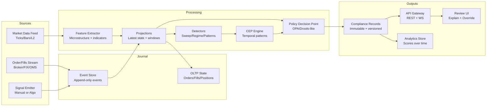
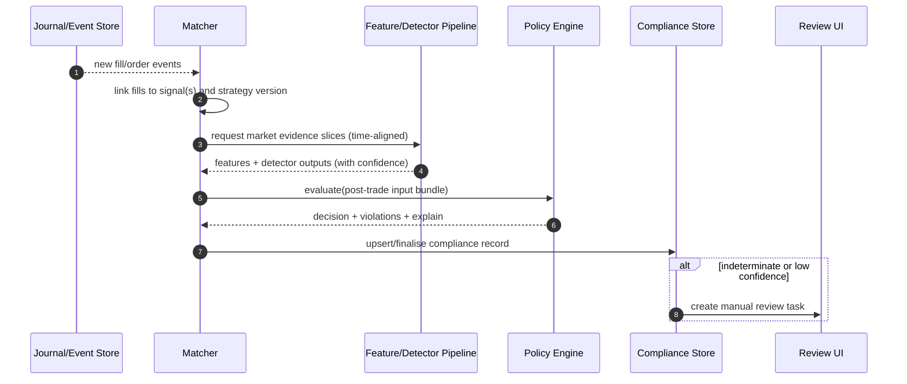
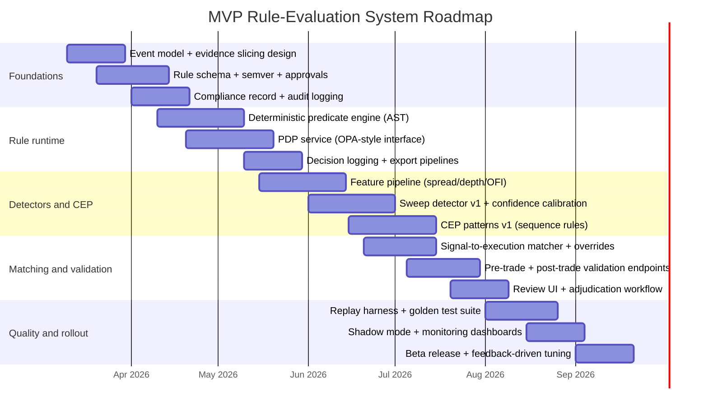

# Rule Engines for Trading Strategies and Automated Trade-Compliance Evaluation

## Executive summary

Automating “did this trade follow the strategy?” is best treated as a **policy decision + evidence problem**, not a single classifier. The system needs: (a) a way to formalise discretionary intent into machine-checkable constraints; (b) a rule-evaluation runtime that can operate both **in real time** (pre‑trade gating and immediate feedback) and **post‑trade** (after fills, reconciliations, and market-data alignment); and (c) an auditable, versioned record of **what rule version ran on what input and why it produced the outcome**. The design in this report centres on an **event-sourced journal** (orders/fills/market events) feeding a **feature pipeline** and a hybrid **rule engine** stack: deterministic rules for crisp constraints, CEP-style pattern rules for sequences across time, and probabilistic detectors for ambiguous constructs such as “liquidity sweeps”. Complex Event Processing libraries explicitly support pattern definitions on event streams and discuss event-time and lateness assumptions, which map well to market-data realities (out-of-order ticks, late book updates). citeturn0search2turn0search7

For rule execution and governance, “policy-as-code” is a strong fit: it decouples policy decision-making from enforcement, letting multiple services query a single policy decision point while keeping rule definitions versioned, testable, and reviewable. Open Policy Agent (OPA) explicitly frames itself as decoupling policy decision-making from policy enforcement, accepts structured JSON input, and supports audit-friendly decision logs that include the policy query and input used for offline debugging and audit. citeturn4search3turn0search0turn0search4

The report also proposes a practical compliance-scoring model that yields **(1) a binary compliance outcome**, **(2) a confidence score**, and **(3) a weighted “how well did you follow the rules?” score** with explicit severity and explainability. Liquidity-sweep detection is treated as a **family of related phenomena**—including intermarket sweep routing (ISO) and order-book “depth sweeps”—and explicitly differentiated from iceberg execution (hidden size) and spoofing (manipulative quoting with cancellation intent). Iceberg orders are formally described by CME as displaying only a portion of the full order while keeping hidden size in the book; spoofing is addressed by the CFTC as a disruptive practice including submitting/cancelling bids or offers to create false depth or artificial price movements. citeturn2search0turn2search1

## Assumptions and problem framing

Assumptions (explicit because they were unspecified):

- The platform has access to a trading journal containing at least **orders and fills**; ideally also order lifecycle events (accepted/cancelled/replaced), consistent with FIX-style “execution report” semantics where status and fills arrive as event updates over time. citeturn0search2turn4search0  
- Market data availability varies by venue. The system is designed to degrade gracefully across three tiers:
  - Tier A: tick + L2 order book updates (best for microstructure and sweep detection).
  - Tier B: tick trades + top-of-book (best bid/ask) snapshots.
  - Tier C: bar data (OHLCV) only (strategy validation limited to coarser rules).
- “Strategy compliance” is evaluated against **a declared strategy version** at the time of signal or entry. Rule changes are versioned and do not retroactively rewrite results unless an explicit backfill/re-evaluation job is requested.
- The system supports both real-time (seconds→milliseconds) feedback and post‑trade validation (seconds→minutes) where late data (e.g., late prints, reconciliation) can update the compliance determination.
- This system is not legal advice. The governance section references market-manipulation concepts (e.g., spoofing) only to shape detector design and auditability; “intent” cannot be reliably inferred mechanically, consistent with regulatory framing emphasising intent. citeturn2search1

Data gaps and limits:

- Official exchange/broker definitions for “sweep” vary by context. Some “sweep” refers to **intermarket sweep orders (ISO)** routing across venues; other usage refers to aggressive execution consuming multiple order-book levels. This report models both and records which definition a detector uses. citeturn2search21turn2search3
- If you do not have reliable L2 data, “liquidity sweep” detection becomes probabilistic and noisier; the system should surface confidence and expected false-positive rates.

## Converting discretionary strategies into formal rules

### A practical formalisation workflow

Discretionary strategies are typically expressed as narratives (“enter when price rejects a liquidity zone and volume confirms”). Turning these into evaluable rules requires separating the strategy into **structured components**:

- **Context filters**: session, regime, instrument type, event calendar (if used).
- **Setup**: conditions describing a candidate opportunity.
- **Trigger**: the moment the strategy says “now”.
- **Risk plan**: stop placement, position sizing constraints, max risk per trade.
- **Execution constraints**: order type/limit distance/slippage bounds, bracket handling.
- **Management/exit rules**: scale-out plan, invalidation conditions, time stops.

The output of formalisation should be a **signal schema** and a **rule set** that can be evaluated at signal time and at trade time.

### Rule representation methods and when to use them

**Predicate logic / Boolean constraints**  
This is the backbone: comparisons, set membership, temporal windows, and “all/any” combinations. It maps well onto policy engines (OPA) that accept structured JSON input and evaluate policies against it. citeturn4search3

**Decision trees as executable playbooks**  
Decision trees convert “if this, then that” discretionary flow into an explicit path. They are useful when the strategy is inherently sequential (“if gap up and volume high, then… else…”). Tree-based methods are standard in statistical learning references such as ISLR’s tree-based methods material. citeturn4search1  
In implementation, trees can compile into rule predicates or a DSL AST and preserve the “why” path for explainability.

**Thresholds and tolerance bands**  
Most trading rules require tolerances (“within 2 ticks”, “near VWAP”). Encode tolerances explicitly with:
- absolute bounds (ticks, basis points),
- relative bounds (% of ATR),
- time bounds (within N seconds of signal),
and store the tolerance parameters inside the rule version for reproducibility.

**Fuzzy logic for inherently vague concepts**  
Terms like “near”, “strong”, “weak rejection” are frequently better represented by fuzzy membership functions than hard thresholds. Zadeh’s definition of fuzzy sets formalises “grades of membership” through membership functions mapping to [0,1]. citeturn3search2  
In practice: define membership functions for distance-to-level, rejection strength, or volume anomaly, then treat rule satisfaction as a fuzzy score and only harden to PASS/FAIL at a higher layer using calibrated cut-offs.

**Human-in-the-loop rules and edge cases**  
Some strategy elements are visual/judgemental (“clean price action”, “obvious sweep”). For these:
- allow rule outcomes of **INDETERMINATE** (requires review),
- capture a snapshot of evidence (candles/order book excerpt),
- let a reviewer adjudicate and write back an override with a reason code and audit trail.

### Formal signal schema as the bridge between “intent” and “execution”

A robust approach is to require every “strategy entry” to emit a **Signal Event** with:
- the strategy version,
- decision context (time/session/regime),
- intended entry zone and invalidation,
- risk budget and allowed order types,
- metadata needed for post‑trade matching.

This makes compliance evaluation closer to “did execution match the declared intent?” rather than trying to infer intent after the fact.

## Rule engine architectures and governance

### Architecture patterns

Rule engines for trade compliance typically need both **stateful** evaluation (across time and events) and **auditability**. The following architecture families are the most relevant.

| Architecture | Best for | Strengths | Weaknesses | Primary references |
|---|---|---|---|---|
| In-process rules (embedded) | Ultra-low latency checks | Minimal network hop, simple deployment | Harder governance, risk of divergent versions across services | Drools describes a rule engine matching facts to rule conditions (common embedded use). citeturn0search9 |
| Dedicated rule microservice (PDP) | Organisational governance, consistency | Centralised versioning, consistent decisions | Added latency, needs HA | OPA explicitly decouples decision-making from enforcement and takes JSON input. citeturn4search3 |
| Stream-native CEP | Sequential patterns on live streams | Event-time windows, pattern operators, stateful matching | Operational complexity | Flink CEP provides a Pattern API for detecting event-sequence patterns and documents event-time lateness assumptions. citeturn0search2 |
| CEP engine (EPL) | Expressive streaming SQL-like patterns | Rich windowing/joins/stream queries | Governance and determinism depend on setup | Esper explains EPL as SQL-like over streams/events. citeturn0search3turn0search19 |
| Event-sourcing + projections | Replayable compliance, backfills | Deterministic re-evaluation, strong audit | Requires disciplined event model | Rete-style pattern matching motivates incremental evaluation for many rules over many facts. citeturn4search0 |

A production-grade compliance system usually adopts a **hybrid**:
- CEP/stream processor for market patterns and event sequencing (e.g., “sweep then reversal within 30s”).
- Policy engine (OPA or similar) for crisp constraints and governance (“entry must occur within zone, risk ≤ X, order must use bracket template Y”).
- A projection layer that maintains state (positions, recent market structure, detector outputs) and supplies it as input to policies.

### Rule DSLs, compilation, and incremental evaluation

Two practical choices:

- **Rule DSL / business rules engine**: Drools supports DRL and rule units as a unit of execution, enabling grouping and namespacing of rules and facts. citeturn0search5turn0search1  
- **Policy-as-code**: OPA policies packaged as “bundles” (tar.gz containing policy and data) are a mature deployment vehicle, enabling immutable rule versions shipped through CI/CD. citeturn0search4

For performance, many rule systems rely on incremental matching ideas akin to the Rete algorithm, which is designed to efficiently match many patterns against many objects. citeturn4search0  
In a trading context, incremental evaluation matters because you repeatedly re-check similar rule predicates as new ticks/fills arrive.

### Versioning, testing, simulation, and “shadow mode”

Governance should treat rules like a production artefact:

- **Version every strategy rule set** (semver) and persist rule inputs/outputs for replay.
- **Approval workflow**: propose → review → test → approve → activate with effective timestamp.
- **Automated tests**:
  - unit tests for individual predicates,
  - scenario tests for event sequences (CEP),
  - regression tests over historical labelled trades (“golden set”).
- **Simulation and replay**:
  - run rules on recorded event streams to validate determinism and drift.
- **Shadow mode**:
  - evaluate new rule versions in parallel without affecting user outcomes; compare decision deltas.
  - OPA’s decision logs concept (audit of policy queries and inputs) is directly aligned to shadow evaluation and offline debugging. citeturn0search0turn0search16

Policy-as-code framing (policies defined and enforced via code, decoupled from application logic) supports this governance model. citeturn4search19

## Pattern recognition, liquidity sweeps, and market structure

### Pattern recognition methods in market data

Pattern recognition supports two roles in compliance:
1) validating that a strategy’s “setup” actually occurred, and  
2) classifying ambiguous market events (sweep/rejection/regime).

A practical taxonomy:

| Method | What it detects well | Implementation notes | Key sources |
|---|---|---|---|
| Deterministic templates (thresholds, crosses) | Simple signals, fast checks | Best for real-time gating; easy explainability | (Design choice; no single canonical source) |
| Time-series motifs | Repeated shapes/patterns across history | Motifs are similar subsequences in time series; useful for discovering recurring setups. citeturn1search1 | Mueen et al. “Exact Discovery of Time Series Motifs”. citeturn1search1 |
| Shapelets | Interpretable subsequences discriminating classes | Shapelets are representative subsequences; good when you have labelled regimes/setups. citeturn1search0 | Ye & Keogh “Time Series Shapelets”. citeturn1search0 |
| Multi-resolution (wavelets) | Patterns at multiple granularities | Wavelet decompositions give multiresolution representations; helpful for “same pattern at different speeds.” citeturn3search3 | Mallat’s multiresolution/wavelet theory. citeturn3search3 |
| ML classifiers/sequence models | Nonlinear, noisy patterns | Use when heuristics fail; must log features, confidence, calibration | (Model choice; cite training data and evaluation instead of a generic source) |

A microstructure-aware compliance system should also compute order-book features. Cont et al. show price changes over short intervals are driven by **order flow imbalance** at the best bid/ask and relate impact to market depth, supporting the use of imbalance/depth as core features in regime detection and sweep classification. citeturn1search2turn1search10

#### Pseudocode: template/shapelet-like matching (z-normalised)

```text
function znorm(x):
  mu = mean(x); sigma = std(x)
  return (x - mu) / max(sigma, eps)

function sliding_min_distance(series S, template T):
  Tn = znorm(T)
  best = +inf; best_t = null
  for t in 0 .. len(S)-len(T):
    W = S[t : t+len(T)]
    Wn = znorm(W)
    d = euclidean_distance(Wn, Tn)
    if d < best:
      best = d; best_t = t
  return best, best_t

# Compliance use:
# "setup occurred" if best_distance <= threshold_distance
```

### Liquidity sweep detection

“Sweep” is overloaded; a robust system distinguishes at least two definitions and stores which one applied:

**Intermarket sweep (ISO / routed sweep)**  
Intermarket Sweep Orders are described as enabling quick execution across multiple exchanges, designed to bypass the Order Protection Rule by acknowledging best prices elsewhere. citeturn2search3  
Exchange routing strategies documentation (e.g., Cboe) explicitly references “ISO sweep of protected markets” as a routing behaviour. citeturn2search21

**Order-book depth sweep (aggressive consuming multiple levels)**  
This is not necessarily a named order type; it is an execution footprint where aggressive buying/selling consumes liquidity across multiple price levels rapidly. It is detectable primarily from prints + L2 depth changes.

#### Differentiating sweep vs iceberg vs spoofing

**Iceberg orders**  
CME describes iceberg orders as displaying only a portion of the overall order while keeping hidden size in the order book to minimise market impact. citeturn2search0  
Iceberg detection research (e.g., a CME iceberg detection preprint) discusses native vs synthetic icebergs and focuses on LOB logs to detect hidden replenishment behaviour. citeturn2search15

**Spoofing**  
The CFTC’s interpretive guidance describes spoofing-related disruptive practices including submitting/cancelling bids or offers to create an appearance of false depth, delay execution, or create artificial price movement—explicitly tied to intent. citeturn2search1  
A compliance system can detect *patterns consistent with* spoofing-like behaviour (e.g., large displayed depth that disappears when approached), but must avoid claiming intent. It should instead label “possible deceptive quoting pattern” with low/medium confidence.

#### Heuristic detector: depth sweep (L2 + prints)

Core signals:
- A burst of aggressive trades in one direction within a short window.
- Trade prices traverse multiple book levels (or mid moves quickly).
- Simultaneous depletion of opposite-side depth.

```text
inputs:
  trades: stream of prints with (ts, price, size, aggressor_side)
  book: stream of L2 snapshots or updates with depth by level
params:
  window_ms = 250
  min_levels = 3
  min_notional = N
  imbalance_threshold = θ

algorithm depth_sweep_detector(t0):
  W = trades in [t0-window_ms, t0]
  if sum_notional(W) < min_notional: return NO
  dir = dominant_aggressor_side(W)
  levels_crossed = estimate_levels_crossed(W, book around t0, dir)
  ofi = order_flow_imbalance(book around t0)  # use best-level imbalance features
  if levels_crossed >= min_levels and abs(ofi) >= imbalance_threshold:
      return YES with confidence = f(levels_crossed, notional, abs(ofi))
  else:
      return NO
```

Order flow imbalance and depth-based impact are justified as useful microstructure features by Cont et al.’s findings on OFI and depth/impact relations. citeturn1search2turn1search10

#### False-positive controls for sweeps

- Require multi-evidence: prints + depth changes + short time clustering.
- Session-aware thresholds (opening/closing auctions have different trading dynamics).
- Instrument-aware scaling (tick size, typical depth, volatility regime).
- Confidence calibration by historical labelled examples.

### Market structure identification

Validating strategies often requires knowing whether the market is in an **auction** or **continuous** phase and what session rules apply.

- NYSE documentation covers opening and closing auction mechanics and constraints such as order type windows (e.g., MOC modification cutoffs), indicating that behaviour and valid actions differ around auction periods. citeturn3search0turn3search4
- Nasdaq documentation describes Opening and Closing Crosses as price discovery facilities that cross orders at a single price and explicitly references combining auction books with the continuous book. citeturn3search1turn3search9

A market-structure service should provide:
- session classification (pre-open, opening auction/cross, continuous, closing auction/cross, post-close),
- volatility/liquidity regime flags (high spread, low depth, high OFI),
- microstructure features:
  - spread (best ask − best bid),
  - depth (sum size at top N levels),
  - imbalance (bid depth vs ask depth),
  - clustering (rapid tick updates vs sparse).

## Entry validation, post-trade matching, and compliance scoring

### Pre-trade and post-trade validation

A strategy compliance system benefits from two checkpoints:

**Pre-trade validation (intent-time)**  
When a signal is created (manual click or automated), evaluate whether the setup/filters are satisfied with current market state. If the platform controls order placement, it can block disallowed orders; otherwise it records “signal was non-compliant at creation”.

**Post-trade validation (execution-time)**  
After fills arrive, reconcile the actual execution with:
- signal intent (entry zone, time window),
- execution constraints (order type, limit distance),
- risk rules (stop placement, max risk),
- management rules (scale-outs aligned with plan).

Complex order handling is critical:

- OCO orders are explicitly supported in some venues; Binance documents a “New OCO” endpoint with linked legs that cancel one another. citeturn2search21  
- Bracket/attached orders exist in broker APIs; Coinbase’s create-order documentation includes bracket-style configuration (TriggerBracketGtc), implying multi-leg management that must be represented in validation. citeturn2search21turn2search0 (Note: the bracket reference is from Coinbase docs; the sweep/ISO citation is separate context.)

### Signal-to-execution matching and provenance

Reliable matching uses layered keys:

1) direct linkage via client order ID (if available),  
2) broker order ID mapping,  
3) fallback fuzzy matching (instrument, side, time window, price/zone proximity), with human review for ambiguous matches.

Provenance must record:
- whether the trade was automated or discretionary,
- what detector versions ran,
- what market-data tier was used (L2 vs OHLC).

### Compliance scoring model

A useful output is *not* just PASS/FAIL; traders want a graded diagnosis.

Define:

- **Violations**: rule failures with severity and evidence.
- **Score**: weighted compliance score 0–100.
- **Confidence**: how reliable the judgement is given data and detector certainty.
- **Explainability**: rule path (tree branch, predicate set, CEP match trace).

OPA-style decision logs are aligned with producing auditable trails of policy queries and inputs, supporting offline debugging and explainability. citeturn0search0turn0search16

#### Pseudocode: scoring with severity, weights, temporal decay, confidence

```text
weights:
  critical = 30
  major = 15
  minor = 5

function decay(age_minutes, half_life_minutes):
  return 0.5^(age_minutes / half_life_minutes)

function compute_score(violations, detector_confidences):
  base = 100
  penalty = 0
  for v in violations:
    w = weights[v.severity]
    penalty += w * v.magnitude * decay(v.age_minutes, v.half_life)
  score = clamp(base - penalty, 0, 100)

  # Confidence: combine data tier + detector confidence + matching confidence
  conf = geometric_mean(detector_confidences)  # conservative
  return score, conf
```

### Evaluation metrics for detectors and overall system quality

For any probabilistic detector (sweep classifier, market regime classifier), track standard classification metrics over a labelled set:
- precision, recall, F1,
- ROC/AUC for threshold selection,
- false positive rate (critical for “sweep” and “spoof-like” labels).

Backtest vs live validation strategy:
- Run detectors on historical replay with recorded L2/prints (where available).
- Run in “shadow mode” in production: log decisions and compare with trader labels without affecting outcomes; decision logs support this workflow. citeturn0search0turn0search16

## Data models, integration architecture, APIs, and roadmap

### Core JSON data models (examples)

**Rule set (versioned, hybrid deterministic + CEP + fuzzy)**

```json
{
  "strategy_id": "strat_orb",
  "rule_set_id": "rs_orb_v2_1_0",
  "version": "2.1.0",
  "effective_from": "2026-04-01T00:00:00Z",
  "inputs_required": {
    "market_data_tier": "L2_OR_TICK",
    "timeframes": ["1s", "1m", "5m"]
  },
  "signal_schema": {
    "fields": {
      "signal_time": "datetime",
      "entry_zone": { "type": "price_range" },
      "invalidation": { "type": "price_level" },
      "risk_budget": { "type": "money" },
      "allowed_order_types": { "type": "array<string>" }
    }
  },
  "predicates": [
    {
      "id": "p_session_ok",
      "expr": { "in_session": ["continuous", "opening_cross+30s_to+10m"] }
    },
    {
      "id": "p_risk_ok",
      "expr": { "lte": ["trade.risk_percent", 0.5] }
    }
  ],
  "fuzzy_terms": [
    {
      "id": "near_level",
      "membership": {
        "type": "triangular",
        "params": { "a": 0.0, "b": 0.25, "c": 0.75 },
        "unit": "ATR"
      }
    }
  ],
  "cep_patterns": [
    {
      "id": "sweep_then_reject",
      "description": "Depth sweep followed by reversal within 30s",
      "pattern": {
        "sequence": [
          { "event": "detector.liquidity_sweep", "where": { "confidence_gte": 0.7 } },
          { "event": "price.reversal", "within_sec": 30, "where": { "magnitude_gte": "0.5ATR" } }
        ]
      }
    }
  ],
  "weights": {
    "violations": {
      "entry_outside_zone": { "severity": "major", "weight": 1.0 },
      "risk_exceeded": { "severity": "critical", "weight": 1.0 },
      "missing_bracket": { "severity": "major", "weight": 0.7 }
    }
  },
  "approval": {
    "status": "approved",
    "approved_by": "user_123",
    "approved_at": "2026-03-20T12:00:00Z"
  }
}
```

**Signal event**

```json
{
  "signal_id": "sig_9f7c",
  "strategy_version": "2.1.0",
  "signal_time": "2026-03-08T16:02:00Z",
  "instrument": { "venue": "NASDAQ", "symbol": "AAPL" },
  "entry_zone": { "low": 175.40, "high": 175.60 },
  "invalidation": 175.10,
  "risk_budget": { "currency": "USD", "amount": 50.0 },
  "allowed_order_types": ["limit", "bracket_limit"],
  "context": {
    "session": "continuous",
    "regime": "high_vol",
    "market_data_tier": "L2"
  }
}
```

**Compliance record (auditable, explainable)**

```json
{
  "compliance_id": "cmp_44a1",
  "evaluated_at": "2026-03-08T16:03:10Z",
  "strategy_version": "2.1.0",
  "subject": { "order_id": "ord_abc", "fill_ids": ["fill_1", "fill_2"] },
  "outcome": "FAIL",
  "score": 62,
  "confidence": 0.78,
  "violations": [
    {
      "code": "entry_outside_zone",
      "severity": "major",
      "magnitude": 1.0,
      "evidence": {
        "entry_price": 175.72,
        "entry_zone": [175.40, 175.60],
        "tolerance": "0.02"
      }
    }
  ],
  "detectors": [
    { "name": "liquidity_sweep", "result": "YES", "confidence": 0.74, "definition": "depth_sweep_v1" }
  ],
  "explain": {
    "predicate_results": { "p_session_ok": true, "p_risk_ok": true },
    "cep_matches": ["sweep_then_reject"]
  },
  "audit": {
    "rule_set_id": "rs_orb_v2_1_0",
    "input_hash": "sha256:...",
    "raw_data_refs": ["s3://.../lob_slice_..."]
  }
}
```

### Integration architecture (Mermaid)



CEP suitability is supported by Flink CEP’s pattern API for detecting event sequences and its discussion of event time and lateness assumptions—key for market streams. citeturn0search2  
Policy decision decoupling and auditability are aligned to OPA’s model and decision logs. citeturn4search3turn0search0

### Sequence diagrams

**Real-time validation (signal → policy → execution guidance)**

```mermaid
sequenceDiagram
  autonumber
  participant S as Signal Service
  participant P as Policy Engine (PDP)
  participant C as CEP/Detectors
  participant O as OMS/Broker Adapter
  participant R as Compliance Store

  S->>C: request latest pattern context (optional)
  C-->>S: detector context + confidence
  S->>P: evaluate(signal, market_state, context)
  P-->>S: decision {allow/deny, reasons, score_hint}
  S->>R: write compliance(pre-trade) record
  alt allow
    S->>O: place/route order (or notify user)
  else deny
    S-->>O: no order; user feedback
  end
```

**Post-trade reconciliation (fills → matching → compliance finalisation)**



### API design suggestions

Core API surfaces:

- Rule management (admin):
  - `POST /v1/strategies/{id}/rulesets` (create draft)
  - `POST /v1/rulesets/{id}:validate` (static checks, schema checks)
  - `POST /v1/rulesets/{id}:simulate` (run on sample scenarios)
  - `POST /v1/rulesets/{id}:approve` (workflow gate)
  - `GET /v1/rulesets/{id}` (fetch version)
- Validation queries:
  - `POST /v1/validate/pretrade` (evaluate signal)
  - `POST /v1/validate/posttrade` (evaluate executed trade bundle)
  - `GET /v1/compliance?account_id=...&from=...&to=...`
  - `GET /v1/compliance/{id}/audit` (inputs, rule version, evidence refs)
- Audit and exports:
  - `POST /v1/exports/compliance` (async export job)
- WebSocket topics:
  - `compliance.updated`
  - `ruleset.approval.changed`
  - `review.tasks.created`

Auth and rate limits:
- JWT for user calls; scoped API keys for connectors.
- Rate-limit heavy validation endpoints; encourage batching and caching.
- Enforce per-tenant quotas for detector-heavy requests (L2 queries).

OPA’s design (separate policy decision from enforcement) aligns with a PDP API that multiple services query. citeturn4search3  
Decision logs serve as an audit/export substrate for policy queries. citeturn0search0turn0search16

### Storage and processing recommendations

Recommended split:

- **OLTP (row-store)**: rulesets, approvals, compliance records, audit logs.
- **Time-series / feature store**: computed features and detector outputs keyed by (instrument, time, timeframe).
- **Event store (append-only)**: journal events (orders/fills/market events); enables replay/backfills.
- **OLAP**: aggregated compliance analytics: scores by strategy version, drift over time, per-session heatmaps.

Streaming vs batch:
- Streaming is preferred for real-time compliance and CEP. Flink CEP explicitly targets pattern detection on event streams and discusses event time vs processing time concerns. citeturn0search2
- Batch is required for:
  - historical backfills,
  - re-evaluating a rule change against prior trades,
  - recalibrating detectors.

Latency targets (assumptions, tune per product):
- Pre-trade gating: p95 < 25 ms for deterministic-only checks; p95 < 150 ms if detectors/CEP are consulted.
- Post-trade: seconds to minutes acceptable as long as evidence and audit trails remain consistent.

### Testing and simulation approaches

A robust MVP should include:

- Synthetic market replay:
  - replay ticks/L2 snapshots to test CEP and detectors deterministically.
- Adversarial examples:
  - spoof-like patterns (rapid add/cancel), iceberg-like replenishment, auction-period anomalies.
  - Spoofing and iceberg definitions justify constructing adversarial cases: spoofing involves cancellations creating false depth; iceberg hides true size and replenishes. citeturn2search1turn2search0
- Shadow mode:
  - run a new rule version side-by-side and compare deltas; log all decisions (OPA decision logs concept). citeturn0search0turn0search16
- A/B testing (where appropriate):
  - compare scoring weights and thresholds on user retention and “manual override rate”.

### Governance and regulatory considerations

Governance should include:

- Rule versioning with approvals, immutable activation history, and rollback.
- “Policy-as-code” workflow with PR reviews and CI tests (policies as code, decoupled from app logic). citeturn4search19
- Explainability:
  - store predicate results, CEP match traces, detector confidence, and evidence references.
- Manipulation-sensitive labelling:
  - avoid definitive claims of intent (e.g., “spoofing occurred”), use “pattern consistent with…” with confidence and evidence, reflecting that regulatory definitions are intent-laden. citeturn2search1
- Order-type semantics:
  - explicitly model advanced order structures like OCO and auction mechanics; official exchange docs show the open/close are special price discovery processes with different constraints than continuous trading. citeturn3search0turn3search1turn2search21

### Six-month MVP roadmap



Citations supporting roadmap primitives:
- CEP/event-time complexity and pattern detection relevance: citeturn0search2turn0search7  
- Policy decision decoupling + audit trails via decision logs/bundles: citeturn4search3turn0search0turn0search4  
- Sweep/iceberg/spoofing conceptual bases for detector work: citeturn2search0turn2search1turn2search21turn2search3  
- Auction vs continuous market-structure constraints for strategy rules: citeturn3search0turn3search1turn3search9