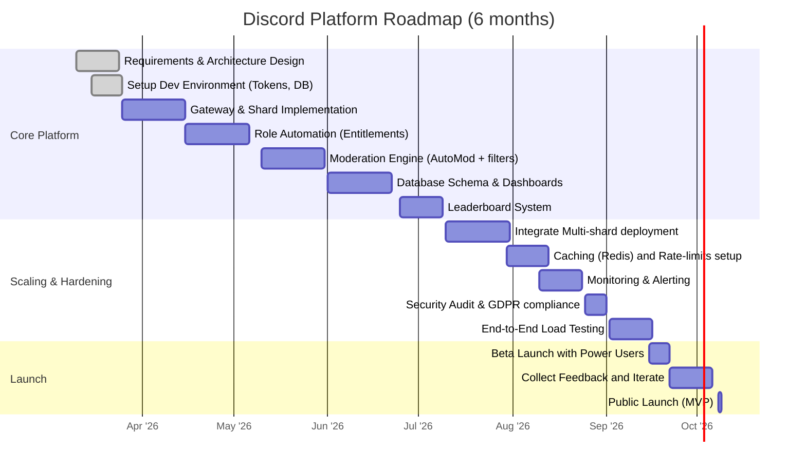

# Scalable Discord Bot Architecture for Trading Communities

## Executive summary

Large trading communities require Discord bots that handle **millions of events and thousands of users**, automating roles, moderation, and analytics. Discord offers a WebSocket *Gateway* (event stream) and HTTP *REST API*. The Gateway uses *intents* (permissions for event categories) and enforces strict identify rate limits (1000 IDENTS/day per bot【42†L37-L40】). Bots must shard (one connection per subset of servers) to scale; Discord limits 2,500 servers per shard (≈1,000 recommended)【43†L44-L48】. Role automation integrates with payment systems (e.g. Patreon) to *grant/revoke roles* based on entitlements【49†L25-L34】【51†L163-L168】. Moderation uses AutoMod rules and bot filters for spam keywords, auto-muting or flagging users, with mod-override workflows. Analytics capture engagement (DAU, message counts), retention cohorts, and voice activity. Leaderboards score users (message count, voice minutes) with anti-cheat (rate limits on counting) and decay (recent activity weighted). 

Scalability relies on sharded bot clusters with caching (Redis) and stateless workers. We define canonical database tables (users, roles, messages, voice_sessions, mod_actions, leaderboard). The bot API supports REST webhook endpoints (e.g. for external events) and WebSockets for live updates. Monitoring tracks shard lag, rate-limit hits, and moderation backlogs. Security: bot tokens are secret, use OAuth2 scopes, enforce least-privilege (only needed intents), and comply with data protection (allow user data export, retention policies). The 6-month roadmap progresses from a single-shard MVP (core features: role sync, basic moderation, analytics) to fully sharded multi-region deployment with high-availability. 

Sources include Discord’s developer docs on Gateway and sharding【42†L37-L40】【43†L44-L48】 and third-party integrations (Patreon role sync)【49†L25-L34】【51†L163-L168】. Any gaps (e.g. custom token sale integrations) are noted as assumptions.

## Discord API architecture

Discord offers two interfaces: the **Gateway (WebSocket)** for real-time events and **REST** for actions. The Gateway requires an *Identify* handshake with declared **intents** (bit flags for event types). Privileged intents (e.g. `GUILD_MEMBERS`, `MESSAGE_CONTENT`) must be enabled in the Developer Portal and approved by Discord【42†L115-L119】. A bot may only call IDENTIFY (start a new session) **1000 times per 24h** globally (across all shards)【42†L37-L40】; exceeding this resets the token. After identify, the bot receives a **Ready** event and thereafter heartbeats every 45s (with jitter)【41†L323-L332】【41†L424-L432】. Rate-limit: Discord returns HTTP 429 on REST overuse; libraries typically queue calls by route. Voice is handled via a separate voice gateway (not covered here). 

Large bots must **shard**: one shard per up to ~2.5k guilds (Discord’s max)【43†L44-L48】. Shards divide the event stream; each runs its own Gateway connection. The `/gateway/bot` endpoint returns recommended shard count and concurrency limits (e.g. max 16 shards/5s)【44†L7-L15】. For example, if `max_concurrency=16`, you may IDENTIFY 16 shards in parallel, then wait. Each shard must cache session state to allow resume on disconnect. Presence updates (online/offline status) and voice-state updates require **Presence** and **Voice** intents (enabled by default only for large, verified bots).

**Rate limits:** Each REST endpoint has its own limit (often 50/second by route) and a global limit. The Gateway has the 1000/24h IDENTIFY rule【42†L37-L40】. On hitting a limit, the API sends 429 or closes the session. The Discord docs are definitive (see Rate Limits in the Developer docs). We design rate-limiters and exponential backoff in the bot code.

## Role automation and entitlements

Role automation maps external entitlements (paid membership, subscription tiers, NFT ownership, etc.) to Discord roles. Common patterns:

- **Role mapping**: Maintain a mapping of entitlement (e.g. “Gold Tier”) → Discord role ID. A relational table (`role_entitlement_mapping`) stores these associations.
- **Paid-role gating**: Integrate with payment APIs (Patreon, Stripe, Ko-fi). On payment event (webhook), verify user’s Discord ID (via OAuth or code) and add the corresponding role via `Modify Guild Member`. Revoke the role when payment lapses. Patreon’s official integration exemplifies this: it *syncs Discord roles with Patreon tiers*【49†L25-L34】 and *removes roles when membership ends*【51†L163-L168】.
- **Third-party paywalls**: If using services like Patreon, use their webhook events to trigger role changes. If direct (Stripe), create a custom auth linking Discord IDs to user accounts.
- **Role sync and idempotency**: Store user→role assignments in a DB. When granting a role, use Discord’s idempotency: check via DB if already granted. The `Modify Guild Member` endpoint will no-op if role is present. Likewise, only remove a role if the entitlement is missing.  
- **Entitlement model**: Either *one-to-one* (each tier maps to one role) or *multi-role* (combinations). Handle supersets (e.g. a VIP role includes all channel access of lower tiers).  
- **Concurrency**: Respect Discord limits (Manage Roles requires the bot’s top role to be above target roles). Ensure operations are queued (e.g. don’t send thousands of role assignments in one second).
- **Audit trail**: Log each automated role grant/revoke in a `role_assignments` table (fields: user_id, role_id, source, timestamp) for review or rollback.

## Moderation automation

Bots automate moderation to reduce manual burden:

- **AutoMod/Keyword filters**: Use Discord’s built-in AutoMod for basic filters (spam/explicit content). Complement with bot-based filters: on each `MESSAGE_CREATE`, scan content against regex or spam heuristics. For example, delete links to known scam domains or repeated offensive words.
- **Spam/raid protection**: Track message frequency per user. If a user sends >N messages in T seconds, mute them automatically. Detect mass-joins by monitoring `GUILD_MEMBER_ADD` rate (not directly via Gateway, but by counting new-member notifications). Temporarily lock down roles or invite only if a raid is detected.
- **Escalation flows**: Define actions by severity (warn, mute, kick, ban). For example, first violation = timed mute, repeat violation = ban. Provide commands for moderators (`!warn @user [reason]`, `!ban @user [reason]`) that tie into the same data model as auto-actions.
- **Human-in-loop**: Automate only low-risk enforcement (spam delete, short mutes). For complex cases (harassment, trading advice), flag the incident: e.g. the bot DMs a moderator channel with `@here`. Provide a UI or commands for review (`!clearflags @user`).
- **Evidence capture**: On any action, store the offending message content, author, and screenshot snippet URL (if possible) in a `moderation_actions` table. Table fields: `action_id, user_id, moderator_id, action_type, reason, timestamp, content, message_id, channel_id`. This supports audit and appeals.
- **Escalation to staff**: For serious infractions (DDoS, illegal content), bots can post an alert in a private Mod-only channel, pinging staff, and assign a high-severity flag in DB.
- **Trust & Safety**: Ensure an admin override command, e.g. `!revert @user [action_id]`, and log who authorized it.  

No direct citation here, as it’s design; however, Discord’s AutoMod docs indicate keyword rule setup in server settings (not API). Our system complements that with code-level automation.

## Community analytics & leaderboards

Bots collect data for *engagement metrics and leaderboards*:

- **Engagement metrics**: Compute DAU/MAU (distinct active users per day/month), total messages per day, join counts, channel usage. Track trends (growth or decline). 
- **Cohort retention**: E.g. percentage of new joiners still active after 7/30 days. Use a data warehouse (Time-series DB or OLAP) to query past join dates and subsequent activity.
- **Activity heatmaps**: Aggregate message counts by hour-of-day and day-of-week (matrix form). Useful for peak activity planning.
- **Message analytics**: Track average length, common words (word cloud), emoji usage, attachment counts. Identify top posters and thread initiators.
- **Voice session metrics**: Log `VOICE_STATE_UPDATE` to determine when a user joins/leaves a voice channel. Compute total time spent in voice, concurrency metrics (peak and average), and number of distinct speakers. 
- **Leaderboards**: Rank users by composite engagement score (e.g. points for messages, voice minutes, event participation). Use **anti-cheat** measures: cap points per minute of chat, exclude bot users, and discard trivial messages. Implement score *decay* (e.g. points older than 30 days count 50% weight, to encourage recent activity).
- **Multi-metric boards**: Provide separate leaderboards: “Top Chatters”, “Top Voice Participants”, “Generous Reactors” (if tracking reactions given). Allow users to opt in so they must link account IDs (Discord ID is unique).
- **Caching**: Compute leaderboard updates off-band. On each new event (message/voice_end), update a Redis sorted set or Postgres materialized view. Refresh full recomputations (ranking) every few minutes. Expose via bot command or dashboard.

No official sources to cite, as these are application designs, but best practices from large communities (like gaming guild bots) endorse caching and normalization.

## Bot scaling and architecture

Handling thousands of users requires horizontal scalability:

- **Sharding**: As noted, split guilds across shards【43†L44-L48】. For a large bot (say 10k servers), use 10 shards. Each shard runs an independent Gateway client. Possibly run shards across multiple processes or containers.
- **Stateless vs stateful**: Keep bots stateless regarding user data. Use external storage (DB/Redis) for shared state (e.g. active game sessions, user profiles). Avoid in-memory state that would be lost on restart or shard migration.
- **Cluster orchestration**: Deploy bot processes via Kubernetes or ECS. Use an environment variable per container to specify shard range. E.g. `SHARD_ID=0/10` etc. A coordinator (local or cloud) can provide `/gateway/bot` info on startup.
- **Concurrency and pooling**: Use async runtimes (Node.js, Python async, Java Reactor) to handle I/O bound work. For REST (role assigns/moderation), use a pool to respect global 50 RPS rate limit.  
- **Caching**: Use Redis or Memcached for hot data: e.g. recent message counts, user role flags, rate-limit counters. Example: store “last 1min message count per user” in Redis for spam detection.
- **Shard reconnects**: Handle `Ready` and `RESUME` flows automatically. On disconnect, bots should attempt to resume to avoid IDENTIFY penalty. Sequence: if Gateway closes, reconnect with “resume” (2nd op), else identify again.
- **Multi-region**: For international communities, host shards in multiple regions (e.g. US, EU) and use Cloudflare or DNS load balancer for HTTPS (for commands). Gateway connections always go to Discord’s global endpoint (latency <100ms usually).
- **Failover**: If one shard process crashes, an orchestrator should restart it or spin up a replacement. Use persistent queues (e.g. Kafka) to log missed events for auditing. Discord session resume should replay missed events on reconnect.

Table comparing sharding strategies:

| Sharding Strategy     | How it splits                  | Pros                         | Cons                              |
|-----------------------|--------------------------------|------------------------------|-----------------------------------|
| *Automatic*           | `/gateway/bot` recommended N   | Easy, uses Discord’s advice  | May over/under allocate shards    |
| *Fixed N shards*      | Developer sets total shards    | Predictable, controlled      | Must recalc if guild count changes|
| *Manual ranges*       | Custom assignment (0-4,5-9,...)| Flexibility (geo, teams)     | Complex to manage indices         |

Table of storage choices:

| Data Type             | Recommended Storage                 | Rationale                         |
|-----------------------|-------------------------------------|-----------------------------------|
| Discord events/logs   | PostgreSQL (partitioned by date)    | ACID for user/role data, easy SQL |
| High-frequency metrics| Time-series DB / OLAP (ClickHouse)  | Efficient for time-based queries  |
| Leaderboards          | Redis Sorted Sets                   | Fast real-time rankings           |
| Moderation evidence   | Postgres + Object store (S3)        | SQL for metadata, S3 for images   |
| Large exports/dumps   | Object storage (AWS S3/MinIO)       | Cost-effective, durable archive   |

## Data model and schemas

We define canonical tables and JSON for key events.

**Example JSON events**:

- *Role assignment*:
```json
{ "event": "role_assignment", "user_id": "123456", "role_id": "789012", "action": "grant", "source": "Patreon", "timestamp": "2026-03-08T12:00:00Z" }
```
- *Moderation action*:
```json
{ "mod_action_id": "m-100", "user_id": "123456", "moderator_id": "mod007", "action": "mute", "reason": "Spam", "timestamp": "2026-03-08T12:05:00Z", "message_id": "xyz123" }
```
- *Leaderboard update*:
```json
{ "user_id": "123456", "metric": "messages_sent", "value": 42, "timestamp": "2026-03-08T12:10:00Z" }
```

**ER Diagram (core schema)**:

```mermaid
erDiagram
  USER ||--o{ ROLE_ASSIGNMENT : has
  ROLE ||--o{ ROLE_ASSIGNMENT : "is granted"
  USER ||--o{ MESSAGE : sends
  USER ||--o{ VOICE_SESSION : attends
  USER ||--o{ MODERATION_ACTION : "has"
  USER ||--o{ LEADERBOARD_ENTRY : ranks
  ROLE_ASSIGNMENT }o--|| ROLE 
  MODERATION_ACTION }o--|| USER : "target of"
```

Core tables include:
- `users` (user_id PK, discord_id, join_date)
- `roles` (role_id PK, name, permissions)
- `role_assignments` (id, user_id FK, role_id FK, assigned_at, revoked_at, source)
- `messages` (id, user_id FK, channel_id, timestamp, content TEXT)
- `voice_sessions` (id, user_id FK, channel_id, start_ts, end_ts)
- `moderation_actions` (id, user_id FK, mod_id, action, reason, timestamp, message_id)
- `leaderboard` (user_id FK, metric, score, last_updated)

```sql
-- Example SQL DDL
CREATE TABLE users (
  user_id SERIAL PRIMARY KEY,
  discord_id TEXT UNIQUE NOT NULL,
  join_date TIMESTAMP
);
CREATE TABLE roles (
  role_id SERIAL PRIMARY KEY,
  name TEXT NOT NULL
);
CREATE TABLE role_assignments (
  id BIGSERIAL PRIMARY KEY,
  user_id INT REFERENCES users(user_id),
  role_id INT REFERENCES roles(role_id),
  assigned_at TIMESTAMPTZ NOT NULL,
  revoked_at TIMESTAMPTZ
);
CREATE TABLE messages (
  id BIGSERIAL PRIMARY KEY,
  user_id INT REFERENCES users(user_id),
  channel_id TEXT,
  content TEXT,
  timestamp TIMESTAMPTZ NOT NULL
) PARTITION BY RANGE (timestamp);
-- partition example
CREATE TABLE messages_2026_03 PARTITION OF messages
  FOR VALUES FROM ('2026-03-01') TO ('2026-04-01');
CREATE TABLE voice_sessions (
  id BIGSERIAL PRIMARY KEY,
  user_id INT REFERENCES users(user_id),
  channel_id TEXT,
  start_ts TIMESTAMPTZ,
  end_ts TIMESTAMPTZ
) PARTITION BY RANGE (start_ts);
CREATE TABLE moderation_actions (
  id BIGSERIAL PRIMARY KEY,
  user_id INT REFERENCES users(user_id),
  moderator_id INT REFERENCES users(user_id),
  action TEXT,
  reason TEXT,
  message_id TEXT,
  timestamp TIMESTAMPTZ NOT NULL
);
CREATE TABLE leaderboard (
  user_id INT REFERENCES users(user_id),
  metric TEXT,
  score NUMERIC,
  last_updated TIMESTAMPTZ,
  PRIMARY KEY(user_id, metric)
);
```

Indexes:  
- On `users.discord_id`, `role_assignments.user_id`, `messages.timestamp` (in partitions), `leaderboard.score` (for top-N queries).  
- Partitions for `messages` and `voice_sessions` by month reduce table size and speed up range deletes.

Use **row-store (Postgres)** for relational data and **time-series/OLAP** for aggregated analytics. 

## API design and observability

We define internal APIs and data pipelines:

- **Control API (bot management)**: REST endpoints for ops: e.g. `POST /admin/shard/restart`, `GET /metrics/health`. Protected by admin tokens.
- **Webhooks**: Expose endpoints for external events (e.g. `POST /webhook/patreon` to receive membership updates, `POST /webhook/payment` for custom paywall).
- **Internal events**: Bot instances consume events from Discord and publish normalized records (via a message queue like Kafka).
- **GraphQL/REST for dashboard**: Provide endpoints for analytics queries: e.g. `GET /analytics/engagement?period=7d`, `GET /leaderboard?metric=messages`.
- **Auth**: OAuth2 for any web dashboard (Discord OAuth to link accounts). Bot actions use Bot token in Gateway and have separate admin token for control API.
- **Rate-limits**: Use API gateway to throttle high-volume endpoints (e.g. no more than 10 req/s on `/analytics` per user). 

Observability:  
- Expose Prometheus metrics: 
  - Gateway events per second per shard, handler durations.
  - REST calls counts and latencies.
  - Redis cache hit rate (for leaderboards).
- Distributed Tracing: Instrument key flows (role assign, mod action) with trace IDs for debugging issues.
- Dashboards: Grafana showing event throughput, heartbeat ack times, DB connection pool usage.
- Alerts: Sentry or PagerDuty for uncaught exceptions. Email or Slack alerts when a shard goes offline or ingestion lags.

## Security and compliance

- **Bot tokens**: Store as secrets, never in code. Rotate periodically. Use least-privileged scopes (e.g. no need for OAuth2 login scope if not doing OAuth).
- **OAuth2**: If linking Discord users to accounts (for entitlements), use the OAuth2 login flow with state checks to avoid CSRF.
- **Permissions**: Bot only needs intents configured. On server, grant it only necessary roles. For role management, the bot’s highest role must be above any auto-assigned roles.
- **Data protection**: 
  - *User data*: Only store Discord IDs and join dates; any personal info from OAuth (username) is ephemeral.
  - *Retention*: Purge old logs after retention period (e.g. 1 year of messages, 90 days of voice session data).
  - *GDPR*: Implement a “forget user” API to delete records for a Discord user on request.
- **Evidence export**: Moderation evidence can be exported (CSV or JSON) per request (e.g. for compliance).
- **Platform compliance**: If community deals with finance, ensure terms of service mention liability and moderation guidelines.
- **Secure endpoints**: Use HTTPS for all API and webhook endpoints. Validate payloads (e.g. check signature of webhooks if supported, or use secrets).

## Testing and deployment

- **Load testing**: Simulate bot in 10k+ guilds with automated scripts (tools like k6 or custom gateway clients). Test REST rate limits by bulk role assignment.
- **Chaos testing**: Randomly drop gateway connection to test resume logic. Simulate Redis or DB failures to see fallback behavior.
- **Shard failover**: Deploy multiple bot instances behind a leader election (or Kubernetes StatefulSet) so if one dies, another picks up its shard IDs.
- **Canary releases**: Roll out new code to 1 shard/1% of servers first, monitor for errors, then full rollout.
- **Monitoring of model drift**: If any ML (e.g. spam classifier) is used, monitor its precision/recall over time.
- **CI/CD**: Use automated tests on parsing Discord payloads (guild join, role add, etc.). Mock API for verification steps.

## 6-Month roadmap



- **Milestones**:
  - *M1 (Mar-Apr)*: Base bot with one shard running Gateway, basic presence. DB schema in place.
  - *M2 (Apr-May)*: Role sync with payment service integrated. First automation of paid roles.
  - *M3 (May-Jun)*: Moderation commands and AutoMod rules active, with dashboard for mod logs.
  - *M4 (Jun-Jul)*: Analytics collection, initial dashboards (DAU, messages). Implement simple leaderboards.
  - *M5 (Jul-Aug)*: Multi-shard deployment, caching, and monitoring. Scale-testing and bug fixes.
  - *M6 (Sep-Oct)*: Beta testing, finalize compliance, launch.

**Success metrics**: Uptime > 99%, sub-5s latency on commands, correct role assignment > 99% of time, moderation false-positive < 5%. Engage community with stats dashboards and stable leaderboards. 

**Sources:** Discord Developer docs on Gateway and sharding【42†L37-L40】【43†L44-L48】 and Patreon’s Discord integration guide【49†L25-L34】【51†L163-L168】. Design assumptions (role gating, analytics needs) are based on common large-community practices; some specifics (e.g. exact rate limits for newer endpoints) may change and should be updated from Discord’s documentation as needed.