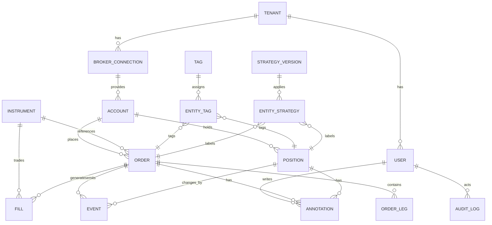
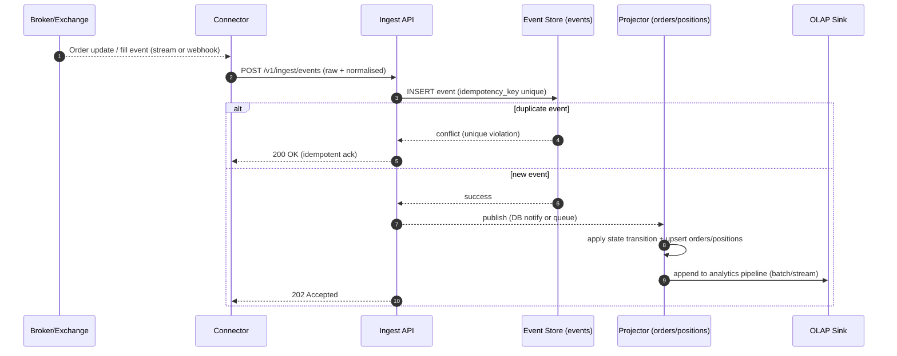
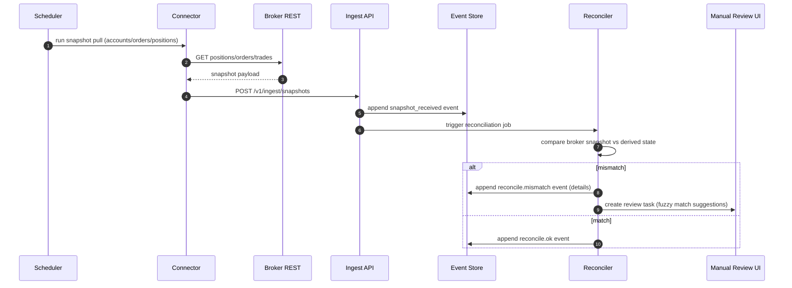
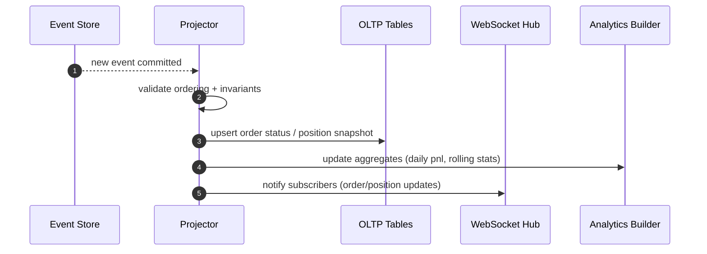
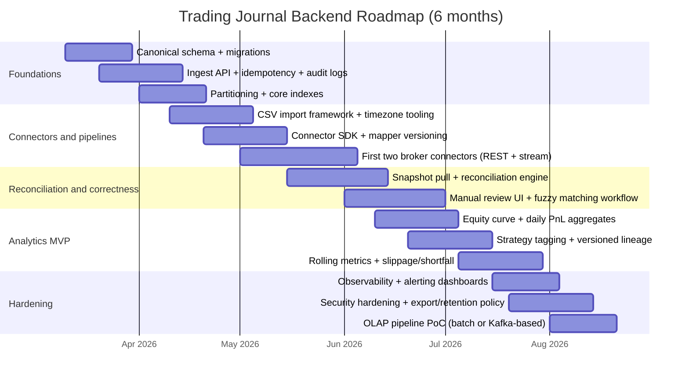

# Trading Journal Systems and Backend Architecture for a Trading Journal Platform

## Executive summary

A robust trading journal backend is fundamentally an **event-normalisation and reconciliation system**: brokers/exchanges emit heterogeneous “order/trade/position” constructs, sometimes via REST snapshots and sometimes via streams; the journal must convert these into a stable internal model, preserve raw broker truth for auditability, and compute analytics on top without corrupting history. Broker ecosystems expose both synchronous HTTP endpoints and asynchronous/event-driven streams (for example, the Client Portal Web API describes an HTTP + websocket model), which strongly favours an **append-only event log** plus idempotent ingestion. citeturn1search0

This document proposes a backend design centred on:

- A **canonical schema** for Accounts, Instruments, Orders, Fills, Positions, Events, Tags, and Audit Logs (with raw broker payload retention).
- A **trade lifecycle state machine** that can represent partial fills, cancels/replaces, OCO/bracket orders, and scaling in/out, mapped from broker-specific statuses and FIX-style execution reports. citeturn1search3turn1search15
- A computation layer for risk and performance metrics (Sharpe, drawdown, VaR/ES, expectancy, slippage/implementation shortfall), with explicit assumptions about data frequency and return definitions. The Basel market risk framework defines VaR and ES in a way suitable for portfolio risk reporting, and is used here as a reference definition for those measures. citeturn2search7turn2search3
- A storage architecture that separates **OLTP** (write-heavy, strongly consistent journal data) from **OLAP/time-series analytics** (rolling metrics, heatmaps, attribution), while keeping immutable raw payloads in object storage.
- A scalable ingestion pipeline using partitioned relational tables and (optionally) an event streaming backbone; Apache Kafka documentation describes idempotent and transactional modes that can prevent duplicates and support exactly-once semantics patterns in stream processing. citeturn2search14turn2search6

Key technical choice: implement journalling using **event sourcing + projections** (append-only “broker events” table, plus derived “current state” tables for Orders/Positions), because broker feeds are inherently eventful and reprocessing/reconciliation is inevitable.

## Assumptions and scope

Assumptions (explicit because you did not specify constraints):

- The platform is a **multi-tenant SaaS** (tenant → users → linked brokerage accounts).
- We must support both **netting** and **hedging** position models. MetaTrader 5 documentation distinguishes netting (one position per symbol) vs hedging (multiple positions per symbol, including multidirectional). citeturn1search25
- All timestamps are stored internally as **UTC** plus the original broker/exchange timestamp and timezone metadata where available (many broker APIs return server timestamps; some file exports are local time).
- We will **not place trades**; we only ingest and analyse. However, order lifecycle modelling must still represent advanced order types (OCO/brackets, partial fills, cancel/replace).
- “Trade” in user-facing analytics refers to a **round-trip** (open→close) “position episode” where possible; but the canonical storage is **orders + fills + positions + events**, because brokers disagree on what constitutes a “trade”.

Data gaps / variability to anticipate:

- Broker APIs evolve (fields, status enums, “order vs trade” semantics). Keep all broker payloads verbatim (object store + JSONB) and implement versioned mappers per connector. citeturn0search18turn1search8
- Some brokers expose “order lists”, “orderId”, “clientOrderId”, and “fills” differently; the system must treat **broker IDs as opaque** and hold a stable internal UUID mapping.

## Core data structures and canonical schema

### Canonical entities and why they exist

A durable journal schema separates **facts** (immutable events/fills) from **state** (current order status, current positions) and from **human metadata** (annotations/tags).

- **Account**: a logical trading account (a broker account or sub-account). It defines base currency, margin model, and netting/hedging rules (if known).
- **Instrument**: a normalised representation of a tradable symbol; must capture asset class and contract details to interpret quantities and P&L.
- **Order**: user/broker intent; may have multiple legs (OCO has two linked legs; bracket has attached child orders).
- **Fill (execution)**: ground truth of executed quantity/price; analytics should be primarily fill-driven.
- **Position**: current exposure per instrument per account (netting) or per “position ticket/lot” (hedging).
- **Event**: append-only lifecycle events (order accepted, replaced, partially filled, filled, cancelled, rejected; position update; corporate action; manual adjustment).
- **Annotation / Tag**: user-supplied metadata and machine metadata (strategy, setup, error type, emotion, rule violations).
- **Audit log**: who changed what metadata; critical for compliance, integrity, and debugging.

### ER diagram for core schema



### Postgres core table definitions

The DDL below is intentionally “core + extensible”: you can add high-cardinality optional fields as JSONB, with selective indexing. PostgreSQL supports declarative partitioning (range/list/hash), which is recommended for large, time-bounded event tables. citeturn2search0  
For flexible broker payloads and strategy metadata, JSONB with GIN indexing is useful; PostgreSQL documents JSON/JSONB indexing with GIN and operator class trade-offs. citeturn2search5turn2search1

```sql
-- Extensions (adjust to your environment)
CREATE EXTENSION IF NOT EXISTS pgcrypto;

-- Tenancy
CREATE TABLE tenants (
  tenant_id uuid PRIMARY KEY DEFAULT gen_random_uuid(),
  name text NOT NULL,
  created_at timestamptz NOT NULL DEFAULT now()
);

CREATE TABLE users (
  user_id uuid PRIMARY KEY DEFAULT gen_random_uuid(),
  tenant_id uuid NOT NULL REFERENCES tenants(tenant_id),
  email text NOT NULL,
  created_at timestamptz NOT NULL DEFAULT now(),
  UNIQUE (tenant_id, email)
);

-- Broker connection (OAuth tokens etc stored encrypted at app layer or via KMS envelope)
CREATE TABLE broker_connections (
  connection_id uuid PRIMARY KEY DEFAULT gen_random_uuid(),
  tenant_id uuid NOT NULL REFERENCES tenants(tenant_id),
  broker_code text NOT NULL, -- e.g. "ibkr", "binance"
  external_user_ref text NULL,
  status text NOT NULL DEFAULT 'active',
  created_at timestamptz NOT NULL DEFAULT now()
);

-- Account
CREATE TABLE accounts (
  account_id uuid PRIMARY KEY DEFAULT gen_random_uuid(),
  tenant_id uuid NOT NULL REFERENCES tenants(tenant_id),
  connection_id uuid NOT NULL REFERENCES broker_connections(connection_id),
  broker_account_id text NOT NULL,   -- opaque broker account id
  base_currency text NOT NULL,
  account_type text NOT NULL DEFAULT 'cash', -- cash|margin|futures|fx etc
  position_model text NOT NULL DEFAULT 'netting', -- netting|hedging|unknown
  created_at timestamptz NOT NULL DEFAULT now(),
  UNIQUE (connection_id, broker_account_id)
);

-- Instrument master
CREATE TABLE instruments (
  instrument_id uuid PRIMARY KEY DEFAULT gen_random_uuid(),
  tenant_id uuid NOT NULL REFERENCES tenants(tenant_id),
  venue text NULL,               -- exchange/venue
  symbol text NOT NULL,          -- venue symbol or canonical symbol
  asset_class text NOT NULL,     -- equity|option|future|fx|crypto|cfd etc
  base_asset text NULL,
  quote_asset text NULL,
  contract_spec jsonb NOT NULL DEFAULT '{}'::jsonb, -- option strike/expiry/right, future month, fx pair, etc
  created_at timestamptz NOT NULL DEFAULT now(),
  UNIQUE (tenant_id, venue, symbol, asset_class)
);

-- Orders
CREATE TABLE orders (
  order_id uuid PRIMARY KEY DEFAULT gen_random_uuid(),
  tenant_id uuid NOT NULL REFERENCES tenants(tenant_id),
  account_id uuid NOT NULL REFERENCES accounts(account_id),
  instrument_id uuid NOT NULL REFERENCES instruments(instrument_id),

  broker_order_id text NULL,      -- assigned by broker
  client_order_id text NULL,      -- set by client (if any); many brokers support this concept
  parent_order_id uuid NULL REFERENCES orders(order_id),

  order_type text NOT NULL,       -- market|limit|stop|stop_limit|oco|bracket etc (normalised)
  side text NOT NULL,             -- buy|sell
  time_in_force text NULL,        -- gtc|day|ioc|fok etc (normalised)
  quantity numeric(24,10) NOT NULL,
  limit_price numeric(24,10) NULL,
  stop_price numeric(24,10) NULL,

  status text NOT NULL DEFAULT 'created',   -- created|submitted|accepted|part_filled|filled|cancelled|rejected|expired
  submitted_at timestamptz NULL,
  last_status_at timestamptz NULL,

  source text NOT NULL DEFAULT 'import',    -- import|manual|api|fix|bot
  broker_raw jsonb NOT NULL DEFAULT '{}'::jsonb, -- last seen broker order payload (optional)
  created_at timestamptz NOT NULL DEFAULT now(),

  UNIQUE (account_id, broker_order_id),
  UNIQUE (account_id, client_order_id)
);

-- Optional: multi-leg modelling (OCO = two legs, bracket = parent + children)
CREATE TABLE order_legs (
  order_leg_id uuid PRIMARY KEY DEFAULT gen_random_uuid(),
  tenant_id uuid NOT NULL REFERENCES tenants(tenant_id),
  order_id uuid NOT NULL REFERENCES orders(order_id),

  leg_role text NOT NULL,         -- primary|take_profit|stop_loss|oco_above|oco_below
  leg_quantity numeric(24,10) NULL,
  leg_limit_price numeric(24,10) NULL,
  leg_stop_price numeric(24,10) NULL,

  broker_leg_ref text NULL,
  created_at timestamptz NOT NULL DEFAULT now()
);

-- Fills / Executions
CREATE TABLE fills (
  fill_id uuid PRIMARY KEY DEFAULT gen_random_uuid(),
  tenant_id uuid NOT NULL REFERENCES tenants(tenant_id),
  account_id uuid NOT NULL REFERENCES accounts(account_id),
  order_id uuid NULL REFERENCES orders(order_id),
  instrument_id uuid NOT NULL REFERENCES instruments(instrument_id),

  broker_trade_id text NULL,      -- broker execution id, if provided
  executed_at timestamptz NOT NULL,
  quantity numeric(24,10) NOT NULL,
  price numeric(24,10) NOT NULL,
  commission numeric(24,10) NULL,
  fees numeric(24,10) NULL,
  liquidity text NULL,            -- maker|taker|unknown
  broker_raw jsonb NOT NULL DEFAULT '{}'::jsonb,

  UNIQUE (account_id, broker_trade_id)
);

-- Positions (current snapshot; recomputable from fills/events)
CREATE TABLE positions (
  position_id uuid PRIMARY KEY DEFAULT gen_random_uuid(),
  tenant_id uuid NOT NULL REFERENCES tenants(tenant_id),
  account_id uuid NOT NULL REFERENCES accounts(account_id),
  instrument_id uuid NOT NULL REFERENCES instruments(instrument_id),

  position_key text NOT NULL,      -- for hedging: broker position ticket; for netting: account+instrument
  quantity numeric(24,10) NOT NULL,
  avg_open_price numeric(24,10) NULL,
  realised_pnl numeric(24,10) NOT NULL DEFAULT 0,
  unrealised_pnl numeric(24,10) NOT NULL DEFAULT 0,

  last_mark_price numeric(24,10) NULL,
  last_mark_at timestamptz NULL,
  updated_at timestamptz NOT NULL DEFAULT now(),

  UNIQUE (account_id, position_key)
);

-- Events: append-only lifecycle and reconciliation events
-- Partitioning recommended by event_time for scale.
CREATE TABLE events (
  event_id uuid PRIMARY KEY DEFAULT gen_random_uuid(),
  tenant_id uuid NOT NULL REFERENCES tenants(tenant_id),

  account_id uuid NULL REFERENCES accounts(account_id),
  order_id uuid NULL REFERENCES orders(order_id),
  fill_id uuid NULL REFERENCES fills(fill_id),
  position_id uuid NULL REFERENCES positions(position_id),
  instrument_id uuid NULL REFERENCES instruments(instrument_id),

  event_type text NOT NULL,        -- order.accepted, order.part_filled, order.cancelled, fill.posted, position.updated, reconcile.mismatch, etc
  event_time timestamptz NOT NULL,
  source text NOT NULL,            -- broker_stream|broker_poll|file_import|manual|system
  idempotency_key text NOT NULL,   -- used to ensure exactly-once ingestion for the same broker event
  payload jsonb NOT NULL DEFAULT '{}'::jsonb, -- normalised event payload
  broker_raw jsonb NOT NULL DEFAULT '{}'::jsonb,

  created_at timestamptz NOT NULL DEFAULT now(),
  UNIQUE (tenant_id, idempotency_key)
);

-- Tags (hierarchical)
CREATE TABLE tags (
  tag_id uuid PRIMARY KEY DEFAULT gen_random_uuid(),
  tenant_id uuid NOT NULL REFERENCES tenants(tenant_id),
  name text NOT NULL,
  parent_tag_id uuid NULL REFERENCES tags(tag_id),
  tag_type text NOT NULL DEFAULT 'user', -- user|system|strategy|risk|error
  created_at timestamptz NOT NULL DEFAULT now(),
  UNIQUE (tenant_id, name, parent_tag_id)
);

-- Tag assignment to entities (polymorphic via columns)
CREATE TABLE entity_tags (
  entity_tag_id uuid PRIMARY KEY DEFAULT gen_random_uuid(),
  tenant_id uuid NOT NULL REFERENCES tenants(tenant_id),
  tag_id uuid NOT NULL REFERENCES tags(tag_id),
  order_id uuid NULL REFERENCES orders(order_id),
  position_id uuid NULL REFERENCES positions(position_id),
  fill_id uuid NULL REFERENCES fills(fill_id),
  created_by uuid NULL REFERENCES users(user_id),
  created_at timestamptz NOT NULL DEFAULT now()
);

-- Strategy versioning
CREATE TABLE strategy_versions (
  strategy_version_id uuid PRIMARY KEY DEFAULT gen_random_uuid(),
  tenant_id uuid NOT NULL REFERENCES tenants(tenant_id),
  strategy_name text NOT NULL,
  version text NOT NULL,                  -- semver string
  parent_strategy_version_id uuid NULL REFERENCES strategy_versions(strategy_version_id),
  signal_schema jsonb NOT NULL DEFAULT '{}'::jsonb, -- expected fields for signal metadata
  created_at timestamptz NOT NULL DEFAULT now(),
  UNIQUE (tenant_id, strategy_name, version)
);

CREATE TABLE entity_strategy (
  entity_strategy_id uuid PRIMARY KEY DEFAULT gen_random_uuid(),
  tenant_id uuid NOT NULL REFERENCES tenants(tenant_id),
  strategy_version_id uuid NOT NULL REFERENCES strategy_versions(strategy_version_id),
  order_id uuid NULL REFERENCES orders(order_id),
  position_id uuid NULL REFERENCES positions(position_id),
  confidence numeric(6,5) NULL,            -- optional ML/confidence score
  signal_metadata jsonb NOT NULL DEFAULT '{}'::jsonb,
  created_at timestamptz NOT NULL DEFAULT now()
);

-- Annotations
CREATE TABLE annotations (
  annotation_id uuid PRIMARY KEY DEFAULT gen_random_uuid(),
  tenant_id uuid NOT NULL REFERENCES tenants(tenant_id),
  author_user_id uuid NOT NULL REFERENCES users(user_id),
  order_id uuid NULL REFERENCES orders(order_id),
  position_id uuid NULL REFERENCES positions(position_id),
  fill_id uuid NULL REFERENCES fills(fill_id),
  body text NOT NULL,
  created_at timestamptz NOT NULL DEFAULT now()
);

-- Audit log for user actions that mutate metadata (tags, notes, mappings, overrides)
CREATE TABLE audit_logs (
  audit_id uuid PRIMARY KEY DEFAULT gen_random_uuid(),
  tenant_id uuid NOT NULL REFERENCES tenants(tenant_id),
  actor_user_id uuid NULL REFERENCES users(user_id),
  action text NOT NULL,
  entity_type text NOT NULL,
  entity_id uuid NOT NULL,
  before jsonb NULL,
  after jsonb NULL,
  ip inet NULL,
  user_agent text NULL,
  created_at timestamptz NOT NULL DEFAULT now()
);

-- Index patterns
CREATE INDEX idx_events_tenant_time ON events (tenant_id, event_time DESC);
CREATE INDEX idx_fills_account_time ON fills (account_id, executed_at DESC);
CREATE INDEX idx_orders_account_status ON orders (account_id, status, last_status_at DESC);

-- JSONB indexing as needed (avoid blanket GIN indexes; use them where queries justify)
CREATE INDEX idx_events_payload_gin ON events USING gin (payload jsonb_path_ops);
```

Partitioning note: for high volume, make `events` and `fills` partitioned by time (monthly/weekly) and/or by tenant. PostgreSQL declarative partitioning supports RANGE/LIST/HASH; for time partitioning, use RANGE on `event_time`. citeturn2search0

## Trade lifecycle modelling and state transitions

### Canonical lifecycle concept

Most broker/exchange models can be represented as:

- **Order intent** (submitted/accepted/rejected/cancelled/replaced)
- **Execution** (0..N fills; partial fills are normal)
- **Position impact** (netting vs hedging rules change how fills aggregate)

This aligns with FIX-style semantics: Execution Report messages are used to confirm receipt, relay order status changes, and provide fill information. citeturn1search3  
New orders are commonly represented as New Order Single messages (FIX MsgType D) at the protocol level. citeturn1search15

### Recommended order state machine

A pragmatic normalised state set:

- `created` → `submitted` → `accepted`
- `accepted` → `part_filled` (on first fill if remaining qty > 0)
- `part_filled` → `filled` (cum_qty == orig_qty)
- `accepted|part_filled` → `cancel_pending` → `cancelled`
- any → `rejected` (terminal)
- any → `expired` (terminal, for time-in-force expiry)
- plus “replace/modify” which is tracked as an event with an updated “current order” projection

Binance’s documentation describes that order status reporting and status change triggers can be monitored via REST and streams, reinforcing a model where status changes are events that must be processed idempotently. citeturn0search13

### Partial fills, scaling in/out, and the “trade” abstraction

- **Partial fill**: store each execution as a `fill` record and emit `order.part_filled` events. Keep `orders.status` as a projection; the truth is in fills/events. (This mirrors FIX where a stream of execution reports updates CumQty/AvgPx fields over time. citeturn1search3)
- **Scaling in/out**: scaling is not a special case; it is multiple fills/orders affecting the same position. The “round trip trade” for journalling is a derived concept computed by reconstructing position episodes (FIFO/LIFO/average-cost, user-selectable policy).
- **Netting vs hedging**: MetaTrader 5 explains that netting allows only one position per symbol, while hedging can hold several positions per symbol (including opposite directions). This must be modelled explicitly (`accounts.position_model`, plus `positions.position_key`). citeturn1search25

### OCO and bracket representation

You need first-class modelling of linked orders, because brokers implement these constructs differently.

- **OCO (one-cancels-the-other)**: Binance’s trading endpoints document “New OCO” orders as two linked legs where execution of one cancels the other (and they count as two unfilled orders). citeturn3search0  
  Represent this as:
  - `orders` parent with `order_type='oco'`
  - two `order_legs`: `oco_above`, `oco_below`
  - child broker orders if the broker materialises them separately
  - events: `order.oco_leg_filled` triggers `order.oco_other_cancel_requested`

- **Bracket / attached orders**: Coinbase’s Advanced Trade create-order docs reference attached order configuration (TriggerBracketGtc), implying a parent order with dependent bracket logic. citeturn0search10  
  Some brokerage APIs explicitly teach “complex orders” such as brackets and combos (e.g., a TWS Python lesson covering brackets). citeturn1search24  
  Model similarly with parent/child orders (`parent_order_id`) and leg roles (`take_profit`, `stop_loss`).

### Manual vs automated orders

Treat “how the order was produced” as provenance:

- `source=manual` (user entered into broker UI and later imported)
- `source=api` (user’s automation, webhook, algo)
- `source=fix` (institutional FIX gateway)
- `source=bot` (signals-to-order bot; if you ever support it later)

Certain APIs are explicitly event-driven (HTTP + websockets), which makes source tracking and ordered event processing important. citeturn1search0

### Sequence diagrams

**Order ingestion (stream/webhook)**



**Reconciliation (poll/snapshot)**



**Lifecycle events and projections**



## Risk metrics, strategy tagging, and performance analytics

### Risk-management metrics: definitions, requirements, and pitfalls

Risk metrics are only as sound as the underlying time series and valuation assumptions. For VaR/ES specifically, supervisory frameworks define them in terms of loss distributions over a time horizon and confidence level: OSFI’s market risk chapter (reflecting Basel Framework) states VaR is a “worst expected loss … over a given time horizon and a pre-defined confidence level” and ES is “the average of all potential losses exceeding the VaR”. citeturn2search7  
Separately, Basel Committee publications describe the policy shift from VaR to Expected Shortfall under stress to better capture tail risk. citeturn2search3turn2search23

| Metric | Scope | Inputs you must store | Key implementation detail |
|---|---|---|---|
| Realised / unrealised P&L | Trade + portfolio | fills, fees, mark prices, FX rates | Unrealised needs a mark source and timestamp; store `last_mark_at/price`. |
| Slippage | Trade | decision price, execution price, qty | Define decision price per fill or per signal event; store as event metadata. |
| Implementation shortfall | Portfolio / strategy | decision portfolio value, executed portfolio value | Perold defines it as the difference between theoretical (“paper”) and implemented portfolio return, attributable to execution realities. citeturn3search3turn3search7 |
| Win/loss, expectancy | Strategy | per-trade P&L, trade grouping rules | Define “trade” as round trip; be explicit about scaling and partial exits. |
| Max drawdown | Portfolio | equity curve time series | Make frequency explicit (intraday vs daily closes). |
| MAR ratio | Portfolio | CAGR + max drawdown | MAR depends on drawdown definition and compounding frequency (assumption). |
| Sharpe ratio | Portfolio / strategy | return series, risk-free/benchmark series | Sharpe introduced reward-to-variability ratio for mutual fund performance; the Stanford note references Sharpe (1966) and explains the ratio concept. citeturn3search2turn3search6 |
| Sortino ratio | Portfolio / strategy | return series, downside deviation | Requires defining MAR/minimum acceptable return and downside deviation window (assumption). |
| Exposure (gross/net) | Portfolio | current positions by instrument + notional | Needs instrument multiplier + FX conversion to base. |
| Kelly fraction | Strategy | win rate, payoff ratio (or full distribution) | Highly sensitive to estimation error; store assumptions (window, shrinkage). |
| VaR / Expected Shortfall | Portfolio | return series, horizon, confidence | Store config (method: historical/parametric/Monte Carlo), horizon, confidence; cite Basel-style definitions. citeturn2search7turn2search3 |

Practical recommendation: persist **calculation configuration** with every computed metric series (window, frequency, benchmark/risk-free assumptions, inclusion/exclusion filters), otherwise analytics will be irreproducible.

### Strategy tagging: taxonomy, multi-label, and versioned lineage

A strategy system for a journal is more than free-form tags; it must support:

- **Hierarchical taxonomy** (e.g., “Breakout → Opening Range Breakout”).
- **Multi-label tagging** (one trade can be “Mean Reversion” and “Earnings” and “High Volatility”).
- **Versioning and lineage** (Strategy v1 vs v2; compare backtest vs live by version).
- **Signal metadata schema** (fields like setup_time, signal_price, model_confidence, stop_model, regime label).

Design pattern:

- `strategy_versions(strategy_name, version, parent_strategy_version_id, signal_schema)`
- `entity_strategy(order_id|position_id, strategy_version_id, signal_metadata, confidence)`
- `tags` remain generic; strategies are first-class so you can reason about lineage.

### Performance analytics: time-series, attribution, rolling metrics, and backtest vs live

Core analytics outputs you should plan to generate:

- **Time series**: equity curve, daily P&L, realised/unrealised breakdown, exposure over time.
- **Attribution**: by strategy version, instrument, asset class, session (Asia/London/NY), holding time bucket.
- **Rolling metrics**: rolling Sharpe, rolling win rate, rolling drawdown, rolling slippage.
- **Cohort analysis**: compare performance by “strategy version cohort start date”, or “after rule-change”.
- **Heatmaps**: hour-of-day × day-of-week performance; volatility regime × setup type.

Backtest vs live comparison requires storing backtest outputs in a comparable schema:

- backtest “fills” (simulated) and “orders” (signals) should map into the same canonical model but with `source='backtest'` and explicit slippage/commission models recorded as configuration.

## Broker formats, schema mapping, and import pipelines

### Broker/API format comparison table

The table focuses on data model and ingestion implications, not commercial detail.

| Broker / format | Core objects exposed | Real-time capability | Order linkage constructs | Notes for mapping |
|---|---|---|---|---|
| **entity["company","Interactive Brokers","brokerage and trading api"]** | Client Portal Web API supports orders/portfolio updates via HTTP and websocket event-driven access. citeturn1search0 | websocket + HTTP snapshots citeturn1search0 | Complex orders (e.g., brackets) are documented in lessons. citeturn1search24 | Map broker order IDs and treat “reply/confirm” flows as events; store callbacks as lifecycle events. citeturn1search1 |
| **entity["company","Alpaca","brokerage api platform"]** | Orders API to monitor/place/cancel; docs emphasise order object fields and client IDs. citeturn0search8turn0search16 | REST; platform also documents FIX entry. citeturn1search23 | FIX 4.2 spec for order entry exists in docs. citeturn1search23 | Store `client_order_id`, `filled_avg_price`-style fields as projections; fills are separate truth. citeturn0search12 |
| **entity["company","Binance","crypto exchange"]** | REST trading endpoints; supports OCO order endpoint (documented as linked legs). citeturn3search0turn3search4 | REST + user data streams (status monitoring discussed). citeturn0search13 | OCO has two linked orders; execution of one cancels the other. citeturn3search4 | Normalise `orderId` + `clientOrderId` and treat “order lists”/OCO as group + legs. citeturn3search0turn3search16 |
| **entity["company","Coinbase","crypto exchange"]** | Advanced Trade API provides REST API and WebSocket protocol for real-time market data. citeturn0search18 | REST + WebSocket citeturn0search18 | Attached/bracket-style configuration referenced in create order docs. citeturn0search10 | Use `order_id` as broker ID; map attached order metadata into `order_legs` / `parent_order_id`. citeturn0search6turn0search10 |
| **entity["company","OANDA","forex and cfd broker"]** | v20 REST API for accounts/orders; order schema documents trigger/price component behaviour. citeturn0search3turn0search7 | REST; polling common | OCO may exist on certain platforms (e.g., MT4 premium upgrade) per help content. citeturn3search29 | FX units often signed (+/-) and instrument names like EUR_USD; map as instrument + signed qty. citeturn0search15 |
| **MetaTrader MT4/MT5 exports** (via entity["company","MetaQuotes","metatrader platform vendor"]) | MT5 distinguishes orders, deals, and positions; and netting vs hedging models. citeturn1search14turn1search25 | Mostly file export / bridge APIs | Hedging account “close by” behaviours exist; impacts trade grouping. citeturn1search29 | Treat “deal” as fill; “order” as intent; “position” as exposure; store platform ticket IDs as broker refs. citeturn1search14turn1search25 |
| **FIX** (industry standard via entity["organization","FIX Trading Community","fix protocol steward"]) | MsgType D (New Order Single) and MsgType 8 (Execution Report) provide order entry and fill/status updates. citeturn1search15turn1search3 | Stream-oriented | Cancel/replace patterns and order status updates are represented as execution reports. citeturn1search3 | Parse into canonical events + store raw tag stream; beware FIX versions and custom tags. citeturn1search3turn1search15 |

### Mapping rules: broker payload → internal schema

Use a mapping contract per connector:

- **Idempotency key** = `broker_code + broker_account_id + primary_id + event_type + event_time(or sequence)`  
  Store as `events.idempotency_key` with a unique constraint.
- **Order identity**:
  - `orders.broker_order_id` = broker order id (opaque)
  - `orders.client_order_id` = client order id if supported (some APIs emphasise client-side IDs) citeturn0search8
- **Fill identity**:
  - `fills.broker_trade_id` = execution id if provided
  - If absent, derive a synthetic key from (order_id, executed_at, price, qty, venue sequence) and treat as “best effort”; flag for reconciliation.
- **Status changes** are always events; `orders.status` is a projection computed from latest consistent event.

### Data model examples (JSON)

**Order (canonical)**

```json
{
  "order_id": "6d4f6c47-7b64-4a2f-9d7e-3a5c4f2c6d5a",
  "account_id": "2cc7f0f1-7f1f-4f4b-9a41-4bd8cfea4f3e",
  "instrument": { "venue": "NASDAQ", "symbol": "AAPL", "asset_class": "equity" },
  "broker_order_id": "abc12345",
  "client_order_id": "myapp-2026-03-08-0001",
  "order_type": "limit",
  "side": "buy",
  "time_in_force": "gtc",
  "quantity": "10",
  "limit_price": "175.50",
  "status": "part_filled",
  "submitted_at": "2026-03-08T16:01:12Z",
  "last_status_at": "2026-03-08T16:01:15Z",
  "source": "import",
  "broker_raw": { "raw_version": "v1", "raw_fields": "..." }
}
```

**Fill**

```json
{
  "fill_id": "d1b1d90c-7f09-4d8b-a4b0-2b1cd6cda04a",
  "order_id": "6d4f6c47-7b64-4a2f-9d7e-3a5c4f2c6d5a",
  "broker_trade_id": "exec-778899",
  "executed_at": "2026-03-08T16:01:15.481Z",
  "quantity": "4",
  "price": "175.60",
  "commission": "0.12",
  "fees": "0.00",
  "liquidity": "taker",
  "broker_raw": { "executionReport": "..." }
}
```

**Position (netting example)**

```json
{
  "position_id": "e5d8b5bb-3f45-4e0d-9c9b-6e8b4f2a4f9e",
  "account_id": "2cc7f0f1-7f1f-4f4b-9a41-4bd8cfea4f3e",
  "instrument": { "venue": "NASDAQ", "symbol": "AAPL", "asset_class": "equity" },
  "position_key": "net:AAPL",
  "quantity": "10",
  "avg_open_price": "174.80",
  "realised_pnl": "12.35",
  "unrealised_pnl": "3.10",
  "last_mark_price": "175.11",
  "last_mark_at": "2026-03-08T16:10:00Z"
}
```

**Account**

```json
{
  "account_id": "2cc7f0f1-7f1f-4f4b-9a41-4bd8cfea4f3e",
  "broker_code": "ibkr",
  "broker_account_id": "U1234567",
  "base_currency": "USD",
  "account_type": "margin",
  "position_model": "netting"
}
```

**Strategy tag (versioned + metadata)**

```json
{
  "strategy_name": "Opening Range Breakout",
  "version": "2.1.0",
  "parent_version": "2.0.0",
  "signal_schema": {
    "fields": {
      "setup_time": "datetime",
      "or_high": "price",
      "or_low": "price",
      "entry_model": "enum",
      "confidence": "float",
      "regime": "enum"
    }
  },
  "example_signal_metadata": {
    "setup_time": "2026-03-08T14:30:00Z",
    "or_high": 175.40,
    "or_low": 174.90,
    "entry_model": "breakout_pullback",
    "confidence": 0.63,
    "regime": "high_vol"
  }
}
```

### FIX snippets (illustrative, simplified)

The following are intentionally minimal examples to demonstrate mapping. FIX dictionaries describe that a New Order Single is MsgType D and Execution Report is MsgType 8, used for order receipt/status/fill info. citeturn1search15turn1search3

```text
# New Order Single (MsgType=D) - simplified
8=FIX.4.2|9=...|35=D|11=clOrdId-123|55=AAPL|54=1|38=10|40=2|44=175.50|59=1|60=20260308-16:01:12.000|10=...

# Execution Report (MsgType=8) - simplified partial fill
8=FIX.4.2|9=...|35=8|11=clOrdId-123|37=ordId-999|39=1|150=1|32=4|31=175.60|14=4|6=175.60|60=20260308-16:01:15.481|10=...
```

Internal mapping: each Execution Report becomes an `events` row with `event_type` derived from OrdStatus/ExecType plus a `fills` row if it contains execution quantity/price.

### Import pipelines, reconciliation, and idempotency

A journal platform must support three ingestion patterns:

| Ingestion pattern | Best for | Failure mode | Required controls |
|---|---|---|---|
| Webhooks / push events | near-real-time journalling | duplicate deliveries; out-of-order | idempotency keys + event ordering + retries with safe dedup (unique constraint) |
| Polling (snapshots) | brokers without streams; gap filling | missed intraday events; rate limits | incremental cursors; periodic full reconciliation; snapshot events |
| File import (CSV/MT4/MT5 exports) | legacy & portability | timezone ambiguity; column drift | schema detector + user mappings; fuzzy matching; canonical timezone conversion |

Broker ecosystems commonly provide both REST and streaming options (e.g., some APIs explicitly note REST + WebSocket protocols for real-time data). citeturn0search18turn1search0

Key ingestion engineering practices:

- **Idempotency**: enforce `UNIQUE(tenant_id, idempotency_key)` on `events`. This “database as idempotency gate” is simple and reliable.
- **Deduplication**: prefer broker-provided unique IDs; where absent, compute stable hashes from semantically identifying fields.
- **Reconciliation**: schedule periodic snapshots of orders/positions; compare broker snapshot to derived fill-based positions; emit `reconcile.mismatch` events and generate a manual review task.
- **Timezone handling**: store:
  - `broker_time` string/raw
  - `event_time` UTC (parsed)
  - `source_timezone` and parsing confidence
  - if a CSV uses local time and DST, require user confirmation and store the mapping decision in `audit_logs`.

## Storage, APIs, scalability, and operational controls

### Recommended storage choices

The architecture separates concerns:

1. **Row-store OLTP (authoritative journal)**:  
   Use entity["organization","PostgreSQL","open-source relational database"] for strongly consistent writes and relational integrity across orders/fills/positions/events; use declarative partitioning for `events` and `fills` to manage scale. PostgreSQL supports partitioning strategies RANGE/LIST/HASH. citeturn2search0

2. **Columnar OLAP (analytics)**:  
   Use a columnar warehouse (e.g., ClickHouse/BigQuery/Snowflake—implementation choice) for rolling metrics, heatmaps, cohort analysis and wide scans. Rationale: user-facing analytics often require scanning many rows and aggregating; this competes with OLTP workloads.

3. **Time-series storage**:  
   Many analytics are time-series (equity curve, exposure over time). A columnar OLAP can often handle this; alternatively add a time-series extension/DB if you need high-resolution marks. (Assumption: start with OLAP + partitions; only add a specialised TSDB when needed.)

4. **Object store**:  
   Store raw broker payloads/files (CSV uploads, JSON snapshots) in object storage; keep references + hashes in OLTP. Rationale: cheap retention, auditability, replay.

### OLTP vs OLAP separation and CQRS

- Write path: ingest events → persist to OLTP → update projections.
- Read path: most dashboards should read from **pre-aggregated** tables / materialised views / OLAP, not raw event scans.

This is a practical CQRS pattern: OLTP is the source of truth; OLAP is derived.

### Event streaming and processing

An event streaming backbone is optional, but beneficial once ingestion and analytics scale:

- entity["organization","Apache Kafka","distributed event streaming platform"] supports idempotent producer semantics; its docs note idempotence can prevent duplicates from retries, and transactional producers can send messages atomically to multiple partitions/topics. citeturn2search6turn2search14  
- Kafka design docs discuss transactional processing patterns as a route toward exactly-once semantics in stream processing pipelines. citeturn2search25

In this architecture:
- Ingest API commits to OLTP first (source of truth).
- A CDC/outbox pattern publishes to Kafka for projections/analytics (or the projector reads directly from OLTP).

### API design suggestions (REST + WebSocket)

API goals: stable identifiers, idempotent writes, streaming-friendly reads.

**Auth**
- Platform: JWT access tokens for users; service tokens for connectors.
- Broker connectors: OAuth where applicable (often broker-specific; store encrypted).
- Use per-tenant API keys for ingestion endpoints; rotate; scope to accounts.

**REST endpoints (illustrative)**
- `POST /v1/ingest/events` (connector writes normalised + raw broker events; idempotency required)
- `POST /v1/ingest/files` (CSV uploads; returns job id)
- `GET /v1/accounts`
- `GET /v1/instruments?symbol=...`
- `GET /v1/orders?account_id=...&from=...&to=...`
- `GET /v1/fills?account_id=...`
- `GET /v1/positions?account_id=...`
- `GET /v1/analytics/equity_curve?account_id=...&freq=1d`
- `GET /v1/analytics/attribution?by=strategy_version&from=...`
- `POST /v1/annotations`
- `POST /v1/tags`
- `POST /v1/strategies/versions`

**WebSockets**
- `/ws/v1/stream` with topics:
  - `orders.updated`
  - `positions.updated`
  - `imports.progress`
  - `reconcile.alerts`

**Rate limiting**
- Separate limits for:
  - user dashboard reads (e.g., 60 req/min burst 120)
  - connector writes (e.g., 300 req/min/account, with batching)
  - heavy analytics endpoints (force cached/async jobs)

### Scalability patterns

- **Partitioning**: partition `events` and `fills` by time; optionally by tenant for extreme multi-tenancy. PostgreSQL partitioning is declarative and supports common strategies. citeturn2search0
- **Index strategy**: keep B-tree indexes for tenant/time and account/time, and selective GIN indexes for JSONB where you need querying. PostgreSQL documents index types including GIN and B-tree. citeturn2search13turn2search1
- **Read replicas**: serve dashboard reads from replicas; keep ingestion on primary.
- **CQRS projections**: maintain “current order status” and “current positions” tables updated by a projector; rebuildable from events.
- **Materialised views**: in OLTP for small scale; later push to OLAP for large scans.
- **Batching**: connectors should batch events (e.g., 50–500 events per request) to reduce overhead.
- **Stream processing**: Kafka consumer groups for analytics builders; use idempotent producers and transaction patterns when exactly-once matters. citeturn2search14turn2search25
- **Sharding**: only when a single Postgres cluster cannot handle write volume; shard by tenant_id hash (align with partitioning strategy).

### Monitoring, observability, and alerting

Instrument the system around correctness and lag:

- **Ingestion**
  - events/sec, fills/sec
  - broker stream lag (broker timestamp vs event_time ingested)
  - dedup rate (% rejected by idempotency key)
  - parsing failures (per connector version)
- **Reconciliation**
  - mismatch count by account/day
  - unresolved review tasks
  - drift magnitude distribution (position qty, P&L)
- **Database**
  - p95/p99 write latency to `events`
  - replication lag (if using replicas)
  - partition bloat / index bloat signals
- **Analytics**
  - equity curve freshness (latest computed date)
  - job queue time, failure rate
- **Security**
  - anomalous API key usage
  - repeated auth failures
  - suspicious data export volumes

Alerts:
- ingestion lag > threshold (e.g., >60s for streaming connectors)
- reconciliation mismatch spikes
- dedup rate spikes (indicates connector replay or broker duplication)
- DB replication lag > threshold
- sustained error rate on ingestion endpoint

### Security, compliance, and privacy controls

Even if this platform is “just journalling”, the data is sensitive (PII + financial data).

Minimum controls:

- **Encryption in transit**: TLS everywhere (API, websockets).
- **Encryption at rest**: encrypt disks; additionally encrypt broker tokens and any PII fields at the application layer (envelope encryption).
- **Key management**: KMS-backed envelope encryption; rotate keys; audit access.
- **PII minimisation**: do not store unnecessary broker identity data; store opaque broker account IDs; store user email only for auth.
- **Auditability**: all user metadata mutations (tags, notes, manual merges) go to `audit_logs`.
- **Retention policies**:
  - raw broker payload retention configurable per tenant
  - event retention: keep immutable event log for X years (configurable) + ensure data export
- **Export/portability**: provide complete export of fills/orders/events + annotations + tags (and raw payload references).

Regulatory note: the Basel/OSFI sources used for VaR/ES definitions are risk-measure references, not a requirement that you comply with banking regulations; however, adopting standard definitions improves interpretability and prevents “invented VaR”. citeturn2search7turn2search3

### Migration and data quality strategies

Data quality problems are normal; you need workflows, not just code.

- **Reconciliation reports**: daily per account: broker snapshot vs derived state; mismatches by instrument, quantity, average price.
- **Manual review UI**:
  - fuzzy match broker fills to internal orders by time window + price tolerance + quantity
  - propose merges/splits; record decisions in `audit_logs`
- **Fuzzy matching rules** (examples):
  - same instrument, same side, |executed_at diff| < 2s, |price diff| < tick_size×N
  - for CSV imports with coarse timestamps, widen window and require user confirmation
- **Versioned mappers**: keep connector versions; store `mapper_version` in events payload; allow replay with updated parsers.

### Performance benchmark targets and capacity planning

Because user behaviour varies widely, capacity planning should be scenario-based. Below are pragmatic targets for a SaaS journalling platform (assumptions stated).

Assumptions for modelling:
- Average active user: 20 orders/day, 1.2 fills/order, ~3 lifecycle events/order (submitted/accepted/fill+status) plus reconciliation events.
- Burstiness: 10× at market open.
- Average event row “effective footprint” (row + indexes + overhead): 0.5–1.5 KB (range; depends on JSONB payload size).

| Scale tier | Active users | Orders/day | Events/day (rough) | Sustained ingest (events/sec) | Burst target (events/sec) | Storage growth (events only, GB/day) |
|---:|---:|---:|---:|---:|---:|---:|
| MVP | 1,000 | 20,000 | 80,000–150,000 | 1–2 | 10–20 | 0.05–0.20 |
| Growth | 100,000 | 2,000,000 | 8,000,000–15,000,000 | 90–175 | 900–1,750 | 4–22 |
| Scale | 1,000,000 | 20,000,000 | 80,000,000–150,000,000 | 925–1,735 | 9,000–17,000 | 40–220 |

Interpretation:
- Up to ~100k active users, a well-tuned Postgres + partitions + replicas can be viable if payload sizes are controlled and OLAP is offloaded.
- Beyond that, pushing event analytics to columnar storage and using streaming/batching becomes essential.

## Six-month technical roadmap



Key deliverables at the end of 6 months:
- Stable canonical schema with event sourcing and rebuildable projections.
- At least 2 production-grade ingestion connectors + a robust CSV/MT export importer.
- Reconciliation + manual review workflow.
- Strategy versioning, tagging, and core performance/risk analytics.

---

**Additional note on primary sources used:** Broker/API statements above are grounded in official or vendor documentation where possible (e.g., broker REST/stream docs and order type docs), and protocol lifecycle semantics are anchored in FIX dictionary references for MsgType D/8. PostgreSQL partitioning and JSONB indexing recommendations are anchored in PostgreSQL official documentation. Kafka semantics are anchored in Apache Kafka documentation/Javadoc regarding idempotent and transactional producers. Risk definitions for VaR/ES are anchored in supervisory framework descriptions (OSFI/BIS). citeturn1search0turn0search18turn2search0turn2search5turn2search14turn2search7turn2search3turn1search3turn1search15