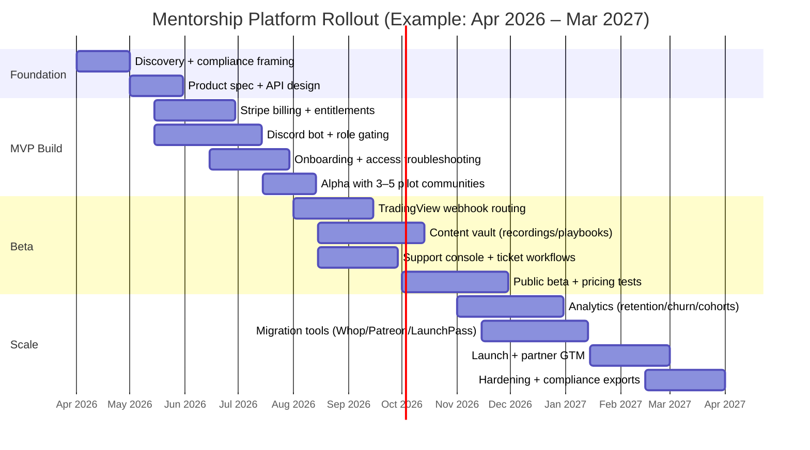

# Trading Mentor Industry With Emphasis on Discord-Based Trading Communities

## Executive summary

Discord-centric trading mentorship has converged into a recognisable “creator-led services” industry: educators, signal providers, and community operators bundle real-time chat, structured learning, and (sometimes) automated alerting/execution into recurring memberships. The dominant packaging is tiered subscriptions that gate Discord roles/channels (or entire servers) and upsell coaching, indicators, or “lifetime” access. Discord’s own native monetisation (Server Subscriptions / Server Shop) exists but remains US-only for creators as of late 2025, which materially shapes the tooling choices of non‑US mentors toward third‑party paywall/gating providers. citeturn20search3turn19view0turn0search4turn12search8

Business models and governance risks are tightly coupled. Regulators explicitly treat “advice for compensation” as a potential regulated activity in multiple regimes (e.g., “investment adviser” for securities; “commodity trading advisor” for futures/FX/commodity interests). Separately, enforcement has shown Discord can be used to coordinate market manipulation, not just education—raising compliance, moderation, and brand-trust requirements for legitimate communities. citeturn1search1turn1search5turn1search8turn0search1turn0search11

Community size in this niche is heavy‑tailed: most listed servers are small (tens to low thousands), while the best-known multi‑asset and crypto servers can reach tens of thousands of members. In a sample of public Discord invites and Discord Discovery listings, communities range from ~4k to ~67k members for prominent “signals + tools” brands, while broad directory listings under forex/stock-market tags typically show the mid‑hundreds to low‑thousands. citeturn5search8turn5search25turn10search3turn10search4turn14view0turn13view0

A mentorship platform opportunity exists in reducing operational sprawl (Discord + LMS + payments + analytics + support), reducing fraud/chargebacks, and adding compliance-by-design (disclosures, audit trails, moderation tooling, affiliate governance). A pragmatic MVP can focus on identity + billing + role gating + content delivery + ticketing + analytics, then layer in trading-specific features (journaling, playbooks, cohort coaching workflows, performance attestations, integrations with alert sources such as TradingView webhooks). citeturn16search0turn17search17turn12search1turn12search8turn19view0

## Market structure and mentor archetypes

### What “trading mentor” means in practice
In Discord-based trading, the “mentor” role spans a spectrum:

- **Education-first mentors**: prioritise curriculum, trade reviews, psychology, market structure, and community feedback; signals may be limited or framed as examples.
- **Signals-first operators**: monetise trade ideas/alerts; education exists but is often secondary (and sometimes minimal).
- **Tools-first operators**: sell indicators, scanners, dashboards, or bots (the community is the support + distribution layer).
- **Prop-firm pathway mentors**: focus on evaluation rules, risk constraints, and consistency milestones (often tracking progress/ranks).

These archetypes frequently blend; some brands explicitly market multi-asset analyst teams and daily signals as part of membership value. citeturn5search12turn0search0turn9search8turn5search0

### Asset-class segmentation
Across Discord trading communities, mentor positioning commonly falls into (and should be treated as) the following categories. If a community does not clearly specify, it should be marked **unspecified** (a non-trivial fraction of listings and “general trading” servers remain vague). citeturn13view0turn14view0turn15view0

| Mentor / community focus | Typical delivery in Discord | Common adjacent products | Notes on specification |
|---|---|---|---|
| Forex | Live sessions around London/NY, marked-up charts, MT4/MT5 indicator discussions | Indicators, EAs, broker/prop affiliations | “Forex” is heavily used as a tag/category on server directories; many list “signals” plus “education”. citeturn14view0turn16search1 |
| Crypto (spot/futures) | 24/7 chat; alerts; airdrop/news channels; bot-driven notifications | Exchange referral rebates, automation/execution tooling | Crypto communities often add “VIP” tiers and affiliate monetisation. citeturn10search11turn5search18 |
| Stocks | Market prep, watchlists, entries/exits, education channels | Scanners, newsletters, options upsell | Stock-market tagged servers on directories frequently claim watchlists/alerts + education. citeturn13view0 |
| Options | Alerts + explanations; trade review; risk controls | Courses, playbooks, “alerts rooms” | Options communities may emphasise “live voice explanations” and structured learning. citeturn6search6turn10search12 |
| Futures | Market structure + risk rules; session-based live trading | Prop-firm evaluation coaching | Some servers explicitly tie rank/identity to prop-firm milestones. citeturn9search8 |
| Prop firms (strategy + evaluation) | Evaluation planning; discipline; drawdown management; milestone ranks | Affiliate links, payout proof culture (high risk) | Often bundled with “accountability” systems and progress ranks. citeturn9search8turn14view0 |
| Unspecified / general “trading” | Broad channels across markets; variable mentor quality | Mixed | Directories show many generic “trading” communities with unclear methodology. citeturn14view0turn13view0 |

### Regulatory boundary conditions that shape operations
Discord-based mentorship sits near regulated financial activity. Three “bright lines” matter operationally:

1. **Compensated advice can trigger registration regimes**. In the US, “investment adviser” in the Investment Advisers Act is defined as a person who, **for compensation**, is in the business of advising others about securities (or issuing analyses/reports about securities). citeturn1search1turn1search5  
   For futures/commodity interests, the CFTC definition of a “commodity trading advisor” similarly focuses on advising others **for compensation or profit**, including via publications or electronic media. citeturn1search8turn1search0turn1search12

2. **Financial promotions/finfluencer rules apply to social channels**. The UK FCA has finalised guidance specifically addressing financial promotions on social media, including expectations for influencers and affiliates; the FCA’s own reporting highlights the role of affiliate marketers/finfluencers and the need for proactive responsibility. citeturn1search2turn1search14

3. **Enforcement shows Discord can be used for manipulation**. The SEC charged influencers in a stock-manipulation scheme promoted on Discord and other social platforms, and the DOJ announced indictments tied to the same alleged conduct—illustrating why compliant communities need controls against coordinated “pump” behaviour and misleading performance claims. citeturn0search1turn0search11turn0search19

Implication: scaling a mentorship community is not only a content or growth problem; it is also a “regulated-comms + conduct + auditability” problem, even when mentors frame content as “education only”. citeturn1search3turn1search7turn1search2

## Monetisation and student pricing mechanics

### How Discord communities monetise in 2026
Monetisation in Discord-based trading communities typically layers several revenue streams:

1. **Recurring subscriptions (core)**  
   - **Native Discord Server Subscriptions** allow server owners to offer subscription plans in exchange for Discord roles/perks; Discord described subscription price ranges of **$2.99–$199.99**, and a creator revenue split where creators receive **90%** before applicable deductions. citeturn19view0turn20search3  
   - **Constraint:** Discord’s creator revenue docs state Server Subscriptions will **not** be available outside the United States (creator-side), pushing many non‑US trading communities to third‑party billing/gating. citeturn20search3turn20search2

2. **Third-party paywalls that map “paid status → Discord roles”**  
   Common patterns are “sell on a landing page, then auto‑assign Discord roles and revoke on churn/non‑payment.” citeturn12search8turn0search4turn12search0  
   - entity["company","LaunchPass","paid chat subscriptions"] positions itself as enabling paid Discord/Telegram/Slack communities by connecting to Stripe and managing paid access. citeturn0search4turn0search6  
   - entity["company","Whop","digital product marketplace"] documents linking Whop products to Discord via a bot, with automated role assignments based on subscription status/payment history. citeturn12search8turn12search28  
   - entity["company","Patreon","creator membership platform"] similarly syncs Discord roles with Patreon tiers using its integration and bot-driven role assignment. citeturn12search0turn12search22

3. **One-time courses / playbooks / “blueprints”**  
   Often delivered off-Discord via course platforms, with Discord used for support, office hours, and community. Trade Travel Chill’s membership explicitly bundles multiple courses and live sessions as part of membership value. citeturn10search0turn21view0

4. **Signal services (alerts) and premium channels**  
   These can be discretionary analyst callouts or bot-driven alerts. Market pricing varies widely; one recent exchange-branded explainer summarised paid signal services as commonly ranging **$50–$500 per month**, with higher-end packages costing more. citeturn5search18

5. **Coaching and upsells**  
   Upsells include 1:1 sessions, bundles, or “elite” memberships. Example: Elite Signals lists paid coaching sessions as separate products (e.g., single session and multi-session packages). citeturn5search4

6. **Affiliate / referral / rebate economics**  
   These include broker/exchange referral links, profit splits, or fee rebates. Trade Travel Chill explicitly references exchange links and trading-fee rebates as part of its monetisation ecosystem. citeturn10search11turn1search14

7. **Ads, sponsorship, and “distribution partnerships”** (secondary but material at scale)  
   Larger communities monetise attention through partnerships (e.g., newsletter sponsorships, tool partnerships); regulators explicitly warn firms about affiliate marketers/finfluencers and promotion governance, which applies to these models. citeturn1search14turn1news41

### Student pricing models observed in Discord trading
Pricing tends to follow a small set of templates:

- **Free → premium tiers** (most common): free channels build trust; premium unlocks signals, live sessions, vault content, and priority support. Zeiierman’s documentation explicitly distinguishes a free tier and paid tier within the same Discord-centred ecosystem. citeturn5search37turn5search29  
- **Monthly / quarterly / yearly**: used to reduce churn and chargeback risk via prepayment discounts. Zeiierman lists monthly, quarterly, yearly, and lifetime pricing. citeturn5search1turn5search5  
- **Lifetime (high-ticket)**: often positioned as “pay once, get access forever,” sometimes with periodic “limited-time” discounts. (This can create consumer protection and refund/chargeback friction if expectations are mis-set.) citeturn5search5turn11search10turn12search1  
- **Trials**: free trials reduce acquisition friction but increase operational complexity (gating, cancellations). The Traveling Trader markets a 7‑day free trial for Discord access. citeturn6search8turn6search13  
- **Scholarships / subsidised seats**: less standardised. In practice, communities more often use discounts, “limited access” starter tiers, or affiliate-funded rebates rather than formal scholarships (evidence is sparse in public materials; treat as a data gap unless a community explicitly documents it). citeturn21view0turn10search11

### Pricing, billing, and platform-fee realities that affect mentorship operators
Payments and disputes are an operational risk centre. For example, entity["company","Stripe","payments processor"] explains chargebacks generate dispute fees (e.g., Stripe described a $15 fee per chargeback in one explainer), which can become significant for subscription communities with high churn or unclear descriptors. citeturn12search1turn12search5  
Discord’s own subscription experience is also platform-fee sensitive: Discord’s help centre notes iOS purchases can be priced higher because Apple takes an additional 30% revenue share on iOS-initiated subscriptions. citeturn20search1  
Third‑party gating tools add their own take rates: LaunchPass documentation describes Stripe handling payments while LaunchPass charges an additional fee (e.g., 3.5% in its payments guide). citeturn0search13turn0search21

### Comparative table of common pricing patterns and examples

| Pricing pattern | What it looks like | Examples from Discord-based trading communities |
|---|---|---|
| Monthly core membership | Pay monthly for premium roles/channels | Zeiierman monthly price listed on its pricing page. citeturn5search1 Trade Travel Chill monthly tiers appear on its membership levels page. citeturn21view0 |
| Multi-term discounts | Quarterly/yearly prepay at lower effective monthly rate | Zeiierman quarterly and yearly pricing. citeturn5search5 A1 Trading lists monthly vs yearly. citeturn4view0 |
| “Starter / limited access” intro tier | Low initial price, then steps up | Trade Travel Chill “Business Class – Limited Access”: $25/month for 3 months then $78/month. citeturn21view0 |
| Trial | Free access that converts unless cancelled | The Traveling Trader markets a free 7‑day trial for Discord access. citeturn6search8turn5search23 |
| Lifetime | One-time payment for “permanent” access | Zeiierman lifetime pricing appears in documentation. citeturn5search5 SINTRADES lists “LIFETIME MENTORSHIP” as a paid product. citeturn11search10 |
| Native Discord subscription tiers | Sell 1–3 tiers inside Discord; paywall roles/channels | Discord’s subscription range and tiered offering concept. citeturn19view0turn20search10 Example server in Discord Discovery shows a $5.99/mo subscription tier and start trial button. citeturn9search6 |

## Community size benchmarks and economics

### Observed size ranges and a “heavy-tail” distribution
The size distribution is skewed: a long tail of small servers, and a small number of very large servers.

**Large multi-asset / tools-driven servers (tens of thousands):**
- Elite Signals Discord invite shows **67,580 members**. citeturn5search8  
- Zeiierman Trading Discord Discovery listing shows **~20,180 members**. citeturn5search25  
- Trade Travel Chill Discord invite shows **17,510 members**. citeturn10search3

**Mid-sized mentorship communities (thousands):**
- SINTRADES Discord Discovery listing shows **~3,993 members**. citeturn10search4

**Directory-listed trading servers (often mid-hundreds to low-thousands):**
- On a stock‑market tag page sorted by member count, visible listings show member counts commonly in the ~100–1,500 range, with occasional entries claiming “10,000+” in descriptions (not always reflected in the displayed count). citeturn13view0  
- On a forex tag page sorted by member count, visible listings include 5,911, 2,623, 2,122, and 1,038 members for top entries. citeturn14view0

**Interpretation:** the niche contains everything from “small cohort + high-touch mentorship” to “broadcast-scale signals + tools + support.” The platform architecture and operational burden differ sharply across that spectrum.

### A practical segmentation by size (and what tends to break at each stage)
Discord’s own “Server Insights” feature is positioned for Community servers and is referenced as unlocking at **500+ members**, which is a useful operational breakpoint for when retention/engagement measurement becomes necessary rather than optional. citeturn17search0turn17search9

| Segment | Approx. members | Typical product | What starts to break |
|---|---:|---|---|
| Micro | <250 | 1 mentor, informal chat + occasional callouts | Consistency, onboarding, retention tracking (often absent). citeturn13view0 |
| Small | 250–1,000 | Free tier + paid room; basic bots | Support load; moderation; refunds & “role not assigned” issues. citeturn12search25turn16search4 |
| Mid | 1,000–10,000 | Multi-tier subs; support/tickets; education library | Standard operating procedures, quality control across analysts, compliance posture, churn management. citeturn14view0turn12search1turn1search14 |
| Large | 10,000–50,000 | “Media brand” + tools; affiliate engine; multiple analysts | Fraud/impersonation, coordinated manipulation risk, high moderation needs, operational data/analytics needs. citeturn10search3turn0search1turn16search4 |
| Mega | 50,000+ | Platform-like operations | Trust & safety becomes a primary function; legal exposure rises with visibility. citeturn5search8turn1news41 |

### Data caveats on size metrics
Member counts from Discord invites and Discord Discovery pages are point-in-time and can change daily; directory counts may be stale or incomplete because listing is optional and subject to platform policies. This report therefore treats “size” as *indicative*, not definitive—unless the community publishes audited metrics (rare). citeturn5search8turn5search25turn13view0turn14view0

## Tools mentors use and operational challenges

image_group{"layout":"carousel","aspect_ratio":"16:9","query":["Discord Server Subscriptions setup screen","Discord AutoMod settings screen","TradingView alert webhook settings","Discord server insights dashboard"],"num_per_query":1}

### Core Discord capabilities mentors operationalise
Mentorship operators typically turn Discord into a “membership app” by combining:

- **Role-based access control** (paid vs free roles; mentor vs analyst vs student) as the primary gating primitive. citeturn12search0turn12search8  
- **Community Server tooling** such as onboarding/rules, raid protection, and server insights. citeturn17search17turn17search3turn17search9  
- **AutoMod and moderation pipelines** (keyword/spam filters, logged alerts) to manage scams, harassment, and coordinated manipulation. citeturn16search4turn16search2turn16search13  
- **Subscription-native monetisation** (US-only for creators) where applicable, using tiers and premium roles/channels. citeturn20search3turn19view0turn20search10

### Common bot and automation patterns (and why they exist)
Trading communities use bots and automation for two reasons: (1) to scale moderation/support; (2) to reliably deliver time-sensitive content.

A typical automation stack looks like:
- **Paywall bot / role sync**: assigns roles based on payment status (Whop/Patreon/LaunchPass patterns). citeturn12search8turn12search0turn0search4  
- **Alert ingestion and re-broadcast**: pushes signals into channels from external sources. Many signal stacks originate from TradingView alerts with webhook POSTs, then relay into Discord via a middleware service/bot. citeturn16search0turn16search14turn16search6  
- **Ticketing/support**: either Discord ticket bots or external helpdesks when volume is high; Discord Community guidance itself emphasises structured moderation/support, while external vendors like Zendesk position ticketing systems as scalable request management. citeturn16search25turn18search1turn18search22  
- **Workflow automation** (onboarding sequences, CRM sync, marketing) using Zapier-like connectors. citeturn18search7turn18search14

### Trading-specific tooling (charting → alerts → execution)
Many mentorship communities standardise on widely used charting/alert systems, then adapt them to Discord delivery:

- entity["company","TradingView","charting platform"] supports alerts and webhook delivery (HTTP POST) to a user-provided URL, enabling automated fan-out to downstream systems. citeturn16search0turn16search14  
- TradingView’s Pine Script “strategy” and “indicator” concepts support backtesting/forward testing and alert triggers, which tool-driven communities use to package “indicators + alerts” as subscription value. citeturn16search7turn16search11turn16search3  
- For forex communities, algorithmic tooling is often framed around automated “Expert Advisors” running on MetaTrader (commonly described by brokers as programs designed to run on MetaTrader). citeturn16search1turn16search24

**Order execution tools** are usually broker/exchange-specific and rarely integrated directly into Discord; instead, communities either (a) publish discretionary execution guidance, or (b) use external automation layers that translate alerts into orders. Where execution automation exists, governance becomes critical (API key safety, permission scopes, audit trails). citeturn16search0turn16search22

### LMS, CRM, support, analytics: typical non-trading software stack
Because Discord is not a full “learning + commerce” platform, larger communities commonly bolt on:

- **LMS / course commerce**:  
  - entity["company","Teachable","online course platform"] positions itself for selling courses/coaching and memberships, including tiered access and free trials. citeturn17search4turn17search11turn17search25  
  - entity["company","Kajabi","creator business platform"] positions itself as an all‑in‑one for courses, coaching programmes, memberships, and communities. citeturn17search12turn17search18

- **CRM**:  
  - entity["company","HubSpot","crm software company"] describes a free CRM powering support, sales, and marketing workflows in one platform. citeturn18search0turn18search11  

- **Helpdesk / support**:  
  - entity["company","Zendesk","customer service software"] describes ticketing systems to track/manage/resolve customer requests across channels. citeturn18search1turn18search22  
  - entity["company","Intercom","customer service platform"] positions proactive support and automated, contextual messaging to reduce ticket load. citeturn18search9turn18search13  

- **No-code automation**:  
  - entity["company","Zapier","automation software"] describes trigger/action automation across thousands of apps, commonly used to connect payments → CRM → support workflows. citeturn18search7turn18search14  

- **Discord-native analytics**: Discord positions Server Insights as visibility into visitors/communicators/retention, supporting a more analytical growth/retention approach for 500+ member communities. citeturn17search0turn17search9turn17search2  

### Major operational challenges in Discord-based mentorship
The operational failure modes are well-documented across official guidance, enforcement actions, and community anecdotes:

**Compliance and regulated communications**
- Social media communications in finance are regulated for member firms (FINRA) and subject to “fair, clear, not misleading” principles (FCA), with heightened scrutiny on finfluencers and affiliates. citeturn1search3turn1search2turn1news41  
- The compliance burden increases when communities publish testimonials/performance claims or imply guaranteed returns; FINRA rule frameworks explicitly address testimonial disclosures and misleading communications. citeturn1search7turn1search11  

**Trust, scams, and market-manipulation risk**
- Enforcement cases show coordinated manipulation can occur via Discord, heightening the need for rules against coordinated “pumps,” conflicts-of-interest disclosures, and real moderation. citeturn0search1turn0search11  

**Risk management and “signals culture”**
- Signal-driven communities often drift toward FOMO and overtrading behaviours; community posts from traders reviewing paid Discords frequently cite issues like hype, poor educational value, or “scammy” behaviour in some groups (anecdotal but recurrent). citeturn10search1turn10search2  

**Content moderation and safety**
- Discord’s AutoMod is explicitly positioned to filter harmful/undesirable messages and spam, but configuration and ongoing iteration are labour-intensive at scale. citeturn16search4turn16search21  

**Retention and onboarding**
- Discord highlights onboarding/rules/raid protection and insights as tools for sustainable communities, implying retention is a measurable lever rather than vibes-based. citeturn17search17turn17search9turn17search3  

**Billing friction, disputes, and chargebacks**
- Subscription communities face dispute costs (e.g., Stripe’s dispute fee structures) and operational overhead in refunds, cancellations, and “I didn’t get access” claims. citeturn12search1turn12search5turn12search25  

### Pain points when scaling mentorship specifically
As mentorship offerings scale from “one mentor” to “multi-analyst operation,” the pain shifts from “content creation” to “service delivery management”:

- **Quality control**: consistent standards across analysts, consistent risk framing, consistent disclosure language (harder when content is live and frequent). citeturn5search12turn1search14  
- **Instructor/analyst recruitment**: onboarding analysts into the house style; avoiding contradictory calls that damage trust (rarely documented publicly; inferred from multi-analyst marketing). citeturn0search0turn5search12  
- **Automation vs personalisation trade-offs**: automation scales alerts and onboarding, but members demand individual feedback and trade reviews (often the differentiator of high-retention groups). citeturn10search0turn9search8  
- **Billing and entitlement complexity**: trials, downgrades, pausing, “lifetime,” bundle entitlements (tools + Discord + courses) create many edge cases. citeturn5search5turn21view0turn0search21  
- **Legal and auditability**: storing what was said, when, to whom; affiliate governance; takedowns; deceptive promotion risk. citeturn1search2turn1news43turn20search5  

## Case studies of successful Discord-based trading communities

The table below prioritises communities with publicly visible Discord size signals (invite pages or Discord Discovery listings). “Revenue” is not asserted unless the operator publishes it; models are described from published pricing and product structure.

### Comparative case table

| Community | Asset focus | Public size signal | Monetisation model | Pricing signal | Tech stack indicators | Growth tactics visible in sources | Retention / community design cues |
|---|---|---:|---|---|---|---|---|
| **entity["company","Elite Signals","trading community brand"]** | Multi-asset (stocks/crypto/forex/options, plus tools) | 67,580 members on Discord invite citeturn5search8 | Subscription for toolkit + Discord value; upsell coaching and higher-ticket packages citeturn5search0turn5search4turn5search12 | $67/mo listed for “All Inclusive Access” toolkit citeturn5search0 | Discord community + documentation; coaching shop suggests e‑commerce layer citeturn5search12turn5search4 | “World’s biggest trading community” positioning on invite; promotes toolkit pricing page citeturn5search8turn5search0 | Documentation frames Discord as hub for daily signals, weekly training, direct support citeturn5search12 |
| **entity["company","Zeiierman Trading","trading tools and signals brand"]** | TradingView‑centric tools + signals (multi-market implied) | 20,180 members on Discord Discovery page citeturn5search25 | Subscription for “premium tools” + gated signal channels; free tier exists citeturn5search37turn5search29 | Monthly $95.20; quarterly/yearly/lifetime options citeturn5search1turn5search5 | Mentions TradingView indicators; dashboard connects Discord and assigns roles citeturn5search25turn5search29 | Presence on Discord Discovery; Whop listings also exist for free access citeturn5search13turn5search25 | Role-based channels (“Get Signals”) and automated role assignment; 1-on-1 support positioning citeturn5search25turn5search29 |
| **entity["company","Trade Travel Chill","crypto trading education community"]** | Crypto-focused education + community | 17,510 members on Discord invite citeturn10search3 | Membership tiers bundling courses, live sessions, Discord/Telegram access; affiliate and rebates referenced citeturn21view0turn10search0turn10search11 | $88/mo Business; $158/mo First Class; intro tier $25/mo then $78/mo citeturn21view0 | Membership site + Discord + Telegram; “account support” suggests ticketing/helpdesk workflows citeturn10search0turn21view0 | Public pricing pages; social promo references exchange links/rebates citeturn10search0turn10search11 | Monthly “Top Trader Award” + competitions; tiering distinguishes live vs recordings access citeturn10search0turn21view0 |
| **entity["company","SINTRADES","trading mentorship brand"]** | Discipline/market structure; prop-firm milestone culture | 3,993 members on Discord Discovery page citeturn10search4 | Free Discord + paid digital products / mentorship offerings (via Whop) citeturn11search0turn11search10 | “LIFETIME MENTORSHIP” listed at $149.99 on Whop citeturn11search10 | Discord Discovery presence; Whop as checkout/distribution appears in listings citeturn11search0turn10search9 | Link-in-bio + marketplace distribution implied (Whop storefront presence) citeturn11search0turn11search8 | Discord page highlights progress-based ranks tied to prop-firm progress/funded payouts citeturn9search8 |
| **entity["company","The Traveling Trader","trading education brand"]** | Stocks/options/futures (stated); live trading + investing | Patreon shows 2,024 total members and 534 paid members (Discord community referenced) citeturn6search4 | Paid membership sold via Whop; free tier also offered on Whop citeturn6search13turn6search5 | $129/mo for premium Discord access tier on Whop; also lower-priced “investing floor” tier citeturn6search13turn5search3turn5search32 | Whop as checkout + membership; Discord as community surface; free trial offer exists citeturn6search13turn6search8 | Cross-platform funnel (YouTube audience, Whop checkout, free trial landing page) citeturn6search9turn6search13turn6search8 | Free trial, daily live trading, “interactive market chat,” and support team positioning citeturn6search8turn6search13 |

### What these case studies suggest (cross-case synthesis)
Across the cases above, three consistent patterns appear:

1. **Discord is the engagement layer; monetisation is frequently external.** Even when Discord monetisation exists, its US-only creator limitation means many globally marketed communities adopt third‑party paywalls. citeturn20search3turn12search8turn12search0turn0search4

2. **The “durable moat” is operational, not informational.** Many communities sell not just “signals,” but packaged operations: live sessions, recurring reviews, playbooks, tool access, and support workflows. Trade Travel Chill explicitly differentiates tiers by access to live sessions vs recordings, which is a classic operational moat. citeturn10search0turn21view0

3. **Retention is engineered via cadence + identity + status systems.** Daily market updates, weekly Q&As, progress ranks, awards, and role-based channel unlocks show up repeatedly as retention mechanisms. citeturn10search0turn9search8turn5search29turn17search9

## Software opportunities for a mentorship platform

### Problem framing: why a dedicated mentorship platform wins over “Discord + duct tape”
A Discord-first trading mentor business is typically forced into a “toolchain”:

- discovery + funnel (social platforms) → checkout → entitlement/role syncing → Discord onboarding → content delivery (LMS) → support/tickets → analytics/retention → compliance artefacts.

Today this chain is implemented via fragmented vendors: paywall tools (Whop/Patreon/LaunchPass), payment processors, Discord bots, course hosts, and separate support/CRM systems. citeturn12search8turn12search0turn0search4turn17search4turn18search1

Fragmentation increases:
- **entitlement edge cases** (e.g., trial-to-paid, downgrades, bundles), citeturn21view0turn6search8  
- **support load** (“I paid but didn’t get my role”), citeturn12search25turn12search4  
- **chargebacks/refunds**, citeturn12search1turn20search1  
- **compliance risk** (affiliate marketing governance; misleading claims; auditing what was communicated). citeturn1search14turn1search2turn0search1  

A mentorship platform opportunity is to provide **one source of truth for identity, entitlements, content delivery, comms governance, and health metrics**—while integrating seamlessly with Discord rather than trying to replace it.

### Product feature opportunities (what to build)
Below is a feature set tailored to Discord-based trading mentorship, grounded in observed needs from Discord’s own community tooling, subscription gating patterns, and trading-alert automation patterns. citeturn17search17turn12search8turn16search0turn16search4

**Commerce and entitlements**
- Universal entitlement model: subscription tiers, lifetime, trials, bundles, coupons. citeturn5search5turn0search21turn6search8  
- Robust cancellation/proration logic + self-serve portal (reduce disputes). citeturn20search1turn12search1  
- Clear descriptors/receipts and “what you bought” summaries to reduce unrecognised-charge disputes. citeturn12search1  

**Discord-native experience layer**
- Role/channel mapping UI (tier → roles → channels), with audit logs of assignments/removals. citeturn12search8turn12search0turn5search29  
- Onboarding flows aligned to Discord Community Server onboarding/rules. citeturn17search3turn17search17  
- Moderator tooling integrations, including AutoMod rule templates for trading scam vectors (impersonation links, “guaranteed returns,” etc.). citeturn16search4turn16search13  

**Mentorship operations**
- Cohort scheduling, office hours, and attendance tracking (voice sessions, live trading reviews). citeturn10search0turn6search8  
- Trade review workflow: submit trade, structured rubric, mentor feedback, follow-up tasks. (Differentiator vs “signals room”.)

**Trading-specific value layers**
- Alert pipeline builder: connect TradingView webhooks → validate → route to channels → stamp disclaimers + risk notes. citeturn16search0turn16search14turn16search6  
- Signal “schema”: entry, exit, risk, timeframe, thesis, invalidation level; allow analytics on adherence (not just outcomes).  
- Journaling integration (imports from brokers/CSV) and community leaderboards with compliance-safe design (avoid misleading performance marketing). citeturn1search7turn1search14  

**Support and customer ops**
- Built-in ticketing (or integration with Zendesk/Intercom) for billing/access/coaching queries. citeturn18search1turn18search9  
- CRM sync (HubSpot etc.) for lifecycle messaging (winback, upgrade prompts) and affiliate governance. citeturn18search0turn18search7  

**Compliance-by-design**
- Disclosure library and “required disclaimers” injection into signals and marketing snippets. citeturn1search2turn1search14  
- Affiliate and referral tracking + approval flow to reflect FCA-style “proactive responsibility” expectations for affiliates. citeturn1search14turn1news41  
- Immutable audit trails: edits, deletions, moderator actions, and “what was said when” exports for incident response. citeturn16search13turn0search1  

### Integration priorities (what matters first)
- Discord API + bot permissions + role sync (table stakes). citeturn16search13turn12search8turn12search0  
- Stripe subscription billing + dispute webhooks (reduce access failures; manage churn). citeturn12search5turn12search1  
- TradingView webhook ingestion (fast path to “real trading value”). citeturn16search0turn16search14  
- Optional: Whop/Patreon migration tooling (import members, map tiers → roles) to reduce switching costs; migration is explicitly marketed by third-party bots, suggesting demand. citeturn0search17turn12search0turn12search8  

### Suggested pricing strategy for the mentorship platform (B2B SaaS)
Given that Discord native subscriptions are US-only (creator-side), many operators already pay third-party fees. A platform can compete via lower total cost of ownership (TCO) and better retention economics.

A plausible pricing model (illustrative, not a market fact):
- **Starter**: £39–£79/month + 1% of processed revenue (for small communities)  
- **Growth**: £149–£299/month + 0.5–1% (bundles analytics + onboarding + tickets)  
- **Scale**: custom (SLA, compliance exports, advanced moderation, multi-server)  

Design pricing to undercut “stacked fees” (gating tool + LMS + support) while providing measurable improvements in churn, support workload, and dispute rate. (Chargeback fees and support costs are a key economic driver.) citeturn12search1turn18search1turn17search11

### Feature prioritisation table for an MVP
Scoring uses a pragmatic “impact vs effort vs risk” lens tailored to Discord-based mentorship realities.

| Feature | User value | Build effort | Risk / dependency | MVP priority |
|---|---|---|---|---|
| Stripe subscriptions + entitlement engine | High | Medium | Payments compliance; disputes | Must-have citeturn12search5turn12search1 |
| Discord role/channel gating + audit logs | High | Medium | Bot permissions; server configs | Must-have citeturn16search13turn12search8 |
| Onboarding flows (rules, welcome, checklists) | Medium–High | Medium | Discord UX variance | Must-have citeturn17search17turn17search3 |
| Ticketing / “paid but no access” automation | High | Low–Medium | Integration + edge cases | Must-have citeturn12search25turn12search4 |
| TradingView webhook ingestion + routing | High | Medium | Latency, retries | Should-have citeturn16search0turn16search6 |
| Content vault (playbooks, recordings, courses light-LMS) | High | Medium–High | Storage, DRM | Should-have citeturn10search0turn17search4 |
| Analytics dashboard (retention, cohort health) | Medium–High | Medium | Data correctness | Should-have citeturn17search9turn17search2 |
| Affiliate/referral governance module | Medium | Medium | Jurisdictional complexity | Could-have citeturn1search14turn10search11 |
| Trade journaling + performance visualisation | Medium | High | Data integrations; compliance | Could-have citeturn1search7 |
| Native Discord monetisation support | Low–Medium | High | US-only constraint | Not MVP (treat as optional add-on) citeturn20search3turn19view0 |

### Reference architecture (Mermaid)

```mermaid
flowchart LR
  subgraph Client
    W[Web App]
    M[Mobile App]
    A[Admin Console]
  end

  subgraph CorePlatform
    AUTH[Identity & Auth\nSSO/OAuth]
    ENT[Entitlements Engine\nTiers/Trials/Lifetime/Bundles]
    BILL[Billing + Invoicing\nStripe Subscriptions]
    LMS[Content Vault / Light LMS\nPlaybooks/Recordings]
    OPS[Mentorship Ops\nCohorts/Bookings/Reviews]
    SUP[Support Console\nTickets + macros]
    ANA[Analytics\nRetention/Engagement/Churn]
    COM[Compliance Layer\nDisclosures/Audit Logs]
  end

  subgraph Integrations
    DAPI[Discord API + Bot\nRoles/Channels/Onboarding]
    TV[TradingView Webhooks\nAlert ingest]
    CRM[CRM/Email (optional)\nHubSpot/Zapier]
    HD[Helpdesk (optional)\nZendesk/Intercom]
  end

  W --> AUTH
  M --> AUTH
  A --> AUTH

  AUTH --> ENT
  ENT --> BILL
  ENT --> LMS
  ENT --> OPS
  ENT --> SUP
  ENT --> ANA
  ENT --> COM

  ENT <--> DAPI
  TV --> COM
  TV --> ENT
  ANA --> CRM
  SUP <--> HD
  CRM <--> ENT
```


### Rollout timeline for a 6–12 month product programme (Mermaid)



### Go-to-market strategy (GTM) that fits the Discord trading niche
A realistic GTM sequence:

1. **Target mid-sized paid Discord communities (1k–20k members)** that already feel the pain of role gating, billing disputes, and analyst consistency. These operators have enough revenue to pay for tooling and enough complexity to benefit. citeturn5search25turn10search3turn12search25

2. **Lead with “revenue protection + reduced support load,” not “more signals.”** Quantify:
   - fewer “paid but no access” tickets (automation + entitlement correctness), citeturn12search25turn12search4  
   - lower dispute/chargeback rates (clear receipts, onboarding, logs), citeturn12search1turn12search5  
   - better retention via instrumentation (cohort health, invite conversion). citeturn17search9turn17search2

3. **Partnership distribution:** integrate with tool marketplaces and creator platforms used by these communities (Discord bots, Whop/Patreon migrations). Whop explicitly markets Discord monetisation workflows, indicating an existing buyer mindset. citeturn12search28turn12search8turn12search0

4. **Trust posture as a differentiator:** provide compliance templates, affiliate governance tooling, and “anti-manipulation” community guardrails informed by enforcement history. citeturn0search1turn1news41turn1search2

## Data gaps, assumptions, and research notes

### What is well-supported by sources (high confidence)
- Discord native monetisation for servers (Server Subscriptions / Shop) exists, uses a 90/10 split, and is US-only for creators per Discord creator support documentation as of August 2025. citeturn20search3turn19view0turn20search2  
- Trading communities actively use third-party monetisation that maps payments to Discord roles (Patreon/Whop/LaunchPass patterns). citeturn12search0turn12search8turn0search4  
- TradingView supports webhook alerts (HTTP POST), enabling alert automation into external apps. citeturn16search0turn16search14  
- Regulators treat compensated advice and social financial promotions as regulated / enforceable domains, with explicit social media guidance and enforcement actions involving Discord. citeturn1search1turn1search8turn1search2turn0search1  

### Where data is incomplete (medium/low confidence unless operators disclose)
- **Revenue and conversion rates** by community (rarely published, often exaggerated in marketing). This report therefore describes monetisation structure and pricing, not verified revenue. citeturn13view0turn14view0  
- **True active users vs member counts**: Discord member counts include inactive accounts; Discord’s monetisation policy itself references bot/inactive composition as an eligibility consideration, reinforcing that raw member count is not equivalent to active community. citeturn20search5turn17search9  
- **Scholarships**: very limited explicit documentation in public sources; discounts and intro tiers are observable, but true scholarship programmes cannot be generalised without further primary evidence. citeturn21view0turn6search8  

### Method note on “community size distribution”
The report uses a mixed evidence approach:
- point-in-time “member count” from Discord invites and Discord Discovery listings for high-visibility communities, citeturn5search8turn5search25turn10search3turn10search4  
- directory page counts for representative mid-market communities, citeturn13view0turn14view0turn15view0  
- and acknowledges selection bias (not all servers list publicly; some invites hide counts or require JS).

This supports the qualitative conclusion (heavy-tail distribution) but does not claim a statistically complete census.